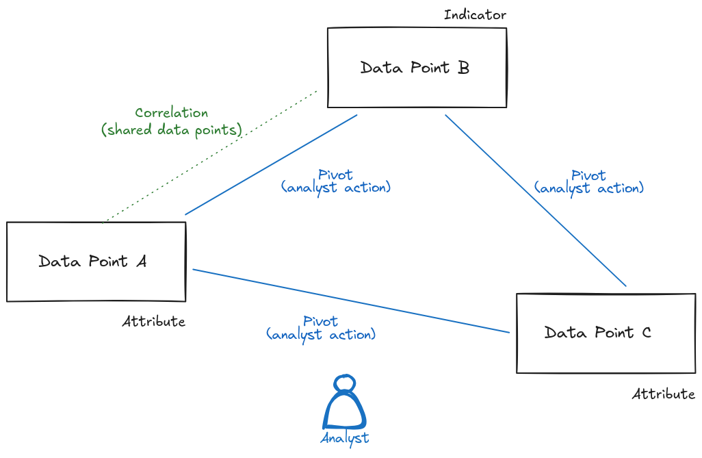
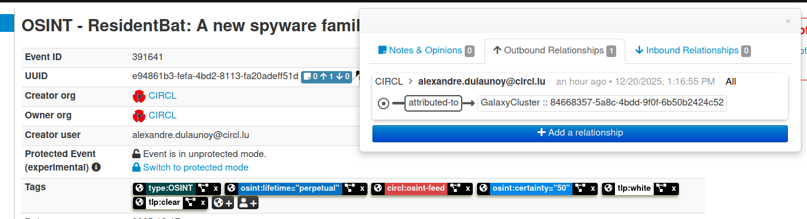
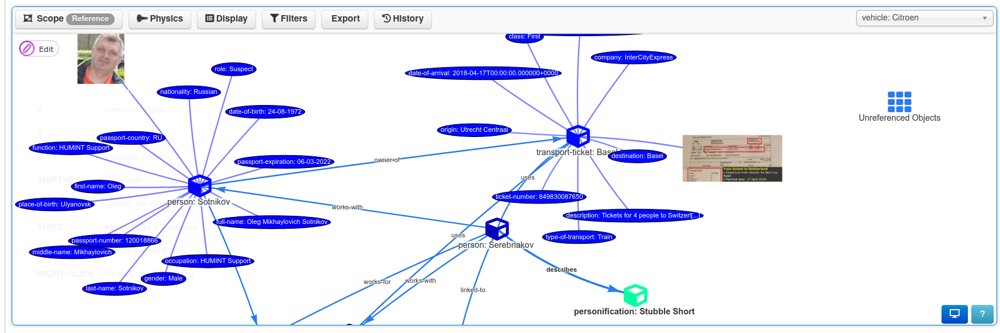

# The Art of Pivoting - Techniques for Intelligence Analysts to Discover New Relationships in a Complex World

This book explores how intelligence and cyber-security analysts can uncover hidden links between threat actor infrastructure and ongoing investigations by pivoting on both classic and unconventional indicators — many of which are often overlooked. The material is grounded in empirical, field-tested strategies used in cyber-security, digital forensics, cyber threat intelligence, and intelligence analysis more broadly.

Our goal is to provide analysts with a practical toolkit of analytical methods, supported by real-world examples, to enhance investigative workflows without locking them into a single mindset, strict model, or overly rigid technical strategy. Instead, the book encourages creative exploration, data-driven reasoning, and the use of diverse data points — from traditional IOCs to subtle metadata traces — as part of a flexible and repeatable analytical process.

The approach presented throughout this book is intentionally built upon open-source tooling, most notably the [MISP threat intelligence platform](https://misp-project.org/) and the [AIL Project](https://ail-project.org/). By relying on transparent and widely adopted tools, every technique described here can be reproduced, validated, and reused by analysts, researchers, educators, or incident response teams. This ensures that the methodology is not theoretical or proprietary, but openly verifiable, community-driven, and designed to evolve. The book itself follows the same philosophy: it is an open, living document, publicly versioned[^versioned], and contributions are [welcomed directly via Git](https://github.com/adulau/the-art-of-pivoting). Readers are encouraged to experiment, improve, and extend the content, making the entire workflow repeatable, auditable, and collaborative within the wider defensive security community.

## Definition and the So-Claimed “Theory”

Before diving into practical techniques and real-world investigations, it is useful to clarify the language and concepts that form the backbone of pivot-based analysis. In threat intelligence, many terms are borrowed from other disciplines — statistics, social networks, cryptography, digital forensics — and are sometimes used informally or inconsistently. This chapter provides supporting definitions tailored for operational analysts, not academic theorists.

The goal is not to impose a rigid theoretical model, but to build a common vocabulary that helps explain how we move from isolated observations to connected intelligence. Terms such as *data points*, *correlation*, and *pivoting* are defined in a way that reflects how analysts actually use them in the field. We also introduce the “Six Degrees” perspective to illustrate why small signals can lead to surprising discoveries.

This section therefore acts as a lightweight theory chapter — just enough structure to explain the logic behind the techniques, without restricting the creativity or intuition that make pivoting effective in practice.



### Data Points

In this book, we use the term **data points** to describe any discrete element that can support correlation or pivoting during threat intelligence analysis. A data point may be a traditional indicator such as an IP address, domain, or file hash, observables at large but it can also include less conventional digital artifacts like cookie names, QR codes, favicon hashes, HTTP header sequences (HHHash), DOM structure, or Marketing Analytics tracking codes. Treating all of these elements uniformly as data points is useful because it avoids assuming that only strong or traditional indicators are relevant. Even weak or unexpected data points can become valuable when combined through composite correlation. In practice, pivoting is the act of moving from one data point to another through inferred or observed relationships, while correlation is the process of identifying those relationships. 

This terminology provides a neutral and flexible way to reason about diverse signals extracted from tooling (such as AIL and MISP) during infrastructure and threat actor analysis.

#### Data Points in MISP: Attributes and Actionability

In the MISP standard data model[^misp-standard], what this book calls a *data point* is represented as an **[attribute](https://www.misp-standard.org/rfc/misp-standard-core.html#section-2.3)**.

An attribute in MISP is a typed value (e.g. domain, IP address, filename, hash, cookie name) that may serve different purposes depending on context. Crucially, MISP attributes include an **actionable flag**, commonly referred to as the **IDS flag**.

- When the IDS flag is **not set**, the attribute is informational or contextual.  It may support correlation, enrichment, analyst reasoning, or historical analysis.
- When the IDS flag **is set**, the attribute is considered suitable for detection or prevention and can be exported to intrusion detection systems, firewalls, or security controls.

In practice, this means that the *same data point* can evolve over time: a contextual attribute may later become actionable once its relevance, reliability, or detection logic is established.

This distinction allows MISP to support both **analysis** and **operations** without forcing analysts to prematurely label every data point as an Indicator of Compromise (IoC).

#### Indicators and IoCs: A Subset of Data Points

In many security contexts, the term **Indicator of Compromise (IoC)** is used to describe data that can be used directly for detection or response. Within the conceptual model of this book:

> An IoC is a **data point that has become actionable**.

In MISP terms, this typically corresponds to an attribute with the IDS flag enabled. Not all data points are IoCs, but many IoCs originate as ordinary data points before being validated, contextualized, and operationalized.

#### Data Points in STIX: Indicators and Observables

In the [STIX standard](https://docs.oasis-open.org/cti/stix/v2.1/errata01/stix-v2.1-errata01.html), the terminology differs, but the underlying concept is similar.

- **STIX Indicator** objects represent actionable detection logic and therefore align closely with the concept of an IoC.
- Many elements that would be represented as MISP attributes *without* the IDS flag are modeled in STIX as **observed data**, **observables**, or supporting objects rather than indicators.

As a result, what MISP treats as a single concept (an attribute with optional actionability) is split across multiple object types in STIX, depending on intended use. This difference reflects design philosophy rather than analytical disagreement.

#### Why This Distinction Matters for Pivoting

For pivot-based analysis, it is important not to conflate *existence* with *actionability*.

- Treating every data point as an IoC leads to noise, false positives, and fragile detection.
- Treating data points as neutral building blocks enables broader correlation, exploration, and hypothesis generation.

By using **data point** as the primary conceptual unit, this book emphasizes that pivoting starts with observation and relationship discovery—not detection. Actionability is an outcome of analysis, not a prerequisite.

This perspective allows analysts to incorporate unconventional, weak, or contextual elements into their investigations while still supporting a clear path toward operationalization when appropriate.

#### Selectors: A Term from the Intelligence Community

In the intelligence community (IC), the term **selector** has a specific and well-established meaning. A selector is a **data point used to identify, filter, task, or retrieve information** related to a target, entity, or activity. Selectors are not intelligence in themselves; rather, they are *handles* that allow analysts and systems to access relevant data streams.

In practice, the term *selector* emphasizes **operational use** rather than analytical interpretation. A selector is something you can act upon: query, monitor, task against, or pivot from.

Selectors are often informally categorized based on their **specificity and reliability**:

- **Strong selectors** uniquely and consistently identify a single entity or activity. They tend to have low false-positive rates and high confidence.
  - Examples: cryptographic file hashes, unique account identifiers, specific email addresses.
- **Soft selectors** are less specific and may refer to multiple entities or contexts. They are more prone to noise but are often easier to collect and more flexible for discovery.
  - Examples: common usernames, IP addresses from shared hosting, generic filenames, language patterns.

This distinction mirrors the weak-versus-strong data point concept discussed throughout this book. Strong selectors are useful for confirmation and precise tracking, while soft selectors excel at **exploration, clustering, and hypothesis generation**.

In pivot-based analysis, selectors function as **entry points into a graph of relationships**. A single selector may lead to multiple related data points, which then become selectors themselves in subsequent pivots.

Importantly, selectors do not need to be strong to be useful. Many of the uncommon data points described in this book—such as cookie names, DOM structure hashes, favicon hashes, or image-derived text—can be understood as *soft selectors*. Their value lies not in uniqueness, but in their ability to reveal connections when combined with other signals.

For the purposes of this book, **selectors can be viewed as a subset of data points with an explicitly operational role**. All selectors are data points, but not all data points are selectors until they are used to drive collection, correlation, or pivoting.

This distinction helps bridge intelligence-community terminology with threat intelligence practice: whether one speaks of selectors, indicators, observables, or data points, the underlying challenge remains the same—determining which elements are actionable, how reliable they are, and how they can be combined to uncover meaningful relationships.

### Correlation

**Correlation** is the analytical process of identifying relationships between two or more data points. In threat intelligence, correlation helps determine whether separate observations — such as domains, certificates, HTTP headers, file hashes, or behavioral artifacts — may belong to the same actor, campaign, or infrastructure cluster. A single correlation does not always imply attribution, but it provides evidence that two elements share a meaningful connection, such as technical similarity, shared metadata, deployment patterns, or operational reuse. Correlation is often iterative and multi-layered: weak signals can become valuable when combined, and composite correlations frequently reveal links that are not visible through traditional indicators alone.

**Correlation** can be *automatic*, *manual*, or a combination of both.

#### Automatic Correlation

**Automatic correlation** is performed by tools and platforms using predefined rules, heuristics, or algorithms. Systems such as MISP automatically correlate data points by comparing attributes across datasets, events, or objects. This may rely on:

- Exact matches (e.g. identical hashes, domains, IPs, certificates fingerprints)
- Similarity or fuzzy matching (e.g. SSDEEP, TLSH, DOM structure, favicon hashes)
- Group-based logic (e.g. shared CIDR ranges, ASNs, hosting providers)
- Behavioral or structural fingerprints (e.g. HTTP header hashes, cookie names)

Automatic correlation can occur at different moments in the lifecycle of data:

- At ingestion time, when new data points are first introduced into a system and immediately compared against existing knowledge.
- Continuously or periodically, when correlation engines are re-run as datasets grow, algorithms improve, or historical context changes.

This continuous nature is important: correlation is not a one-time action. A data point that appeared insignificant at ingestion may become meaningful weeks or months later when additional context emerges.


Automatic correlation excels at scale and speed. It ensures consistency, repeatability, and broad coverage across large volumes of data. However, it operates strictly within the boundaries of what is encoded in rules and algorithms and can therefore generate false positives or noisy correlations, especially when weak or high-entropy data points are involved. This analytical noise can become a burden for analysts, requiring manual validation, contextual filtering, and prioritization to separate meaningful relationships from coincidental ones.


#### Manual and Human-Driven Correlation

Not all correlation can—or should—be automated. **Manual correlation** is performed by analysts who interpret data points using experience, intuition, and contextual understanding that may not be formally captured in systems.

This includes:

- Analytical reasoning based on investigative context
- Pattern recognition across disparate sources
- Hypothesis-driven linking of weak or unconventional signals
- Correlation derived from **HUMINT**, open-source research, linguistic cues, or cultural knowledge
- Insights gained without reliance on external tooling, or by combining outputs from multiple tools mentally rather than mechanically



Manual correlation often explains *why* two data points are related, not just *that* they are related. It is also a key mechanism for improving the overall quality of correlation by validating, refuting, or refining relationships produced by automated systems. By applying contextual understanding, investigative judgment, and external knowledge, analysts can filter out false positives and analytical noise generated by large-scale automatic correlation. In doing so, manual correlation frequently introduces new and more precise pivot paths that automated systems cannot anticipate or model.




#### Correlation as an Iterative Process

Correlation is not binary and not definitive. A single correlation does not imply attribution, ownership, or intent. Instead, it represents **a hypothesis supported by evidence**, whose strength increases as additional, independent correlations accumulate.

In practice, effective pivoting relies on the interplay between:

- Automated correlation to surface candidate relationships at scale
- Human analysis to interpret, contextualize, and validate those relationships

Correlation therefore sits at the core of pivoting: it is both a computational process and a cognitive one. Without correlation, pivoting is blind exploration. With correlation—especially when automated and human-driven approaches reinforce each other—pivoting becomes a structured, explainable, and repeatable analytical method.

> :brain: If you design a threat intelligence platform or system that supports correlation, it is essential to support both automatic and manual correlation. Equally important is the ability to clearly distinguish between these two types and to allow analysts to trace back how a correlation was established. Being able to identify whether a relationship was generated by an algorithm, a rule, or human analysis helps analysts assess confidence, understand potential bias or noise, and make informed decisions when pivoting. In MISP, this distinction is implemented explicitly: automatic correlation and analyst-driven data relationships are handled as separate concepts. Correlations are generated by the system based on matching or similarity algorithms, while data analyst relationships represent intentional, contextual links created and validated by humans.

### Pivoting

**Pivoting** is the investigative action of moving from one known data point to another in order to expand knowledge about a threat actor, infrastructure, or campaign. After correlation reveals that two elements are linked, pivoting uses that link as a new starting point, allowing analysts to continue exploring outward in successive steps. For example, an analyst may begin with a domain, pivot to an IP address that hosts it, then pivot again to other domains hosted on the same server, or even to additional services that share a specific favicon hash, certificate, or cookie name. Pivoting is therefore an exploratory process: it transforms isolated observations into a growing graph of related data points and can uncover infrastructure or behavior that would remain hidden if indicators were examined in isolation.

The term *pivoting* can be confusing because it is used in two different contexts. In cyber defence and threat intelligence, pivoting refers to the analyst’s process of moving from one data point to another to uncover related infrastructure, identities, or activity. This is entirely separate from the attacker’s use of “pivoting,” which typically means lateral movement inside a compromised network. This book focuses exclusively on the defender’s perspective: pivoting as an investigative method for expanding knowledge, not as an adversarial technique for gaining additional access. However, the techniques used by attackers to pivot inside a compromised network can themselves become valuable data points for defenders. Traces of lateral movement — such as reused credentials, tunneling tools, shared SOCKS proxies, or staging servers — often leave forensic or network artifacts that can be extracted, correlated, and used as data points.
  
### Pivot

A pivot itself is **not** a data point. A data point is a discrete element — such as a domain, certificate, cookie name, or hash — that can be compared, correlated, or stored. A pivot, on the other hand, is the investigative action of moving from one data point to another after discovering a relationship. The pivot is the step in the process, not the object being analyzed.

In practice:

- The **domain** is a data point.
- The **shared TLS certificate** is another data point.
- Moving from the domain to the certificate and then to other domains using the same certificate is the **pivot**.

So, a pivot is the *movement across relationships*, whereas a data point is the *thing being related*. Without data points, pivoting is not possible — but a pivot cannot be seen as a data point itself.

### Six Degrees of Separation (Kevin Bacon Concept)

The concept or perception of **Six Degrees of Separation**[^six-degrees] suggests that any two individuals in the world are connected through a short chain of relationships — typically no more than six steps. Popularized in social network theory and later known through the “Kevin Bacon game,” it demonstrates how large, complex networks can still produce surprisingly short paths between seemingly unrelated actors. Similar concepts exists in academic contexts as the ”Erdos number,” which measures how many co-authorship links separate a researcher from the mathematician Paul Erdos.

In cyber threat intelligence, the same idea applies to infrastructure and data points. A single indicator — such as a domain, cookie name, or TLS certificate — may appear isolated. However, when connected through successive correlations, it may lead to a different server, a shared service provider, a reused attack toolkit, or a specific actor’s operational mistake. Although each step may seem small, multiple pivots can reveal links that are not obvious when indicators are viewed alone.

This is why pivoting matters: it transforms a flat list of IOCs into a graph of relationships. Once correlations accumulate, even distant nodes may become connected within only a few steps, showing that many threat infrastructures are not as independent or hidden as they appear. The Six Degrees concept provides a useful mental model for understanding how hidden relationships emerge in large-scale intelligence data.

## The Practice of Pivoting

### Evolution of Pivoting Practices

Early pivoting techniques in threat intelligence were straightforward and deterministic: if two artifacts shared an exact value — the same IP address, file hash, email, or domain — they were assumed to be related. This model worked well when threat actors made simple operational mistakes or reused infrastructure without modification. A perfect match was enough to connect two samples, two campaigns, or two servers.

As adversaries became more fragmented and distributed, perfect matches grew rarer. Infrastructure is now dynamic, rapidly deployed, and often disposable. Servers change IPs, phishing kits are rebranded, domains rotate and are shared among TA, and payloads are customized. In this environment, single indicators can lose value sometime, and analysts must rely on additional signals.

Modern pivoting therefore focuses on *composite correlation* — combining multiple weak or partial data points to reveal a relationship that no single indicator could confirm on its own. A favicon hash may mean little, but paired with a shared Google Analytics ID, a similar DOM structure, or identical cookie names, it becomes meaningful. Clustering techniques push this even further by grouping infrastructure based on patterns, similarity scoring, or behavioral fingerprints, rather than exact matches.

This chapter explores the full spectrum of pivoting methods, from simple one-to-one links to complex, multi-layered correlations that uncover relationships even when adversaries attempt to hide or fragment their infrastructure.

### Exact Match Correlation

The most fundamental form of pivoting is based on **exact match correlation**, where two data points are linked because they share the same value. In MISP, this happens automatically: if two attributes contain the same hash, IP address, domain name, email address, filename, or other indicator, the platform correlates them.

The strength of this method depends entirely on the **type of data point** being compared. Some exact matches are **strong** signals:

- IP address
- Cryptographic file hashes (SHA-256, SHA-1, MD5)
- Unique TLS certificate fingerprints
- PGP key fingerprints

If two events contain the same SHA-256 hash, it is almost certain they refer to the same binary. These cryptographic hash values have an extremely low false-positive rate.

Other exact matches are **weak** signals because the values are generic, widely reused, or trivial to change:

- Filenames such as `invoice.pdf` or `update.exe`
- Common User-Agent strings
- Generic email subjects

These can produce a high number of correlations that are technically correct, but not meaningful. In other words, **exact match correlation is not fragile — it is simply more prone to false positives when the underlying data point is weak**. The advantage is that these false positives are usually easy to spot, because the context around the match (campaign, infrastructure, malware family) often doesn’t align.

Exact match correlation is therefore an essential first step: fast, deterministic, and ideal when strong indicators exist. But it cannot stand alone. In some cases, the **number of exact matches** becomes a clue in itself. An indicator that correlates with a very large volume of unrelated events often signals a potential false positive. For example, an IP address used as a sinkhole may appear in hundreds of malware reports without indicating any shared operator, and multi-homed infrastructure observed through passive DNS may link to a wide set of unrelated hostnames. In these situations, the explosion of matches is less a sign of strong correlation and more a warning that the data point is too generic to support attribution.

### Fuzzy Matching Correlation

Once exact matching has exhausted its value, analysts often turn to **fuzzy matching correlation**. Instead of requiring two data points to be identical, fuzzy matching looks for *similarity*. Tools such as **SSDEEP**, **TLSH**, or **sdhash**[^sdhash] generate similarity hashes that allow analysts to connect files or payloads that share overlapping content, embedded resources, compiler artifacts, or packer stubs.

Fuzzy correlation is especially useful when adversaries produce many variants of the same malware family, or when a phishing kit is redeployed with small modifications. Two PE files that differ in signatures, strings, or timestamp can still score highly in TLSH or SSDEEP, revealing a relationship that exact match correlation would miss.

However, fuzzy matching must be treated with caution. **Increasing sensitivity increases false positives.** Many Windows executables share the same icons, version resources, or packer signatures, which can inflate similarity scores without implying a common operator or campaign. It is common in malware analysis to see large clusters of binaries that look “similar” but are operationally unrelated. For this reason, fuzzy matching should guide investigation, not conclude it: it generates hypotheses and leads, not attribution on its own.

### Group-Based Correlation

A related technique is **group-based correlation**, where data points are clustered based on shared infrastructure or logical grouping rather than identical values. The most common example in MISP is **CIDR correlation**: if multiple malicious domains or IPs fall within the same network range, they may belong to the same operator, hosting provider, or automated deployment.

Group correlations help surface weak signals that would otherwise remain hidden. Even if each IP address appears only once, their presence in a suspicious subnet can indicate shared provisioning, bulletproof hosting, or coordinated activity. Time-based grouping, certificate reuse within a range, or shared ASN ownership can reinforce the signal further.

But as with fuzzy matching, **group correlation can easily become too broad**. Large providers or cloud platforms host thousands of unrelated customers; passive DNS may show hundreds of benign domains sharing the same /24. When correlation returns *everything*, it stops being useful. Analysts can end up trapped in wide clusters that look meaningful but offer little investigative value.

Fuzzy and group-based correlations therefore extend the pivoting process beyond perfect equality. They are most effective when combined with context or layered with other data points — for example, when a CIDR match is reinforced by shared TLS certificates, similar DOM structure, or common malware resources. Just like exact matching, these techniques are valuable tools, but they must be interpreted carefully: the more inclusive the rule, the greater the analyst’s responsibility to validate the result rather than assume it.

### Analytical Strategies of Pivoting

| Pivot Category | Pivot Type | Description / Examples |
|---------------|------------|------------------------|
| Data Points (selector, attribute, IoC) | Current Pivoting | Analysis based on live or near-real-time observations |
| Current Pivoting | Live Infrastructure Mapping | DNS queries, active scanning |
| Current Pivoting | Communication Behavior | Querying services, active monitoring |
| Current Pivoting | Operational Patterns | Key materials, similar malicious files |
| Data Points (selector, attribute, IoC) | Historical Pivoting | Analysis based on past or archived data |
| Historical Pivoting | Past Infrastructure Reuse | Similar network infrastructure, default setups |
| Historical Pivoting | Historical Public Records | WHOIS records, TLS key materials or parameters |
| Historical Pivoting | Historical Records | Leaked credentials, identifier or alias reuse |
| Data Points (selector, attribute, IoC) | Predictive Pivoting | Analysis aiming to anticipate future activity |
| Predictive Pivoting | Recurring TTPs | Similar patterns or techniques reused over time |
| Predictive Pivoting | Predictive Patterns | Domain generation algorithms, reused naming patterns |
| Predictive Pivoting | Forecasting Tools / Techniques | Tools, techniques, or practices for forecasting activity |

Pivoting can also be thought of across different points in time: **current**, **historical**, and **predictive**.

DNS is a good example of how all three can apply.  

- **Current pivoting** looks at live DNS records. When an analyst resolves a hostname, the returned IP address represents the state of the infrastructure at the exact moment of analysis.  
- **Historical pivoting** examines how that hostname resolved in the past, using sources such as [Passive DNS](https://www.circl.lu/services/passive-dns/). This can reveal previous hosting providers, older campaigns, sinkholes, or infrastructure that has since been abandoned.  
- **Predictive pivoting** appears in more advanced cases. Domain Generation Algorithms (DGAs) can compute future domains based on time or seed values, meaning some malicious domains exist mathematically before they ever appear in DNS. By generating or monitoring these future domains, analysts can pivot forward in time and anticipate infrastructure before it becomes active.

This time-based perspective highlights that pivoting is not limited to a single snapshot. Infrastructure evolves, and useful intelligence emerges when current, historical, and potential future states are analysed together.

## Rethinking Pivoting: From Strong Indicators to Unintended Traces

Pivoting is often described as an investigative art, but the goal is to shape it into a more reproducible and practical discipline, one that any analyst can apply methodically rather than intuitively. However, the way we think about pivoting is sometimes constrained by rigid models or inherited practices that no longer reflect how modern adversaries operate. Frameworks like the Pyramid of Pain are useful, but they deserve to be re-examined: how hard is it really for threat actors to alter an indicator, and which indicators do they ignore entirely?

The reality is that attackers do not always understand the traces they leave behind, nor do they reliably anticipate the intelligence value of those traces. A well-known example is the *[Anna-Senpai](https://web.archive.org/web/20190107084715/http://fortune.com/2017/12/13/%E2%80%AA%E2%80%AAmirai%E2%80%AC-%E2%80%AAbotnet%E2%80%AC-cybercrime-doj/)* case behind the Mirai botnet. The malware itself contained no strong identifying indicators that linked directly to the author, and much of its infrastructure was transient and intentionally disposable. Yet a small, seemingly irrelevant artifact—the reuse of the *Anna-Senpai* alias across unrelated online posts—became a pivot point that investigators followed across forums, leaked credentials, and historical activity. That weak signal, when correlated with other data points, eventually contributed to unmasking the individuals involved. 

This illustrates a core principle of modern pivoting: even minor or disconnected artifacts can become powerful intelligence when correlated across time, platforms, and context. The evolution of pivoting lies not in abandoning classical models, but in refining how we interpret traces—especially the ones that attackers assume are meaningless.

### The Danger of Single-Model Reasoning

Models like the Pyramid of Pain are valuable for teaching, but they can become restrictive if treated as absolute truth. The assumption that “high-value indicators are hard to change” encourages analysts to prioritize TTPs, certificates, cryptographic hashes, or infrastructure identifiers, while disregarding weaker signals. In reality, modern adversaries routinely automate or outsource the rotation of high-value indicators: cloud instances are redeployed in seconds, TLS certificates are regenerated for free, and containerized command-and-control servers can be destroyed and rebuilt faster than defenders can react.

At the same time, low-entropy or unconventional indicators often become the most revealing. Reused cookie names, favicons, Google Analytics identifiers, forum nicknames, vanity onion prefixes, or repeated API paths are frequently left untouched. These elements do not appear at the top of any model, yet they provide persistent and highly effective pivot points—because attackers do not consider them “indicators” worth hiding.

In short, **strict adherence to a single model introduces blind spots**. The real world rewards flexible analysis, composite correlation, and attention to the traces adversaries ignore or disregard.

### Re-evaluating Our Indicator Collection and Pivoting Practices

Within the AIL project, we collect data from a wide range of sources: social networks, Tor hidden services, criminal forums, paste sites, and web infrastructure commonly used by threat actors. To make sense of this diversity, we built a dynamic correlation engine that allows new object types to be introduced easily. Instead of restricting analysis to a fixed list of traditional indicators, the system can correlate emerging artifacts such as QR codes, cookie names, HTTP header hashes, or vanity onion prefixes.

This required a deliberate change in mindset. Rather than treating established indicators as the primary source of truth, we began to focus on outliers and overlooked data points—elements attackers rarely consider significant, and therefore rarely bother to obfuscate. In the process, some of our older assumptions had to be challenged or discarded. What was once considered noise often turned into strong investigative leads when combined with other weak signals. By shifting from a rigid interpretation of indicators to a more exploratory, data-driven approach, we uncovered relationships that would have remained invisible using traditional practices.

This shift also changed how analysts think: instead of asking which indicators matter most, we now ask which indicators adversaries fail to hide. This perspective becomes essential as we move into composite correlation and clustering techniques, where weak signals converge into strong intelligence.

### Looking at “Broken” Indicators and Still Using Them

Some indicators are known to be imperfect, yet remain surprisingly effective in real investigations. MurmurHash3, for example, is still widely used for favicon correlation. A single MMH3 hash can quickly reveal Tor hidden services that are also exposed on the clear web, allowing analysts to pivot across seemingly unrelated infrastructure with minimal effort.

If MurmurHash3 is known to be flawed, why continue using it? Because even with weaknesses and potential collisions, it works—and more importantly, attackers rarely consider favicons to be meaningful intelligence artifacts. Many copy the same web assets across panels, icons on webshell, custom css, phishing kits, and darknet storefronts without modification, leaving behind reliable pivot points.

There is an additional twist: when threat actors deliberately attempt to manipulate or collide favicon hashes, those collisions themselves become useful signals. Correlating clusters of colliding favicons can reveal common tooling, shared deployment scripts, or copied infrastructure. In other words, a “broken” indicator can still produce strong intelligence, either because adversaries ignore it, or because their attempts to evade it create new patterns worth pivoting on. Stopping the calculation of such hashes would simply remove a cheap and surprisingly effective investigative tool.

#### Combining Weak and Strong Data Points for Pivoting

The continued use of seemingly weak data points, like MurmurHash3 (MMH3) for favicons or even simple MD5[^collision-md5] file hashes, is justified when they are understood as correlation point rather than definitive attribution artifacts. The key is to integrate them strategically with strong data points within a structured pivoting workflow.


Weak data points are often the initial starting point for an investigation (e.g., A single alone MD5 hash from a security alert). They excel at quickly casting a wide net to find clusters of potentially related infrastructure or activity. Their low interest in threat intelligence practice and tendency for adversaries to ignore them make them ideal for the initial discovery phase.

> :brain: If you design a Threat Intelligence database or storage model, be sure to include a schema that accommodates a diverse array of data points, including those categorized as weak data points (e.g., MMH3, MD5, cookie names). A robust model must treat all data points as correlatable objects, ensuring that initial investigations can effectively use high-volume, low-cost signals for breadth pivoting before confirming connections with high-fidelity, strong data points.

## The Value of Uncommon Data Points

Uncommon data points, which you define as data points that fall outside the traditional set (IPs, domains, file hashes), are extremely interesting and valuable in the Cyber Threat Intelligence (CTI) process because they exploit **two key operational weaknesses of threat actors: neglect and reuse**.

### Mindset Shift: From Perfection to Pragmatism

The traditional CTI process often focuses on strong data points (e.g., high-entropy unique hashes) that promise low false positives. However, this perspective is sometimes clouded by rigid models or legacy practices.

- Challenging Assumptions: We must reconsider our reliance on models like the Pyramid of Pain and critically assess how difficult it truly is for adversaries to alter high-value indicators. Do threat actors always realize which traces they leave behind, and can they accurately gauge the intelligence value of what they expose?
- The Power of Outliers: A successful pivot often comes from focusing on outliers and overlooked data points. These artifacts are often simple, easy to extract, and offer a low-cost way to establish correlation.
- Imperfect is Not Useless: Even outdated or colliding indicators can still provide valuable correlations. The flaw of the indicator is irrelevant if the adversary neglects to change it.

#### Why Uncommon Data Points Are Effective

Uncommon data points are effective precisely because threat actors do not consider them meaningful intelligence artifacts. This neglect turns them into silent, high-utility fingerprints.

- Neglected Fingerprints: When threat actors copy the same web assets across phishing kits, darknet storefronts, or operational panels, they rarely think to modify innocuous files like favicons. A simple MurmurHash3 on a favicon enables quick hash-based pivoting to uncover related infrastructure, such as Tor hidden services exposed on the clear web.
- Operational Reuse: Simplicity and operational efficiency often lead to the reuse of metadata or infrastructure-specific artifacts.
   - HTTP Header Hashing (HHHash)[^hhhash]: HTTP (version 1) response headers can act as subtle fingerprints for linking threat infrastructure.
   - Cookie Names: Custom or reused cookie names can serve as low-noise data points for linking attacker-controlled web infrastructure.
   - Embedded Analytics: Despite the assumption that threat actors avoid including labels that could link their infrastructure , services like Google Analytics tracking codes are often reused across multiple malicious sites, revealing unexpected and meaningful correlations.
- Visual and Structural Clues: Non-traditional image and structure analysis introduces entirely new pivot points:
   - Structural Hashing: The `dom-hash` algorithm clusters Tor Hidden Services based on simple HTML structure, yielding excellent results in structural similarity detection.
   - Extracted Data: QR codes are increasingly seen on social networks and ransomware negotiation pages, providing embedded data points. Barcodes have proven to be valuable correlation points in social media and data leaks.
   - Vision Models: Vision-language models can automatically generate descriptions of collected images (e.g., from social networks or screenshots), allowing investigators to correlate on terms, keywords, or objects identified in the images.

#### The Power of Composite Correlation

The real strength of uncommon data points lies in composite correlation, their ability to connect elements when strong indicators fail.

- A single weak data point may be noisy, but when combined with others, it creates a unique, high-confidence cluster. For example, a Google Analytics ID alone may not prove attribution, but when combined with a specific favicon hash or dom-hash, they help cluster infrastructure belonging to the same threat actor.
- This approach is key to pivoting, which is the investigative action of moving from one known data point to another to expand knowledge about a threat. It transforms isolated observations into a growing graph of related data points.

By expanding our collection to include these unconventional data points, we can achieve deeper insights and better threat discovery.

## An Inventory of Uncommon Data Points

### DOM Hash (`dom-hash`): Structural Fingerprinting of HTML Content

HTML content is an abundant but often underutilized source of correlation in threat intelligence. While much prior work has focused on visual similarity, content hashing, or full document classification, many operational use cases do not require that level of complexity. During discussions with CERT-PL and empirical testing against large-scale web capture datasets (notably LookyLoo), we observed that a remarkably simple strategy yields excellent results for infrastructure pivoting: hashing the structure of the HTML document rather than its content.

This observation led to the development of the **dom-hash** algorithm.


#### Core Idea

The central idea behind dom-hash is to treat the **Document Object Model (DOM) structure** of an HTML page as a fingerprint. Instead of hashing text, scripts, or resources—which are frequently modified or localized—dom-hash focuses exclusively on the **sequence of HTML tag names** present in the document.

By ignoring content and attributes and retaining only structural information, dom-hash captures layout and template reuse while remaining resilient to superficial changes.

In practice, many phishing kits, scam pages, ransomware leak sites, and underground storefronts reuse the same HTML templates across multiple deployments. Even when branding, language, or embedded resources change, the underlying DOM structure often remains untouched.

#### Algorithm Description

At a high level, the dom-hash algorithm follows these steps:

1. Parse the HTML document into a DOM tree.
2. Extract the ordered list of all HTML tag names.
3. Concatenate the tag names into a single string, preserving order.
4. Compute a cryptographic hash over that string.
5. Truncate the result to a fixed length for storage and correlation.

A reference implementation in Python is shown below using the [BeautifulSoup library](https://beautiful-soup-4.readthedocs.io/en/latest/):

```python
def _compute_dom_hash(html_content):
    soup = BeautifulSoup(html_content, "lxml")
    to_hash = "|".join(t.name for t in soup.findAll()).encode()
    return sha256(to_hash).hexdigest()[:32]
```

This simplicity is intentional. The algorithm is fast, deterministic, and easy to reproduce across tooling and datasets.

#### Why `dom-hash` Works in Practice

The strength of dom-hash lies not in theoretical uniqueness, but in **operational neglect**. Threat actors frequently copy and redeploy HTML templates without altering their structural composition. While they may change text, images, JavaScript, or styling, the DOM skeleton remains identical across campaigns or infrastructures.

Because dom-hash ignores volatile elements, it is resistant to:

- Language changes
- Branding modifications
- Variable content such as dates or victim identifiers
- Minor cosmetic edits

At the same time, it is sensitive enough to distinguish between fundamentally different templates.

#### Use Cases for Pivoting

dom-hash is particularly effective for:

- Linking phishing pages derived from the same kit as implemented in [LookyLoo](https://github.com/Lookyloo/lookyloo)
- Correlating ransomware leak sites with similar layouts
- Identifying cloned underground marketplaces or scam portals
- Pivoting between Tor hidden services and clear-web infrastructure using shared templates

As with other uncommon data points, dom-hash is rarely sufficient on its own for attribution. Its value emerges when used as a **pivot primitive** and combined with other indicators such as favicon hashes, TLS certificates, cookie names, or hosting patterns.

#### Limitations and Noise Considerations

dom-hash is intentionally coarse and therefore has limitations:

- Very common frameworks or boilerplate templates may produce high-cardinality correlations.
- Minor structural changes (e.g. adding or removing wrapper elements) will alter the hash.
- Dynamic, heavily JavaScript-driven applications may yield unstable DOMs depending on rendering context.

For these reasons, dom-hash should be interpreted like other structural or weak indicators: as a way to surface candidate relationships that require analyst validation rather than as definitive proof of common ownership.

#### Positioning dom-hash Among Uncommon Data Points

dom-hash exemplifies a broader category of uncommon data points: indicators that are easy to compute, inexpensive to store, and often ignored by adversaries. Its effectiveness does not come from cryptographic strength or semantic understanding, but from exploiting operational reuse and oversight.

Used correctly, dom-hash enables analysts to pivot across infrastructure that would otherwise appear unrelated, reinforcing the central theme of this book: meaningful intelligence often emerges not from perfect indicators, but from simple signals applied creatively and in combination.

### Favicons: Visual Artifacts as Infrastructure Fingerprints

Favicons are small icons associated with websites, typically served as part of a site’s static assets. They are designed purely for user experience and branding, not for security or identification. Precisely because of this, favicons have become a surprisingly effective and durable data point for infrastructure correlation in threat intelligence.

In many malicious ecosystems—phishing kits, scam portals, ransomware leak sites, underground marketplaces—favicons are copied verbatim across deployments. While operators frequently rotate domains, IP addresses, certificates, and even page content, favicons are often reused without modification, making them a reliable pivot point across otherwise fragmented infrastructure.

#### Why Favicons Matter

Favicons occupy a unique position among web artifacts:

- They are rarely customized per deployment.
- They are usually embedded early in development and forgotten.
- They persist across clear-web and Tor or I2P deployments.
- They are commonly reused across campaigns and time.

Threat actors tend to focus their evasion efforts on elements they perceive as indicators—domains, IPs, certificates, or payloads—while treating favicons as benign design assets. This operational blind spot turns favicons into durable fingerprints.

#### Favicon Hashing as a Correlation Primitive

The most common way to operationalize favicons is by hashing their binary content and using that hash as a correlation key. In practice, non-cryptographic hashes such as MurmurHash3 (MMH3) are frequently used because they are fast, widely implemented, and sufficient for clustering purposes.

While MMH3 is not collision-resistant and is unsuitable for security guarantees, this is largely irrelevant in the context of pivoting. The goal is not uniqueness, but **repeatability**: the same favicon reused across infrastructures will reliably produce the same hash.

This makes favicon hashes particularly effective for:

- Linking phishing sites derived from the same kit
- Correlating Tor hidden services with clear-web infrastructure
- Identifying cloned scam or fraud portals
- Discovering reused administrative panels or staging servers

#### Composite Correlation with Favicons

Favicons are rarely used in isolation. Their true value emerges when combined with other data points:

- A shared favicon hash and identical DOM structure
- A favicon hash combined with similar HTTP headers
- A reused favicon across domains sharing analytics identifiers
- A favicon hash linking infrastructure across different hosting providers

In composite correlation, favicons often act as the initial pivot that reveals a broader cluster, which can then be refined using stronger or more contextual indicators.

#### Noise, Collisions, and Interpretation

Like all uncommon data points, favicon correlation is not immune to noise.

- Popular frameworks or widely used templates may share default favicons.
- Collision-prone hashing algorithms can group unrelated icons.
- High-cardinality favicon hashes may indicate generic assets rather than operator reuse.

However, these limitations are manageable. High-volume correlations are themselves a signal that a favicon is likely generic and should be deprioritized. Conversely, low-volume or thematically consistent reuse significantly increases investigative value.

Importantly, even deliberate attempts to evade favicon-based correlation—such as modifying or randomizing icons—can introduce new patterns worth tracking, especially when changes are inconsistent across deployments.

#### Beyond Favicons: Related Visual and Static Assets

Favicons illustrate a broader class of **static visual and resource-based data points** that are often overlooked:

- Logos and embedded images
- CSS files, layout assets and properties
- JavaScript bundles reused across deployments
- Icon fonts and UI components

These artifacts share similar properties: they are operationally neglected, inexpensive to reuse, and rarely treated as indicators by adversaries. When extracted, hashed, and correlated, they provide additional pivot opportunities that complement favicons and DOM-based techniques.

#### Positioning Favicons Among Uncommon Data Points

Favicons are a textbook example of how low-entropy, non-obvious artifacts can outperform traditional indicators in real investigations. Their strength lies not in cryptographic assurance, but in adversarial oversight and operational reuse.

When used as part of a broader pivoting strategy—combined with structural, temporal, and contextual data—favicons remain one of the most effective and accessible uncommon data points available to analysts. They reinforce a recurring lesson of pivot-based analysis: intelligence value often comes from what attackers ignore, not from what they try to protect.

### Graphically Encoded Information: QR Codes, Barcodes, and Visual Payloads

Graphically encoded information—such as QR codes, barcodes, and similar visual symbologies—is increasingly present in threat actor ecosystems. Once limited to logistics and retail, these encodings now appear regularly across social networks, Tor hidden services, phishing pages, scam portals, and even ransomware negotiation sites. Their growing adoption makes them an important and often overlooked source of correlation.

Unlike traditional indicators, these data points are not expressed as text or network artifacts. They are embedded visually within images, screenshots, banners, or scanned documents. As a result, they are frequently ignored by automated collection pipelines and underestimated by analysts—precisely the conditions that make them valuable for pivoting.


#### Why Graphically Encoded Data Matters

QR codes and barcodes serve a practical function for threat actors:

- Redirecting victims to payment pages or wallets
- Linking to messaging platforms or support channels
- Encoding identifiers, order numbers, or tracking references
- Facilitating cash-out, delivery, or coordination processes

Because these codes are meant to be scanned, not read, threat actors often reuse them verbatim across posts, platforms, and campaigns. This reuse creates durable correlation points that survive changes in text, language, or surrounding context.

#### QR Codes as Correlation Primitives

QR codes are especially prevalent in modern threat activity. They are observed in:

- Social media scams and fraud campaigns
- Tor hidden services and underground forums
- Ransomware leak sites and negotiation portals
- Phishing pages designed for mobile users


From an analytical perspective, a QR code is not just an image—it is a container for structured data. Once decoded, it often reveals:

- URLs or deep links
- Cryptocurrency addresses
- Messaging identifiers
- Embedded metadata or parameters

When the same decoded payload appears across multiple images or platforms, it becomes a strong pivot point. Even when QR codes are visually modified (resized, recolored, embedded in different layouts), their encoded content often remains identical.

#### Barcode Extraction Beyond Retail Contexts

Barcodes—such as Code 128, Code 39, Code 93, and similar formats—have also proven valuable in threat intelligence contexts. Initially implemented in response to law enforcement requests, barcode extraction quickly demonstrated broader utility.

Barcodes appear in:

- Large-scale data leaks and document dumps
- Screenshots of financial transactions or receipts
- Social media posts related to cash-out operations
- Internal references shared between threat actors

In many cases, barcodes encode identifiers that are reused across communications or platforms. When extracted and normalized, these identifiers can link seemingly unrelated datasets or interactions.

#### Operational Extraction and Correlation

The primary challenge with graphically encoded data points is not correlation, but **extraction**. Unlike text-based indicators, they require image processing and decoding before they become usable.

The [AIL project](https://ail-project.org/blog/2024/10/03/AIL-v5.8.released/) implemented a multi-layered detection strategy for QR code extraction to handle cases where multiple QR codes are present, partially visible, or embedded within a single image, illustrating how challenging efficient and reliable extraction can be.

Once extracted, however, they behave like any other data point:

- They can be stored as normalized values
- They can be correlated across events and datasets
- They can serve as pivot points for further investigation

In practice, QR codes and barcodes often complement other uncommon indicators. A single QR code may connect a phishing page to a Telegram channel, a ransomware negotiation page, and a social media account—three environments that rarely share traditional indicators.

#### Noise, Reuse, and Analyst Validation

As with all uncommon data points, context matters.

- Widely reused payment QR codes may indicate shared services rather than shared operators.
- Some barcodes encode generic or transactional data with limited intelligence value.
- High-volume reuse may signal infrastructural or service-level commonality rather than campaign-level linkage.

Analyst validation is therefore essential. The investigative value of a graphically encoded data point increases significantly when combined with temporal patterns, platform overlap, or supporting indicators such as DOM structure, favicon reuse, or hosting characteristics.

#### Beyond QR Codes and Barcodes

QR codes and barcodes are representative of a broader class of **visual payloads**:

- Embedded links in images
- Steganographic markers
- Watermarks or visual identifiers
- Machine-readable symbols not intended for human interpretation

As vision and image-processing capabilities improve, these artifacts become increasingly accessible for large-scale analysis. Their intelligence value does not come from complexity, but from neglect: they exist outside the traditional mental model of “indicators,” and are therefore rarely protected or rotated by adversaries.

#### Positioning Graphically Encoded Data Points in Pivoting

Graphically encoded information reinforces a recurring theme in pivot-based analysis: meaningful correlations often originate from places analysts are not trained to look. QR codes and barcodes bridge digital and physical workflows, automate interaction, and silently carry identifiers across platforms.

When treated as first-class data points—extracted, normalized, and correlated—they enable pivots that bypass many of the defensive measures designed to evade traditional indicator-based analysis. Used in combination with other uncommon data points, they significantly expand the analyst’s investigative surface without increasing reliance on brittle or easily rotated indicators.

### HTTP Header Structure Hashing (HHHash): Fingerprinting Server Behavior

HTTP response headers are one of the most consistently overlooked sources of correlation in infrastructure analysis. While analysts often focus on domains, IP addresses, certificates, or web content, the structure and composition of HTTP headers—particularly in HTTP version 1—can act as subtle yet stable fingerprints of server behavior.

This observation led to the development of **HTTP Header Hashing (HHHash)**[^hhhash]: a lightweight technique that captures and hashes the *structure* of HTTP response headers rather than their dynamic values. The approach is intentionally simple and designed for pivoting, clustering, and exploratory analysis rather than precise identification or attribution.

> :brain: When searching for new types of data points, focusing exclusively on values can distract from equally valuable structural characteristics. In many cases, analyzing the structure of a data point—rather than its dynamic or volatile values—yields more stable and actionable correlation opportunities, especially when those values are difficult to collect, store, or correlate reliably.

#### Core Idea

The core idea behind HHHash is that many servers expose a characteristic pattern in how they construct HTTP response headers:

- Which headers are present
- The order in which they appear
- The casing and formatting conventions
- The combination of default and custom headers

These characteristics often remain stable across deployments because they are tied to:

- Specific web server software or versions
- Reverse proxies and load balancers
- Framework defaults
- Custom middleware or deployment templates

By hashing the normalized structure of HTTP/1 response headers, HHHash produces a compact representation that can be used as a correlation key.

#### Why HTTP/1 Headers Are Still Relevant

HHHash explicitly targets **HTTP version 1**, where headers are transmitted in clear text and retain ordering and formatting information. Later protocol versions (HTTP/2 and HTTP/3) change header semantics significantly through compression and binary framing, making this approach unsuitable or far less informative.

Despite the age of HTTP/1, it remains widely deployed across:

- Phishing and scam infrastructure
- Command-and-control panels
- Underground services
- Legacy or misconfigured servers
- Transitional infrastructure exposed briefly during deployment

As a result, HTTP/1 header fingerprints continue to offer real-world investigative value.

#### HHHash as a Correlation Primitive

HHHash is particularly effective when used to:

- Cluster infrastructure deployed using the same server templates
- Link short-lived or rotating hosts operated by the same actor
- Identify reused reverse-proxy or backend configurations
- Pivot between domains or IPs that otherwise share no obvious indicators

Because HHHash abstracts away volatile values (timestamps, cookies, dynamic identifiers), it focuses on structural similarity rather than content equality.

In practice, HHHash often reveals relationships between servers that appear unrelated at the network or domain level but share the same operational setup.

#### Composite Correlation with HTTP Headers

Like other uncommon data points, HHHash is most effective when combined with additional signals:

- Shared HHHash and identical DOM structure
- HHHash combined with favicon reuse
- HHHash reinforced by hosting patterns or deployment timing
- HHHash aligned with similar TLS configurations

In composite correlation, HTTP header fingerprints often act as a *secondary* confirmation signal, strengthening hypotheses formed through other pivots.

#### Noise and Interpretation Challenges

HTTP header correlation must be interpreted carefully.

- Common web servers and default configurations can produce high-cardinality hashes.
- Content delivery networks and managed hosting providers may normalize headers across many unrelated customers.
- Security appliances can inject or reorder headers, obscuring origin behavior.

High-volume HHHash correlations often indicate generic infrastructure and should be deprioritized. Conversely, low-volume or thematically consistent reuse—especially across short timeframes or unusual hosting environments—can be highly informative.

As with other weak or structural indicators, HHHash should guide investigation, not conclude it.

#### Positioning HHHash Among Uncommon Data Points

HHHash belongs to a broader class of **behavioral and structural fingerprints**: indicators that do not identify *what* a server hosts, but *how* it behaves. Its value lies in exploiting operational reuse and default configurations that adversaries rarely consider intelligence-relevant.

Because HTTP headers sit at the intersection of application logic, middleware, and infrastructure, they often encode subtle but persistent characteristics of deployment practices. When extracted and correlated systematically, these characteristics enable pivots that bypass many of the evasion strategies aimed at traditional indicators.

Used alongside dom-hash, favicon hashing, and other uncommon data points, HHHash reinforces a central theme of pivot-based analysis: meaningful relationships are often hidden in plain sight, embedded in technical details that attackers assume are insignificant.

### Cookie Names: Application-Level Fingerprints Beyond Volatile Values

HTTP cookies are traditionally viewed as transient state containers whose values change frequently and are therefore difficult to use for correlation. However, when the focus shifts from **cookie values** to **cookie names**, cookies become a surprisingly stable and low-noise data point for pivoting and infrastructure analysis.

Custom or reused cookie names often reflect application logic, framework defaults, or developer choices. Unlike values, which are typically randomized, time-bound, or user-specific, cookie names are rarely rotated and are commonly reused across deployments. This makes them well suited for correlation.

#### Why Cookie Names Matter

From an operational perspective, cookie names have several properties that make them valuable:

- They are usually hard-coded in application logic.
- They persist across redeployments and campaigns.
- They are rarely considered intelligence-relevant by threat actors.
- They often survive changes in hosting, domains, or certificates.

Threat actors may rotate infrastructure aggressively, but they rarely refactor application-level identifiers such as cookie names unless forced to do so. This operational inertia turns cookie names into durable fingerprints.

#### Cookie Names as Correlation Primitives

Cookie name correlation works by extracting the names of cookies set by a server (e.g. via `Set-Cookie` headers) and treating those names as data points. Correlating on names rather than values avoids most of the noise associated with session identifiers, tokens, or user-specific data. Cookie names can be extracted when crawling websites using standard browser capabilities (as performed in AIL using the [Lacus framework](https://github.com/ail-project/lacus)), and they correspond to the same cookie names that a user would normally see during a regular browsing session. 

Cookie names are particularly effective for:

- Linking phishing sites using the same kit or backend
- Correlating administrative panels or dashboards or similar software stack
- Identifying reused web shells or lightweight control interfaces
- Pivoting between staging, testing, and production deployments

Because cookie names operate at the application layer, they often reveal reuse that is invisible at the network or infrastructure level.

#### Cookie Values: Fragile but Occasionally Useful

While cookie values are generally too volatile for direct correlation, they should not be dismissed entirely. In some cases, values may encode:

- Static identifiers or flags
- Poorly randomized tokens
- Environment or campaign markers
- Developer mistakes or debugging artifacts

However, correlating cookie values safely usually requires additional normalization, decoding, or contextual validation. Without such processing, direct value-based correlation is prone to false positives and analytical noise. For this reason, cookie names should be treated as the primary indicator, with values used selectively and cautiously.

#### Composite Correlation with Cookie Names

Cookie names rarely act alone. Their true value emerges in combination with other uncommon data points:

- Cookie name reuse combined with identical DOM structure
- Cookie names reinforcing favicon or HHHash correlations
- Shared cookie naming patterns across Tor and clear-web services
- Cookie names aligned with similar response headers or paths

In composite correlation, cookie names often function as a reinforcing signal—strengthening hypotheses generated through other pivots.

#### Noise, Defaults, and Interpretation

Not all cookie names are meaningful in the context of an investigation, although some may still be useful for network reconnaissance or for identifying similar software and frameworks in use.

- Common framework defaults (e.g. `PHPSESSID`, `JSESSIONID`) generate high-volume, low-value correlations.
- Third-party services and analytics may introduce generic cookie names.
- Security appliances or proxies may inject their own cookies.

High-cardinality cookie name correlations usually indicate generic or framework-level behavior and should be deprioritized. In contrast, **unusual, custom, or semantically specific cookie names**—especially when observed across multiple deployments—are strong candidates for investigation.

#### Positioning Cookie Names Among Uncommon Data Points

Cookie names exemplify a broader class of **application-layer structural indicators**: data points that reflect developer decisions rather than runtime state. Their effectiveness stems from being overlooked, stable, and inexpensive to extract.

When used thoughtfully, cookie name correlation provides a low-effort, high-return pivot that complements other structural techniques such as DOM hashing and HTTP header fingerprinting. They reinforce a central lesson of pivot-based analysis: durable intelligence often resides not in high-entropy values, but in the quiet, persistent details that attackers rarely bother to change.

### Filenames: Weak Indicators with Contextual Intelligence Value

In threat intelligence, filenames are often dismissed as unreliable or noisy indicators. They are easy to change, frequently generic, and prone to false positives. In many technical contexts—such as malware delivery or file hosting—filenames alone rarely provide strong evidence of shared ownership or coordinated activity.

However, dismissing filenames entirely overlooks an important reality: in certain environments, filenames carry **contextual and semantic meaning** that can reveal key aspects of a threat actor’s activity. When treated as contextual data points rather than definitive indicators, filenames can become valuable tools for pivoting and investigative enrichment.

#### Why Filenames Are Usually Considered Weak

Filenames are generally weak indicators because:

- Common names (`invoice.pdf`, `update.exe`, `document.zip`) are reused widely
- They are trivial to modify or randomize
- Automated tooling often generates generic or meaningless names
- High-cardinality reuse produces substantial analytical noise

In isolation, filename correlation rarely supports attribution or infrastructure linkage. High-volume matches typically indicate coincidence rather than coordination.

#### Where Filenames Become Interesting

The investigative value of filenames increases significantly in **human-facing contexts**, where filenames are chosen deliberately rather than generated automatically. These include:

- Social networks and messaging platforms
- Data leak dumps and archive releases
- Shared folders, paste sites, or cloud storage links
- Screenshots, photos, or documents shared publicly

In these environments, filenames may encode:

- Language preferences or regional spelling
- Operational themes or campaign narratives
- Internal project names or tooling references
- Timestamps, versioning schemes, or sequencing
- Humor, aliases, or stylistic quirks unique to an actor

Such details often persist across platforms and time, making filenames useful for correlation when combined with other signals.


#### Filenames as Pivot and Enrichment Data Points

Rather than serving as primary indicators, filenames are best used as **pivot aids and enrichment signals**. They can help analysts:

- Group related documents within a leak
- Identify recurring naming conventions across releases
- Pivot between social media posts and leaked material
- Correlate content shared by the same actor under different identities

In practice, filenames often function as a *narrative glue*, connecting technical artifacts to human behavior and communication patterns.

#### Composite Correlation with Filenames

Filenames gain strength when used in composite correlation:

- Similar filenames appearing alongside shared metadata
- Filename patterns aligned with specific platforms or communities
- Filenames reinforcing language or cultural indicators
- Filenames recurring in conjunction with specific file formats or content types

When combined with timestamps, platform context, or author identifiers, filenames can help reconstruct activity timelines or reveal operational consistency.

#### Noise, Ambiguity, and Analyst Judgment

Filenames are inherently ambiguous and must be interpreted cautiously.

- Generic filenames should be deprioritized quickly
- Automated renaming by platforms can obscure original intent
- Translations or reuploads may alter filenames

Analyst judgment is essential. The question is not whether a filename is unique, but whether it is **informative in context**. In many cases, the filename’s value lies not in correlation volume, but in the insight it provides into how and why content was shared.

#### Positioning Filenames Among Uncommon Data Points

Filenames occupy a unique position among uncommon data points: they sit at the intersection of technical artifacts and human expression. While weak from a purely technical standpoint, they can reveal intent, habits, and operational patterns that stronger indicators cannot.

Used thoughtfully, filenames complement structural and behavioral indicators by adding semantic and contextual depth. They reinforce a key principle of pivot-based analysis: even fragile data points can yield meaningful intelligence when interpreted within the right context and combined with other signals.

### Image-Derived Text and Visual Semantics: Turning Images into Correlatable Data Points

Images are often treated as opaque artifacts in threat intelligence: difficult to parse, expensive to analyze, and primarily useful for human interpretation. In practice, however, images frequently contain **structured textual and semantic information** that can be extracted automatically and transformed into actionable data points for correlation and pivoting.

With modern OCR techniques and vision-language models, large-scale image analysis has become both feasible and operationally valuable. When images are treated as data sources rather than static evidence, they unlock an additional layer of intelligence that often escapes traditional collection pipelines.

#### Textual Information Embedded in Images

Many images circulating in threat actor ecosystems contain text that is not available elsewhere. This includes:

- Device or account identifiers
- Transaction references and order numbers
- Usernames, aliases, or contact details
- Embedded messages or operational notes
- Screenshots of tools, dashboards, or communications

CRNN-based OCR models are particularly effective at extracting such information from screenshots and photographed displays. These models perform well even on low-quality images and can be deployed efficiently on modern hardware, enabling large-scale, automated text extraction from image collections.

Once extracted, textual content from images behaves like any other data point: it can be indexed, searched, correlated, and used as a pivot for further investigation.

#### Automatic Image Description and Semantic Analysis

Beyond explicit text, images also convey **semantic information**: objects, scenes, interfaces, and contextual clues that are difficult to capture through OCR alone. Vision-language models and other multimodal AI systems can automatically generate structured textual descriptions of images, identifying:

- Objects (e.g. devices, weapons, logos, UI elements)
- Environments (e.g. office settings, server rooms, vehicles)
- Activities (e.g. transactions, configuration steps, negotiations)
- Visual patterns or recurring elements

In AIL, [this capability](https://ail-project.org/blog/2025/09/29/v6.5.released/) is implemented as a **local-only vision analysis**, ensuring that sensitive images—such as those collected from social networks, underground forums, or incident-related screenshots—are processed without external data sharing.

The resulting descriptions transform visual content into searchable and correlatable text, enabling analysts to pivot on keywords, objects, or inferred context rather than raw pixels.


#### Pivoting with Image-Derived Data

Image-derived data points enable pivoting scenarios that are otherwise difficult or impossible:

- Linking social media accounts through shared visual elements
- Correlating screenshots of tools or dashboards across platforms
- Identifying repeated device identifiers or interface layouts
- Connecting visual branding or symbols across campaigns

In many cases, image-derived correlations bridge gaps between technical infrastructure, human communication, and operational behavior.

#### Reducing Analyst Exposure and Cognitive Load

An important operational benefit of automated image analysis is **analyst protection**. Sensitive, disturbing, or harmful images do not need to be viewed directly by investigators. Instead, analysis and correlation can be performed on extracted text and descriptions.

This reduces cognitive strain, minimizes exposure to harmful content, and allows analysts to focus on investigation rather than content moderation.

#### Noise, Ambiguity, and Validation

Image-derived data points are not immune to noise.

- OCR may misinterpret stylized or low-quality text
- Vision models may generate incomplete or ambiguous descriptions
- Common objects or scenes may produce high-cardinality correlations

As with other uncommon data points, analyst validation remains essential. Image-derived indicators should be treated as **hypothesis generators** or **automatic classification**, whose value increases when reinforced by other signals such as filenames, metadata, hosting context, or temporal patterns.

#### Positioning Image Analysis Among Uncommon Data Points

Image-derived text and semantics represent a shift in how analysts interact with visual data. Rather than relying solely on manual inspection, images become structured inputs to correlation engines and pivoting workflows.

Their strength lies not in precision, but in coverage: they surface relationships that would otherwise remain hidden because they exist only visually. When combined with other uncommon data points, image analysis extends the investigative surface beyond traditional text-based intelligence and reinforces a central theme of this book: valuable signals often reside in formats that were never designed to be analyzed at scale.

### Analytics Tracking Identifiers: Google Analytics and Similar Embedded IDs

Third-party analytics and tracking identifiers—such as Google Analytics (GA) tracking IDs and similar statistics or telemetry identifiers—are often overlooked in threat intelligence. They are typically viewed as benign, generic, or irrelevant to adversarial activity. In practice, however, these identifiers can become highly effective correlation points when used as part of composite pivoting.

Many malicious websites, phishing kits, scam portals, and even ransomware-related infrastructure embed analytics code without fully considering its traceability. This creates durable links across deployments that otherwise appear fragmented or intentionally isolated.


#### Why Analytics Tracking IDs Matter

Analytics tracking identifiers have several properties that make them interesting from an investigative perspective:

- They are usually configured once and reused across multiple sites
- They persist across domain, hosting, and infrastructure changes
- They are rarely rotated or removed during redeployment
- They are often copied verbatim when templates or kits are reused

Threat actors frequently focus on hiding network- or payload-level indicators while underestimating the intelligence value of third-party services embedded in their infrastructure. As a result, analytics IDs often survive operational changes that break more traditional indicators.

#### Google Analytics IDs as Correlation Primitives

Google Analytics tracking IDs (e.g., `UA-XXXXXX-X`, `G-XXXXXXXXXX`) can be extracted directly from HTML or JavaScript content. Once normalized, they function as stable, low-noise data points that can be correlated across large datasets.

They are particularly effective for:

- Linking phishing domains derived from the same kit
- Correlating cloned scam or fraud websites
- Identifying reused templates across clear web and Tor services
- Clustering short-lived or fast-flux infrastructure

While a single analytics ID does not prove attribution, repeated reuse across multiple malicious sites strongly suggests shared ownership, shared tooling, or shared operational control.

#### Composite Correlation and Infrastructure Clustering

Analytics tracking identifiers are most valuable when combined with other data points:

- A shared GA ID combined with the same favicon hash
- Analytics reuse reinforced by identical DOM structure (`dom-hash`)
- GA IDs aligned with similar TLS certificates or hosting patterns
- Analytics correlation supporting findings from HHHash or cookie name reuse

In composite correlation, analytics IDs often act as **high-confidence glue** between otherwise weak signals, enabling analysts to cluster infrastructure more reliably.

#### Noise, False Positives, and Interpretation

Not all analytics IDs are meaningful.

- Some identifiers may belong to shared services, resellers, or compromised accounts
- Legitimate tracking IDs may appear on benign sites and later on malicious clones
- Free or trial analytics accounts may be reused opportunistically

High-cardinality analytics correlations should therefore be treated with caution. As with other uncommon data points, analyst validation is essential. Context, timing, and supporting indicators determine whether an analytics ID represents meaningful operational reuse or incidental overlap.

#### Beyond Google Analytics

Google Analytics is only one example of a broader class of **embedded telemetry identifiers**, which may include:

- Alternative analytics platforms
- Advertising or tracking pixels
- Marketing or affiliate identifiers
- Custom statistics endpoints

These identifiers share similar properties: they are embedded deep in application templates, rarely scrutinized by adversaries, and persist across deployments.

#### Positioning Analytics IDs Among Uncommon Data Points

Analytics tracking identifiers exemplify how seemingly weak, third-party artifacts can become powerful intelligence signals when combined with other data points. Their value lies not in uniqueness or secrecy, but in **operational oversight and reuse**.

Used thoughtfully, analytics IDs extend pivoting beyond traditional infrastructure indicators and expose relationships that attackers often assume are invisible. They reinforce a central theme of this book: intelligence advantage often comes from observing what adversaries forget to hide.


## Validating Correlation: Signal or Noise?

Not every correlation is equally useful. While correlation is essential for pivoting, it can also generate large volumes of relationships that are technically correct but analytically unhelpful. One of the core skills of an intelligence analyst is therefore the ability to assess whether a correlation represents a meaningful investigative lead or merely background noise.

Validation is not about disproving correlation, but about evaluating its **investigative value**. A correlation can be valid from a data perspective and still be irrelevant, misleading, or too generic to support further analysis. This section explores common correlation patterns that frequently produce noise, along with counter-examples where the same correlations become highly valuable.


### Correlation Cardinality as a First Heuristic

A simple but powerful heuristic is **cardinality**: how many other data points are linked through the same correlation.

- **Low cardinality** correlations often indicate specificity and intentional reuse.
- **High cardinality** correlations may indicate shared infrastructure, generic services, or artifacts that are not actor-controlled.

Cardinality alone is not sufficient to accept or reject a correlation, but it provides an immediate signal for prioritization and deeper validation.

#### Pivoting on High-Cardinality Values and Outliers

High correlation cardinality is often interpreted as a signal of low investigative value. While this is frequently correct, deliberately pivoting from **highly correlating data points** can itself be a productive analytical strategy—particularly in mature systems where large volumes of data points already exist.

Instead of starting from an event and evaluating its indicators, this approach starts from the **correlation space itself**.

##### High-Cardinality Pivoting to Identify Noise

Data points that correlate with a very large number of unrelated elements often represent:

- Generic infrastructure (shared hosting, CDNs, cloud services)
- Default framework artifacts
- Widely reused resources
- Measurement or collection artifacts

Pivoting from these high-cardinality values allows analysts to **characterize noise explicitly**, rather than encountering it repeatedly during investigations. Once identified, such data points can be:

- Suppressed or deprioritized in automatic correlation
- Added to warning or exclusion mechanisms (e.g., warning lists)
- Flagged as contextual-only data points rather than investigative leads


In platforms like MISP, this logic directly supports mechanisms such as **warning lists**[^warning-list], where globally correlating or misleading values are identified and excluded to reduce analytical noise. Importantly, this noise characterization is not static: it evolves as datasets grow and collection strategies change.

##### Creating Analyst Warnings and Guardrails

High-cardinality correlations are also valuable for building **analyst guardrails**.

By explicitly identifying data points that correlate “too well,” systems can warn analysts when a pivot is likely to explode into unmanageable or irrelevant results. This does not prevent pivoting, but it reframes expectations and reduces cognitive overload.

Such warnings help answer questions like:

- “Is this correlation interesting, or just ubiquitous?”
- “Is this a pivot worth following, or one to constrain immediately?”

This turns noise into a **known and managed property** of the system rather than an unexpected failure mode.

##### Pivoting from Outliers Instead of Averages

The inverse strategy—pivoting from **outliers**—is equally powerful.

Once high-cardinality values are understood and filtered, the remaining low-frequency or unusual data points often represent:

- Misconfigurations
- Operational mistakes
- Rare tooling or custom development
- Transitional or staging infrastructure

Pivoting from outliers helps surface **uncommon data points** that may not appear significant in isolation but become highly informative when correlated across a large dataset.

##### A Dataset-First Analytical Strategy

This approach is particularly effective in systems where:

- Large volumes of data points are already ingested
- Correlation is computed globally, not event-by-event
- Analysts can explore relationships independently of the original events

Rather than asking *“What does this event tell me?”*, the analyst asks:
*“What does the structure of my data tell me about what is common, rare, or misleading?”*

In this sense, pivoting on correlation cardinality—both high and low—is not just a filtering mechanism. It is a discovery strategy that helps identify noise to suppress, signals to protect, and uncommon data points worth elevating.

### IP Address to Hostname Correlation

Correlating IP addresses to hostnames is a foundational technique in infrastructure analysis.

- **Low correlation count** (e.g. one IP hosting one or two related domains) can indicate dedicated infrastructure, staging servers, or early deployment phases of an operation.
- **High correlation count** (e.g. dozens or hundreds of hostnames resolving to the same IP) often indicates shared hosting, CDN nodes, sinkholes, or multi-tenant cloud services.

However, high-volume IP-to-hostname correlations are not inherently useless.

> :twisted_rightwards_arrows: **Counter-example:** If a high-cardinality IP is associated with a narrow thematic set of domains (similar naming patterns, shared TLS certificates, common web content), it may represent a shared malicious hosting provider or a coordinated campaign using pooled infrastructure. In such cases, the *pattern* of the domains matters more than the number.

### Domain to IP (Reverse) Correlation

The reverse correlation, pivoting from a domain to all IPs it has resolved to historically. can also generate noise.

- A domain resolving to many IPs over time is often explained by CDNs, load balancing, or defensive hosting practices.
- This makes individual IP correlations weak in isolation.

> :twisted_rightwards_arrows: **Counter-example:** If historical resolution shows brief appearances in small, obscure network ranges before moving to mainstream hosting, those short-lived IPs may reveal early testing infrastructure or transitional deployment stages worth investigating.

### File Hash Correlation (Especially MD5)

Exact hash correlation is usually considered strong, but volume matters.

- A hash that appears across a very large number of unrelated events may indicate a common library, installer stub, or benign component embedded in many binaries. Services like **[hashlookup.io](https://hashlookup.io)**[^hashlookup] allow analysts to quickly determine whether a file hash corresponds to a known, widely distributed software component observed across multiple ecosystems. This helps avoid over-interpreting correlations that are technically correct but operationally irrelevant.
- MD5 hashes in particular may collide or be reused unintentionally.

> :twisted_rightwards_arrows: **Counter-example:** If a hash appears frequently *but only within a constrained ecosystem* (same malware family, same delivery vector, same campaign timeframe), the repetition strengthens rather than weakens the correlation.

### TLS Certificate Correlation

TLS certificate reuse is often a high-confidence indicator.

- A certificate correlated across a very large number of domains may simply be a default certificate generated by an automated hosting panel or cloud provider.
- Wildcard or auto-issued certificates can dramatically inflate correlation volume.

> :twisted_rightwards_arrows: **Counter-example:** A certificate reused across low-volume, short-lived domains, especially when paired with other shared artifacts (HTTP headers, favicons, cookie names), can indicate operator-level reuse and poor operational hygiene.

### Filename and Path Correlation

Filenames and URL paths are classic weak indicators.

- Common names like `login.php`, `update.exe`, or `/admin/` correlate extremely widely and usually produce noise.
- High correlation volume here is almost always uninteresting.

> :twisted_rightwards_arrows:  **Counter-example:** Highly specific or unusual paths, parameter names, or directory structures—especially when reused across multiple infrastructures—can become strong pivots. Uncommon spelling, language-specific terms, or hard-coded developer paths often reveal shared tooling.

### ASN and Hosting Provider Correlation

Correlating on ASN or hosting provider can be misleading.

- Large providers host millions of unrelated customers.
- High correlation volume usually reflects provider popularity, not coordination.

> :twisted_rightwards_arrows:  **Counter-example:** Repeated use of small, niche providers, short-lived ASNs, or providers known for abuse tolerance can significantly increase the value of this correlation, especially when combined with time-based analysis.

### Time as a Validation Dimension

Time is often underused in correlation validation.

- High-volume correlations spread over years often indicate background noise.
- Correlations clustered tightly in time may indicate coordinated deployment or campaign activity.

A correlation that is weak spatially but strong temporally can still be highly valuable.

### Analyst Validation: Accept, Refine, or Reject

For each correlation, an analyst should consider three outcomes:

- **Accept**: the correlation is meaningful and supports further pivoting.
- **Refine**: the correlation is too broad but becomes useful when constrained (by time, context, or additional data points).
- **Reject**: the correlation is technically correct but analytically irrelevant.

Rejecting a correlation is not failure, it is an essential part of maintaining analytical clarity and avoiding cognitive overload.

Ultimately, effective pivoting depends not on the quantity of correlations, but on the analyst’s ability to evaluate their relevance. Correlation produces possibilities; validation turns them into intelligence.

## Origin of the Book

This book began life as a presentation at the [2025 FIRST Cyber Threat Intelligence Conference](https://www.first.org/conference/firstcti25/program#pThe-Art-of-Pivoting-How-You-Can-Discover-More-from-Adversaries-with-Existing-Inf) held in Berlin (April 21-23, 2025). From the plenary stage, the theme “The Art of Pivoting” resonated with analysts, threat-intelligence practitioners, and incident-response teams alike: how to discover more from adversaries using existing information. Inspired by the lively exchange of ideas and the collaborative spirit of the conference, the authors decided to expand the talk into a full-length guide.

While the presentation’s narrative was time-limited, the ambition of this book is broader. It preserves the pragmatic, analyst-oriented tone of the original session yet adds depth, case studies, workflows, and open-source tooling (such as MISP and the AIL Project) to support repeatable investigation. Above all, it remains an open, living document—rooted in the same community-driven ethos that brought the Berlin event together.

### Acknowledgements

This work would not have been possible without the continuous support and intellectual curiosity of [the entire CIRCL team](https://www.circl.lu/team/). Their openness to experimentation, constant questioning of assumptions, and encouragement to explore unconventional ideas have been instrumental in the discovery and validation of many of the data points described in this book.

I would like to extend special thanks to **Aurélien Thirion** for his continuous dedication to identifying and exploring uncommon data points. His curiosity and persistence have repeatedly challenged conventional thinking and helped surface indicators that might otherwise have remained unnoticed.

I am also grateful to the **[MISP project team](https://misp-project.org/)**, whose work consistently pushes us to better structure, model, and reason about intelligence. Their insistence on clarity, traceability, and interoperability has strongly influenced how correlation and pivoting are approached throughout this book.

Finally, I would like to thank the broader Cyber Threat Intelligence community—especially those contributing to open-source projects—and the Intelligence Community at large for bringing forward complex, real-world problems that continue to inspire new analytical approaches.

## License

*The Art of Pivoting: Techniques for Intelligence Analysts to Discover New Relationships* (c) Alexandre Dulaunoy

*The Art of Pivoting: Techniques for Intelligence Analysts to Discover New Relationships* is licensed under a Creative Commons Attribution-ShareAlike 4.0 International License.

You should have received a copy of the license along with this work. If not, see [https://creativecommons.org/licenses/by-sa/4.0/](https://creativecommons.org/licenses/by-sa/4.0/).

[^six-degrees]: The “Six Degrees of Separation” concept is best understood as an empirical observation rather than a proven universal rule. Its limitations and methodological issues are discussed in depth in [Kleinfeld’s critique of the small-world hypothesis](https://web.archive.org/web/20160423162512/http://www.stat.cmu.edu/~fienberg/Stat36-835/Kleinfeld_SWP.pdf), which highlights how anecdotal interpretations and sampling bias can overstate the universality of short path lengths in real-world networks.

[^versioned]: This book is versioned in a Git repository, and the date refers to the current version. As the book is a living document, it evolves through new contributions and updates whenever new insights, techniques, or noteworthy topics related to pivoting, data points, or correlation are discovered or refined.
[^warning-list]: [MISP Warning Lists](https://github.com/MISP/misp-warninglists) are used to inform MISP users—and tools relying on the same standards—about data points that may generate false positives or require additional contextual awareness during analysis.
[^misp-standard]: MISP published standards are described [https://www.misp-standard.org/standards/](https://www.misp-standard.org/standards/).
[^sdhash]: [https://github.com/sdhash/sdhash](https://github.com/sdhash/sdhash) [Evaluating Similariy Digests: A Study of TLSH, ssdeep, and sdhash Against Common File Modifications](https://dzone.com/articles/similarity-digests-tlsh-ssdeep-sdhash-benchmark) shows the diversity of similary digests/fuzzing hashing and the difficulty to find the perfect one even for a single task such as classifying malware binaries.
[^collision-md5]: [Fast Collision Attack on MD5](https://eprint.iacr.org/2006/104) presents an improved attack algorithm to find two-block collisions of the hash function MD5.
[^hhhash]: [HTTP Headers Hashing (HHHash) or improving correlation of crawled content](https://www.foo.be/2023/07/HTTP-Headers-Hashing_HHHash) which facilitates the hashing of similar returned HTTP headers.
[^hashlookup]: **[hashlookup.io](https://hashlookup.io)** is an open service that aggregates cryptographic hashes observed across a wide range of public software distributions, package repositories, and datasets. It enables analysts to quickly identify hashes that are commonly associated with benign files or shared components, helping to reduce false positives when validating large-scale hash correlations.
