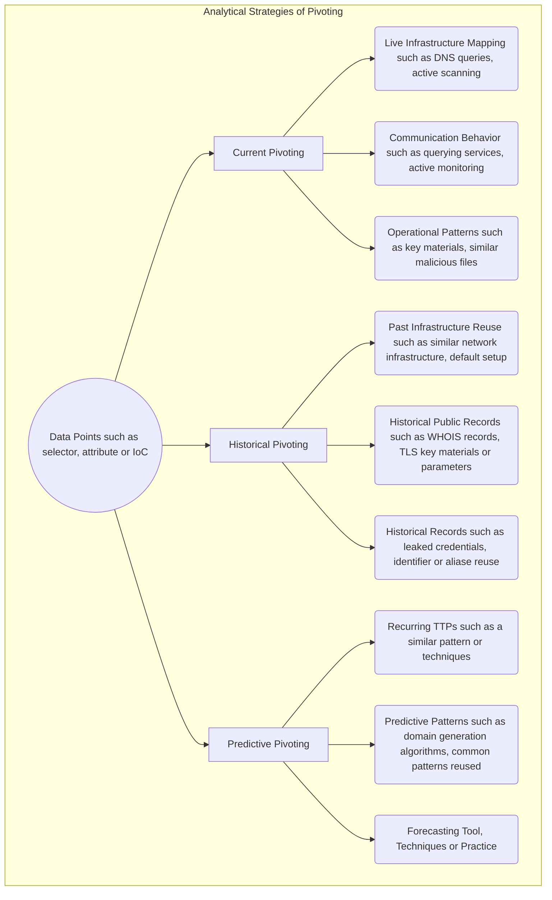

# The Art of Pivoting - Techniques for Intelligence Analysts to Discover New Relationships in a Complex World

This book explores how intelligence and cyber-security analysts can uncover hidden links between threat actor infrastructure and ongoing investigations by pivoting on both classic and unconventional indicators — many of which are often overlooked. The material is grounded in empirical, field-tested strategies used in cyber-security, digital forensics, cyber threat intelligence, and intelligence analysis more broadly.

Our goal is to provide analysts with a practical toolkit of analytical methods, supported by real-world examples, to enhance investigative workflows without locking them into a single mindset, strict model, or overly rigid technical strategy. Instead, the book encourages creative exploration, data-driven reasoning, and the use of diverse data points — from traditional IOCs to subtle metadata traces — as part of a flexible and repeatable analytical process.

The approach presented throughout this book is intentionally built upon open-source tooling, most notably the MISP threat intelligence platform and the AIL Project. By relying on transparent and widely adopted tools, every technique described here can be reproduced, validated, and reused by analysts, researchers, educators, or incident response teams. This ensures that the methodology is not theoretical or proprietary, but openly verifiable, community-driven, and designed to evolve. The book itself follows the same philosophy: it is an open, living document, publicly versioned, and contributions are [welcomed directly via Git](https://github.com/adulau/the-art-of-pivoting). Readers are encouraged to experiment, improve, and extend the content, making the entire workflow repeatable, auditable, and collaborative within the wider defensive security community.

## Definition and the So-Claimed “Theory”

Before diving into practical techniques and real-world investigations, it is useful to clarify the language and concepts that form the backbone of pivot-based analysis. In threat intelligence, many terms are borrowed from other disciplines — statistics, social networks, cryptography, digital forensics — and are sometimes used informally or inconsistently. This chapter provides supporting definitions tailored for operational analysts, not academic theorists.

The goal is not to impose a rigid theoretical model, but to build a common vocabulary that helps explain how we move from isolated observations to connected intelligence. Terms such as *data points*, *correlation*, and *pivoting* are defined in a way that reflects how analysts actually use them in the field. We also introduce the “Six Degrees” perspective to illustrate why small signals can lead to surprising discoveries.

This section therefore acts as a lightweight theory chapter — just enough structure to explain the logic behind the techniques, without restricting the creativity or intuition that make pivoting effective in practice.

### Data Points

In this book, we use the term **data points** to describe any discrete element that can support correlation or pivoting during threat intelligence analysis. A data point may be a traditional indicator such as an IP address, domain, or file hash, observables at large but it can also include less conventional digital artifacts like cookie names, QR codes, favicon hashes, HTTP header sequences (HHHash), DOM structure, or Marketing Analytics tracking codes. Treating all of these elements uniformly as data points is useful because it avoids assuming that only strong or traditional indicators are relevant. Even weak or unexpected data points can become valuable when combined through composite correlation. In practice, pivoting is the act of moving from one data point to another through inferred or observed relationships, while correlation is the process of identifying those relationships. 

This terminology provides a neutral and flexible way to reason about diverse signals extracted from tooling (such as AIL and MISP) during infrastructure and threat actor analysis.

### Correlation

**Correlation** is the analytical process of identifying relationships between two or more data points. In threat intelligence, correlation helps determine whether separate observations — such as domains, certificates, HTTP headers, file hashes, or behavioral artifacts — may belong to the same actor, campaign, or infrastructure cluster. A single correlation does not always imply attribution, but it provides evidence that two elements share a meaningful connection, such as technical similarity, shared metadata, deployment patterns, or operational reuse. Correlation is often iterative and multi-layered: weak signals can become valuable when combined, and composite correlations frequently reveal links that are not visible through traditional indicators alone.

**Correlation** can be *automatic*, *manual*, or a combination of both.

#### Automatic Correlation

**Automatic correlation** is performed by tools and platforms using predefined rules, heuristics, or algorithms. Systems such as MISP automatically correlate data points by comparing attributes across datasets, events, or objects. This may rely on:

- Exact matches (e.g. identical hashes, domains, IPs, certificates fingerprints)
- Similarity or fuzzy matching (e.g. SSDEEP, TLSH, DOM structure, favicon hashes)
- Group-based logic (e.g. shared CIDR ranges, ASNs, hosting providers)
- Behavioral or structural fingerprints (e.g. HTTP header hashes, cookie names)

Automatic correlation can occur at different moments in the lifecycle of data:

- At ingestion time, when new data points are first introduced into a system and immediately compared against existing knowledge.
- Continuously or periodically, when correlation engines are re-run as datasets grow, algorithms improve, or historical context changes.

This continuous nature is important: correlation is not a one-time action. A data point that appeared insignificant at ingestion may become meaningful weeks or months later when additional context emerges.

Automatic correlation excels at scale and speed. It ensures consistency, repeatability, and broad coverage across large volumes of data. However, it operates strictly within the boundaries of what is encoded in rules and algorithms and can therefore generate false positives or noisy correlations, especially when weak or high-entropy data points are involved. This analytical noise can become a burden for analysts, requiring manual validation, contextual filtering, and prioritization to separate meaningful relationships from coincidental ones.

#### Manual and Human-Driven Correlation

Not all correlation can—or should—be automated. **Manual correlation** is performed by analysts who interpret data points using experience, intuition, and contextual understanding that may not be formally captured in systems.

This includes:

- Analytical reasoning based on investigative context
- Pattern recognition across disparate sources
- Hypothesis-driven linking of weak or unconventional signals
- Correlation derived from **HUMINT**, open-source research, linguistic cues, or cultural knowledge
- Insights gained without reliance on external tooling, or by combining outputs from multiple tools mentally rather than mechanically

Manual correlation often explains *why* two data points are related, not just *that* they are related. It is also a key mechanism for improving the overall quality of correlation by validating, refuting, or refining relationships produced by automated systems. By applying contextual understanding, investigative judgment, and external knowledge, analysts can filter out false positives and analytical noise generated by large-scale automatic correlation. In doing so, manual correlation frequently introduces new and more precise pivot paths that automated systems cannot anticipate or model.

#### Correlation as an Iterative Process

Correlation is not binary and not definitive. A single correlation does not imply attribution, ownership, or intent. Instead, it represents **a hypothesis supported by evidence**, whose strength increases as additional, independent correlations accumulate.

In practice, effective pivoting relies on the interplay between:

- Automated correlation to surface candidate relationships at scale
- Human analysis to interpret, contextualize, and validate those relationships

Correlation therefore sits at the core of pivoting: it is both a computational process and a cognitive one. Without correlation, pivoting is blind exploration. With correlation—especially when automated and human-driven approaches reinforce each other—pivoting becomes a structured, explainable, and repeatable analytical method.

> :brain: If you design a threat intelligence platform or system that supports correlation, it is essential to support both automatic and manual correlation. Equally important is the ability to clearly distinguish between these two types and to allow analysts to trace back how a correlation was established. Being able to identify whether a relationship was generated by an algorithm, a rule, or human analysis helps analysts assess confidence, understand potential bias or noise, and make informed decisions when pivoting. In MISP, this distinction is implemented explicitly: automatic correlation and analyst-driven data relationships are handled as separate concepts. Correlations are generated by the system based on matching or similarity algorithms, while data analyst relationships represent intentional, contextual links created and validated by humans.

### Pivoting

**Pivoting** is the investigative action of moving from one known data point to another in order to expand knowledge about a threat actor, infrastructure, or campaign. After correlation reveals that two elements are linked, pivoting uses that link as a new starting point, allowing analysts to continue exploring outward in successive steps. For example, an analyst may begin with a domain, pivot to an IP address that hosts it, then pivot again to other domains hosted on the same server, or even to additional services that share a specific favicon hash, certificate, or cookie name. Pivoting is therefore an exploratory process: it transforms isolated observations into a growing graph of related data points and can uncover infrastructure or behavior that would remain hidden if indicators were examined in isolation.

The term *pivoting* can be confusing because it is used in two different contexts. In cyber defence and threat intelligence, pivoting refers to the analyst’s process of moving from one data point to another to uncover related infrastructure, identities, or activity. This is entirely separate from the attacker’s use of “pivoting,” which typically means lateral movement inside a compromised network. This book focuses exclusively on the defender’s perspective: pivoting as an investigative method for expanding knowledge, not as an adversarial technique for gaining additional access. However, the techniques used by attackers to pivot inside a compromised network can themselves become valuable data points for defenders. Traces of lateral movement — such as reused credentials, tunneling tools, shared SOCKS proxies, or staging servers — often leave forensic or network artifacts that can be extracted, correlated, and used as data points.
  
### Pivot

A pivot itself is **not** a data point. A data point is a discrete element — such as a domain, certificate, cookie name, or hash — that can be compared, correlated, or stored. A pivot, on the other hand, is the investigative action of moving from one data point to another after discovering a relationship. The pivot is the step in the process, not the object being analyzed.

In practice:

- The **domain** is a data point.
- The **shared TLS certificate** is another data point.
- Moving from the domain to the certificate and then to other domains using the same certificate is the **pivot**.

So, a pivot is the *movement across relationships*, whereas a data point is the *thing being related*. Without data points, pivoting is not possible — but a pivot cannot be seen as a data point itself.

### Six Degrees of Separation (Kevin Bacon Concept)

The concept of **Six Degrees of Separation** suggests that any two individuals in the world are connected through a short chain of relationships — typically no more than six steps. Popularized in social network theory and later known through the “Kevin Bacon game,” it demonstrates how large, complex networks can still produce surprisingly short paths between seemingly unrelated actors. Similar concepts exists in academic contexts as the ”Erdos number,” which measures how many co-authorship links separate a researcher from the mathematician Paul Erdos.

In cyber threat intelligence, the same idea applies to infrastructure and data points. A single indicator — such as a domain, cookie name, or TLS certificate — may appear isolated. However, when connected through successive correlations, it may lead to a different server, a shared service provider, a reused attack toolkit, or a specific actor’s operational mistake. Although each step may seem small, multiple pivots can reveal links that are not obvious when indicators are viewed alone.

This is why pivoting matters: it transforms a flat list of IOCs into a graph of relationships. Once correlations accumulate, even distant nodes may become connected within only a few steps, showing that many threat infrastructures are not as independent or hidden as they appear. The Six Degrees concept provides a useful mental model for understanding how hidden relationships emerge in large-scale intelligence data.

## The Practice of Pivoting

### Evolution of Pivoting Practices

Early pivoting techniques in threat intelligence were straightforward and deterministic: if two artifacts shared an exact value — the same IP address, file hash, email, or domain — they were assumed to be related. This model worked well when threat actors made simple operational mistakes or reused infrastructure without modification. A perfect match was enough to connect two samples, two campaigns, or two servers.

As adversaries became more fragmented and distributed, perfect matches grew rarer. Infrastructure is now dynamic, rapidly deployed, and often disposable. Servers change IPs, phishing kits are rebranded, domains rotate and are shared among TA, and payloads are customized. In this environment, single indicators can lose value sometime, and analysts must rely on additional signals.

Modern pivoting therefore focuses on *composite correlation* — combining multiple weak or partial data points to reveal a relationship that no single indicator could confirm on its own. A favicon hash may mean little, but paired with a shared Google Analytics ID, a similar DOM structure, or identical cookie names, it becomes meaningful. Clustering techniques push this even further by grouping infrastructure based on patterns, similarity scoring, or behavioral fingerprints, rather than exact matches.

This chapter explores the full spectrum of pivoting methods, from simple one-to-one links to complex, multi-layered correlations that uncover relationships even when adversaries attempt to hide or fragment their infrastructure.

### Exact Match Correlation

The most fundamental form of pivoting is based on **exact match correlation**, where two data points are linked because they share the same value. In MISP, this happens automatically: if two attributes contain the same hash, IP address, domain name, email address, filename, or other indicator, the platform correlates them.

The strength of this method depends entirely on the **type of data point** being compared. Some exact matches are **strong** signals:

- IP address
- Cryptographic file hashes (SHA-256, SHA-1, MD5)
- Unique TLS certificate fingerprints
- PGP key fingerprints

If two events contain the same SHA-256 hash, it is almost certain they refer to the same binary. These cryptographic hash values have an extremely low false-positive rate.

Other exact matches are **weak** signals because the values are generic, widely reused, or trivial to change:

- Filenames such as `invoice.pdf` or `update.exe`
- Common User-Agent strings
- Generic email subjects

These can produce a high number of correlations that are technically correct, but not meaningful. In other words, **exact match correlation is not fragile — it is simply more prone to false positives when the underlying data point is weak**. The advantage is that these false positives are usually easy to spot, because the context around the match (campaign, infrastructure, malware family) often doesn’t align.

Exact match correlation is therefore an essential first step: fast, deterministic, and ideal when strong indicators exist. But it cannot stand alone. In some cases, the **number of exact matches** becomes a clue in itself. An indicator that correlates with a very large volume of unrelated events often signals a potential false positive. For example, an IP address used as a sinkhole may appear in hundreds of malware reports without indicating any shared operator, and multi-homed infrastructure observed through passive DNS may link to a wide set of unrelated hostnames. In these situations, the explosion of matches is less a sign of strong correlation and more a warning that the data point is too generic to support attribution.

### Fuzzy Matching Correlation

Once exact matching has exhausted its value, analysts often turn to **fuzzy matching correlation**. Instead of requiring two data points to be identical, fuzzy matching looks for *similarity*. Tools such as **SSDEEP**, **TLSH**, or **sdhash**[^sdhash] generate similarity hashes that allow analysts to connect files or payloads that share overlapping content, embedded resources, compiler artifacts, or packer stubs.

Fuzzy correlation is especially useful when adversaries produce many variants of the same malware family, or when a phishing kit is redeployed with small modifications. Two PE files that differ in signatures, strings, or timestamp can still score highly in TLSH or SSDEEP, revealing a relationship that exact match correlation would miss.

However, fuzzy matching must be treated with caution. **Increasing sensitivity increases false positives.** Many Windows executables share the same icons, version resources, or packer signatures, which can inflate similarity scores without implying a common operator or campaign. It is common in malware analysis to see large clusters of binaries that look “similar” but are operationally unrelated. For this reason, fuzzy matching should guide investigation, not conclude it: it generates hypotheses and leads, not attribution on its own.

### Group-Based Correlation

A related technique is **group-based correlation**, where data points are clustered based on shared infrastructure or logical grouping rather than identical values. The most common example in MISP is **CIDR correlation**: if multiple malicious domains or IPs fall within the same network range, they may belong to the same operator, hosting provider, or automated deployment.

Group correlations help surface weak signals that would otherwise remain hidden. Even if each IP address appears only once, their presence in a suspicious subnet can indicate shared provisioning, bulletproof hosting, or coordinated activity. Time-based grouping, certificate reuse within a range, or shared ASN ownership can reinforce the signal further.

But as with fuzzy matching, **group correlation can easily become too broad**. Large providers or cloud platforms host thousands of unrelated customers; passive DNS may show hundreds of benign domains sharing the same /24. When correlation returns *everything*, it stops being useful. Analysts can end up trapped in wide clusters that look meaningful but offer little investigative value.

Fuzzy and group-based correlations therefore extend the pivoting process beyond perfect equality. They are most effective when combined with context or layered with other data points — for example, when a CIDR match is reinforced by shared TLS certificates, similar DOM structure, or common malware resources. Just like exact matching, these techniques are valuable tools, but they must be interpreted carefully: the more inclusive the rule, the greater the analyst’s responsibility to validate the result rather than assume it.

### Analytical Strategies of Pivoting

Pivoting can also be thought of across different points in time: **current**, **historical**, and **predictive**.

DNS is a good example of how all three can apply.  

- **Current pivoting** looks at live DNS records. When an analyst resolves a hostname, the returned IP address represents the state of the infrastructure at the exact moment of analysis.  
- **Historical pivoting** examines how that hostname resolved in the past, using sources such as [Passive DNS](https://www.circl.lu/services/passive-dns/). This can reveal previous hosting providers, older campaigns, sinkholes, or infrastructure that has since been abandoned.  
- **Predictive pivoting** appears in more advanced cases. Domain Generation Algorithms (DGAs) can compute future domains based on time or seed values, meaning some malicious domains exist mathematically before they ever appear in DNS. By generating or monitoring these future domains, analysts can pivot forward in time and anticipate infrastructure before it becomes active.

This time-based perspective highlights that pivoting is not limited to a single snapshot. Infrastructure evolves, and useful intelligence emerges when current, historical, and potential future states are analysed together.

## Rethinking Pivoting: From Strong Indicators to Unintended Traces

Pivoting is often described as an investigative art, but the goal is to shape it into a more reproducible and practical discipline, one that any analyst can apply methodically rather than intuitively. However, the way we think about pivoting is sometimes constrained by rigid models or inherited practices that no longer reflect how modern adversaries operate. Frameworks like the Pyramid of Pain are useful, but they deserve to be re-examined: how hard is it really for threat actors to alter an indicator, and which indicators do they ignore entirely?

The reality is that attackers do not always understand the traces they leave behind, nor do they reliably anticipate the intelligence value of those traces. A well-known example is the *[Anna-Senpai](https://web.archive.org/web/20190107084715/http://fortune.com/2017/12/13/%E2%80%AA%E2%80%AAmirai%E2%80%AC-%E2%80%AAbotnet%E2%80%AC-cybercrime-doj/)* case behind the Mirai botnet. The malware itself contained no strong identifying indicators that linked directly to the author, and much of its infrastructure was transient and intentionally disposable. Yet a small, seemingly irrelevant artifact—the reuse of the *Anna-Senpai* alias across unrelated online posts—became a pivot point that investigators followed across forums, leaked credentials, and historical activity. That weak signal, when correlated with other data points, eventually contributed to unmasking the individuals involved. 

This illustrates a core principle of modern pivoting: even minor or disconnected artifacts can become powerful intelligence when correlated across time, platforms, and context. The evolution of pivoting lies not in abandoning classical models, but in refining how we interpret traces—especially the ones that attackers assume are meaningless.

### The Danger of Single-Model Reasoning

Models like the Pyramid of Pain are valuable for teaching, but they can become restrictive if treated as absolute truth. The assumption that “high-value indicators are hard to change” encourages analysts to prioritize TTPs, certificates, cryptographic hashes, or infrastructure identifiers, while disregarding weaker signals. In reality, modern adversaries routinely automate or outsource the rotation of high-value indicators: cloud instances are redeployed in seconds, TLS certificates are regenerated for free, and containerized command-and-control servers can be destroyed and rebuilt faster than defenders can react.

At the same time, low-entropy or unconventional indicators often become the most revealing. Reused cookie names, favicons, Google Analytics identifiers, forum nicknames, vanity onion prefixes, or repeated API paths are frequently left untouched. These elements do not appear at the top of any model, yet they provide persistent and highly effective pivot points—because attackers do not consider them “indicators” worth hiding.

In short, **strict adherence to a single model introduces blind spots**. The real world rewards flexible analysis, composite correlation, and attention to the traces adversaries ignore or disregard.

### Re-evaluating Our Indicator Collection and Pivoting Practices

Within the AIL project, we collect data from a wide range of sources: social networks, Tor hidden services, criminal forums, paste sites, and web infrastructure commonly used by threat actors. To make sense of this diversity, we built a dynamic correlation engine that allows new object types to be introduced easily. Instead of restricting analysis to a fixed list of traditional indicators, the system can correlate emerging artifacts such as QR codes, cookie names, HTTP header hashes, or vanity onion prefixes.

This required a deliberate change in mindset. Rather than treating established indicators as the primary source of truth, we began to focus on outliers and overlooked data points—elements attackers rarely consider significant, and therefore rarely bother to obfuscate. In the process, some of our older assumptions had to be challenged or discarded. What was once considered noise often turned into strong investigative leads when combined with other weak signals. By shifting from a rigid interpretation of indicators to a more exploratory, data-driven approach, we uncovered relationships that would have remained invisible using traditional practices.

This shift also changed how analysts think: instead of asking which indicators matter most, we now ask which indicators adversaries fail to hide. This perspective becomes essential as we move into composite correlation and clustering techniques, where weak signals converge into strong intelligence.

### Looking at “Broken” Indicators and Still Using Them

Some indicators are known to be imperfect, yet remain surprisingly effective in real investigations. MurmurHash3, for example, is still widely used for favicon correlation. A single MMH3 hash can quickly reveal Tor hidden services that are also exposed on the clear web, allowing analysts to pivot across seemingly unrelated infrastructure with minimal effort.

If MurmurHash3 is known to be flawed, why continue using it? Because even with weaknesses and potential collisions, it works—and more importantly, attackers rarely consider favicons to be meaningful intelligence artifacts. Many copy the same web assets across panels, icons on webshell, custom css, phishing kits, and darknet storefronts without modification, leaving behind reliable pivot points.

There is an additional twist: when threat actors deliberately attempt to manipulate or collide favicon hashes, those collisions themselves become useful signals. Correlating clusters of colliding favicons can reveal common tooling, shared deployment scripts, or copied infrastructure. In other words, a “broken” indicator can still produce strong intelligence, either because adversaries ignore it, or because their attempts to evade it create new patterns worth pivoting on. Stopping the calculation of such hashes would simply remove a cheap and surprisingly effective investigative tool.

#### Combining Weak and Strong Data Points for Pivoting

The continued use of seemingly weak data points, like MurmurHash3 (MMH3) for favicons or even simple MD5[^collision-md5] file hashes, is justified when they are understood as correlation point rather than definitive attribution artifacts. The key is to integrate them strategically with strong data points within a structured pivoting workflow.

Weak data points are often the initial starting point for an investigation (e.g., A single alone MD5 hash from a security alert). They excel at quickly casting a wide net to find clusters of potentially related infrastructure or activity. Their low interest in threat intelligence practice and tendency for adversaries to ignore them make them ideal for the initial discovery phase.

> :brain: If you design a Threat Intelligence database or storage model, be sure to include a schema that accommodates a diverse array of data points, including those categorized as weak data points (e.g., MMH3, MD5, cookie names). A robust model must treat all data points as correlatable objects, ensuring that initial investigations can effectively use high-volume, low-cost signals for breadth pivoting before confirming connections with high-fidelity, strong data points.

## The Value of Uncommon Data Points

Uncommon data points, which you define as data points that fall outside the traditional set (IPs, domains, file hashes), are extremely interesting and valuable in the Cyber Threat Intelligence (CTI) process because they exploit **two key operational weaknesses of threat actors: neglect and reuse**.

### Mindset Shift: From Perfection to Pragmatism

The traditional CTI process often focuses on strong data points (e.g., high-entropy unique hashes) that promise low false positives. However, this perspective is sometimes clouded by rigid models or legacy practices.

- Challenging Assumptions: We must reconsider our reliance on models like the Pyramid of Pain and critically assess how difficult it truly is for adversaries to alter high-value indicators. Do threat actors always realize which traces they leave behind, and can they accurately gauge the intelligence value of what they expose?
- The Power of Outliers: A successful pivot often comes from focusing on outliers and overlooked data points. These artifacts are often simple, easy to extract, and offer a low-cost way to establish correlation.
- Imperfect is Not Useless: Even outdated or colliding indicators can still provide valuable correlations. The flaw of the indicator is irrelevant if the adversary neglects to change it.

#### Why Uncommon Data Points Are Effective

Uncommon data points are effective precisely because threat actors do not consider them meaningful intelligence artifacts. This neglect turns them into silent, high-utility fingerprints.

- Neglected Fingerprints: When threat actors copy the same web assets across phishing kits, darknet storefronts, or operational panels, they rarely think to modify innocuous files like favicons. A simple MurmurHash3 on a favicon enables quick hash-based pivoting to uncover related infrastructure, such as Tor hidden services exposed on the clear web.
- Operational Reuse: Simplicity and operational efficiency often lead to the reuse of metadata or infrastructure-specific artifacts.
   - HTTP Header Hashing (HHHash)[^hhhash]: HTTP (version 1) response headers can act as subtle fingerprints for linking threat infrastructure.
   - Cookie Names: Custom or reused cookie names can serve as low-noise data points for linking attacker-controlled web infrastructure.
   - Embedded Analytics: Despite the assumption that threat actors avoid including labels that could link their infrastructure , services like Google Analytics tracking codes are often reused across multiple malicious sites, revealing unexpected and meaningful correlations.
- Visual and Structural Clues: Non-traditional image and structure analysis introduces entirely new pivot points:
   - Structural Hashing: The `dom-hash` algorithm clusters Tor Hidden Services based on simple HTML structure, yielding excellent results in structural similarity detection.
   - Extracted Data: QR codes are increasingly seen on social networks and ransomware negotiation pages, providing embedded data points. Barcodes have proven to be valuable correlation points in social media and data leaks.
   - Vision Models: Vision-language models can automatically generate descriptions of collected images (e.g., from social networks or screenshots), allowing investigators to correlate on terms, keywords, or objects identified in the images.

#### The Power of Composite Correlation

The real strength of uncommon data points lies in composite correlation, their ability to connect elements when strong indicators fail.

- A single weak data point may be noisy, but when combined with others, it creates a unique, high-confidence cluster. For example, a Google Analytics ID alone may not prove attribution, but when combined with a specific favicon hash or dom-hash, they help cluster infrastructure belonging to the same threat actor.
- This approach is key to pivoting, which is the investigative action of moving from one known data point to another to expand knowledge about a threat. It transforms isolated observations into a growing graph of related data points.

By expanding our collection to include these unconventional data points, we can achieve deeper insights and better threat discovery.

## Origin of the Book

This book began life as a presentation at the [2025 FIRST Cyber Threat Intelligence Conference](https://www.first.org/conference/firstcti25/program#pThe-Art-of-Pivoting-How-You-Can-Discover-More-from-Adversaries-with-Existing-Inf) held in Berlin (April 21-23, 2025). From the plenary stage, the theme “The Art of Pivoting” resonated with analysts, threat-intelligence practitioners, and incident-response teams alike: how to discover more from adversaries using existing information. Inspired by the lively exchange of ideas and the collaborative spirit of the conference, the authors decided to expand the talk into a full-length guide.

While the presentation’s narrative was time-limited, the ambition of this book is broader. It preserves the pragmatic, analyst-oriented tone of the original session yet adds depth, case studies, workflows, and open-source tooling (such as MISP and the AIL Project) to support repeatable investigation. Above all, it remains an open, living document—rooted in the same community-driven ethos that brought the Berlin event together.

[^sdhash]: [https://github.com/sdhash/sdhash](https://github.com/sdhash/sdhash) [Evaluating Similariy Digests: A Study of TLSH, ssdeep, and sdhash Against Common File Modifications](https://dzone.com/articles/similarity-digests-tlsh-ssdeep-sdhash-benchmark) shows the diversity of similary digests/fuzzing hashing and the difficulty to find the perfect one even for a single task such as classifying malware binaries.
[^collision-md5]: [Fast Collision Attack on MD5](https://eprint.iacr.org/2006/104) presents an improved attack algorithm to find two-block collisions of the hash function MD5.
[^hhhash]: [HTTP Headers Hashing (HHHash) or improving correlation of crawled content](https://www.foo.be/2023/07/HTTP-Headers-Hashing_HHHash) which facilitates the hashing of similar returned HTTP headers.
