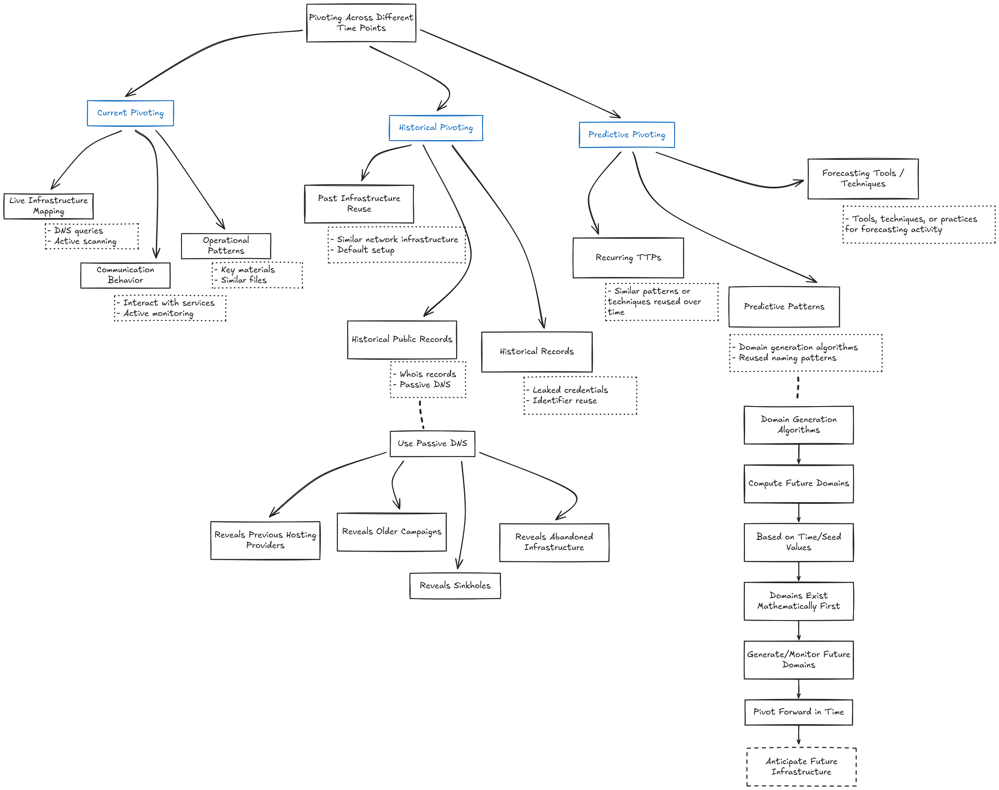

# ピボットの技術 - 複雑な世界で新たな関係性を発見するためのインテリジェンス分析官向け手法

本書は、インテリジェンス分析官やサイバーセキュリティ分析官が、従来型および非従来型の指標（その多くはしばしば見過ごされる）にピボットすることで、脅威アクターのインフラストラクチャと進行中の調査の間の隠れたリンクをどのように発見できるかを探求します。本書の内容は、サイバーセキュリティ、デジタルフォレンジックス、サイバー脅威インテリジェンス、そしてより広範なインテリジェンス分析において使用される実証的で実地検証済みの戦略に基づいています。

私たちの目標は、分析官に実践的な分析手法のツールキットを提供することです。実世界の例に裏打ちされ、単一の思考パターン、厳格なモデル、または過度に硬直した技術戦略に縛られることなく、調査ワークフローを強化します。むしろ、本書は創造的な探索、データ駆動型の推論、そして従来のIoCから微妙なメタデータの痕跡まで、多様なデータポイントの使用を、柔軟で再現可能な分析プロセスの一部として奨励します。

本書全体を通じて提示されるアプローチは、意図的にオープンソースツールに基づいて構築されています。特に[MISP脅威インテリジェンスプラットフォーム](https://misp-project.org/)と[AILプロジェクト](https://ail-project.org/)が挙げられます。透明で広く採用されているツールに依存することで、ここで説明されているすべての手法は、分析官、研究者、教育者、またはインシデント対応チームによって再現、検証、再利用できます。これにより、方法論が理論的または専有物ではなく、公開検証可能で、コミュニティ主導であり、進化するように設計されていることが保証されます。本書自体も同じ哲学に従います。オープンな生きた文書であり、公開版管理[^versioned]であり、貢献は[Git経由で直接歓迎](https://github.com/adulau/the-art-of-pivoting)されます。読者は実験、改善、コンテンツの拡張を奨励され、より広範な防御セキュリティコミュニティ内でワークフロー全体を再現可能、監査可能、協力的にします。

## 定義と「理論」と称されるもの

実践的な手法と実世界の調査に深入りする前に、ピボットベースの分析の基盤を形成する言語と概念を明確にすることは有用です。脅威インテリジェンスでは、多くの用語が他の分野（統計学、ソーシャルネットワーク、暗号学、デジタルフォレンジックス）から借用されており、非公式または一貫性なく使用されることがあります。この章では、学術理論家ではなく、運用分析官向けに調整された支援的な定義を提供します。

目標は、厳格な理論モデルを押し付けることではなく、孤立した観察から接続されたインテリジェンスへとどのように移動するかを説明するのに役立つ共通の語彙を構築することです。*データポイント*、*相関*、*ピボット*などの用語は、分析官が実際に現場で使用する方法を反映するように定義されています。また、小さなシグナルが驚くべき発見につながる理由を説明するために、「六次の隔たり」の視点も紹介します。

したがって、このセクションは軽量な理論章として機能します。手法の背後にある論理を説明するのに十分な構造を持ちながら、ピボットを実践で効果的にする創造性や直感を制限しません。


### データポイント

本書では、**データポイント**という用語を使用して、脅威インテリジェンス分析中に相関やピボットをサポートできる任意の離散要素を説明します。データポイントは、IPアドレス、ドメイン、ファイルハッシュなどの従来の指標、一般的な観測可能要素である場合もありますが、クッキー名、QRコード、ファビコンハッシュ、HTTPヘッダーシーケンス（HHHash）、DOM構造、マーケティング分析トラッキングコードなどの従来型ではないデジタルアーティファクトも含むことができます。これらの要素をすべてデータポイントとして均一に扱うことは有用です。なぜなら、強力または従来の指標のみが関連していると仮定することを避けることができるからです。弱いまたは予期しないデータポイントでさえ、複合相関を通じて組み合わせると価値のあるものになる可能性があります。実際には、ピボットは推論または観察された関係を通じて1つのデータポイントから別のデータポイントへ移動する行為であり、相関はそれらの関係を識別するプロセスです。

この用語は、インフラストラクチャと脅威アクターの分析中にツール（AILやMISPなど）から抽出された多様なシグナルについて推論するための、中立的で柔軟な方法を提供します。

#### MISPにおけるデータポイント：属性と実行可能性

MISP標準データモデル[^misp-standard]では、本書が*データポイント*と呼ぶものは**[属性](https://www.misp-standard.org/rfc/misp-standard-core.html#section-2.3)**として表現されます。

MISPの属性は、コンテキストに応じて異なる目的に役立つ可能性のある型付き値（例：ドメイン、IPアドレス、ファイル名、ハッシュ、クッキー名）です。重要なことに、MISP属性には**実行可能フラグ**が含まれており、一般的に**IDSフラグ**[^history-ids-flag]と呼ばれます。

- IDSフラグが**設定されていない**場合、属性は情報提供またはコンテキスト的なものです。相関、エンリッチメント、分析官の推論、または履歴分析をサポートする場合があります。
- IDSフラグが**設定されている**場合、属性は検出または防止に適していると見なされ、侵入検知システム、ファイアウォール、またはセキュリティ制御にエクスポートできます。

実際には、これは*同じデータポイント*が時間の経過とともに進化できることを意味します。コンテキスト属性は、その関連性、信頼性、または検出ロジックが確立されると、後で実行可能になる可能性があります。

この区別により、MISPは分析官にすべてのデータポイントを侵害指標（IoC）として早急にラベル付けすることを強制することなく、**分析**と**運用**の両方をサポートできます。

#### 指標とIoC：データポイントのサブセット

多くのセキュリティコンテキストでは、**侵害指標（IoC）**という用語は、検出または対応に直接使用できるデータを説明するために使用されます。本書の概念モデル内では：

> IoCは、**実行可能になったデータポイント**です。

MISPの用語では、これは通常、IDSフラグが有効になっている属性に対応します。すべてのデータポイントがIoCであるわけではありませんが、多くのIoCは、検証、コンテキスト化、運用化される前に、通常のデータポイントとして始まります。

#### STIXにおけるデータポイント：指標と観測可能要素

[STIX標準](https://docs.oasis-open.org/cti/stix/v2.1/errata01/stix-v2.1-errata01.html)では、用語は異なりますが、基本的な概念は類似しています。

- **STIX Indicator**オブジェクトは実行可能な検出ロジックを表し、したがってIoCの概念に密接に整合します。
- IDSフラグ*なし*でMISP属性として表現される多くの要素は、STIXでは指標ではなく、**観測データ**、**観測可能要素**、または支援オブジェクトとしてモデル化されます。

その結果、MISPが単一の概念（オプションの実行可能性を持つ属性）として扱うものは、STIXでは意図された用途に応じて複数のオブジェクトタイプに分割されます。この違いは、分析的な不一致ではなく、設計哲学を反映しています。

#### ピボットにとってこの区別が重要な理由

ピボットベースの分析では、*存在*と*実行可能性*を混同しないことが重要です。

- すべてのデータポイントをIoCとして扱うと、ノイズ、偽陽性、脆弱な検出につながります。
- データポイントを中立的な構成要素として扱うことで、より広範な相関、探索、仮説生成が可能になります。

**データポイント**を主要な概念単位として使用することで、本書はピボットが観察と関係発見から始まることを強調します—検出ではありません。実行可能性は分析の結果であり、前提条件ではありません。

この視点により、分析官は非従来型、弱い、またはコンテキスト的な要素を調査に組み込むことができ、適切な場合に運用化への明確なパスをサポートします。

#### セレクター：インテリジェンスコミュニティの用語

インテリジェンスコミュニティ（IC）では、**セレクター**という用語には特定の確立された意味があります。セレクターは、ターゲット、エンティティ、またはアクティビティに関連する情報を**識別、フィルタリング、タスク化、または取得するために使用されるデータポイント**です。セレクター自体はインテリジェンスではありません。むしろ、分析官とシステムが関連するデータストリームにアクセスできるようにする*ハンドル*です。

実際には、*セレクター*という用語は、分析的解釈ではなく**運用使用**を強調します。セレクターは、クエリ、監視、タスク化、またはピボットできるものです。

セレクターは、**特異性と信頼性**に基づいて非公式に分類されることがよくあります：

- **強力なセレクター**は、単一のエンティティまたはアクティビティを一意かつ一貫して識別します。偽陽性率が低く、信頼性が高い傾向があります。
  - 例：暗号化ファイルハッシュ、一意のアカウント識別子、特定のメールアドレス。
- **ソフトセレクター**は、より具体的ではなく、複数のエンティティまたはコンテキストを参照する場合があります。ノイズの影響を受けやすいですが、収集が容易で、発見に対してより柔軟です。
  - 例：一般的なユーザー名、共有ホスティングからのIPアドレス、汎用ファイル名、言語パターン。

この区別は、本書全体で議論されている弱い対強いデータポイントの概念を反映しています。強力なセレクターは確認と正確な追跡に有用ですが、ソフトセレクターは**探索、クラスタリング、仮説生成**に優れています。

ピボットベースの分析では、セレクターは**関係のグラフへのエントリーポイント**として機能します。単一のセレクターは複数の関連データポイントにつながる可能性があり、それらは後続のピボットでセレクター自体になります。

重要なことに、セレクターは有用であるために強力である必要はありません。本書で説明されている多くの一般的でないデータポイント（クッキー名、DOM構造ハッシュ、ファビコンハッシュ、画像から抽出されたテキストなど）は、*ソフトセレクター*として理解できます。それらの価値は一意性ではなく、他のシグナルと組み合わせたときに接続を明らかにする能力にあります。

本書の目的のために、**セレクターは、明示的な運用役割を持つデータポイントのサブセットと見なすことができます**。すべてのセレクターはデータポイントですが、収集、相関、またはピボットを駆動するために使用されるまで、すべてのデータポイントがセレクターであるわけではありません。

この区別は、インテリジェンスコミュニティの用語と脅威インテリジェンスの実践を橋渡しするのに役立ちます：セレクター、指標、観測可能要素、またはデータポイントについて話すかどうかに関わらず、基本的な課題は同じです—どの要素が実行可能か、それらがどれほど信頼できるか、そして意味のある関係を明らかにするためにそれらをどのように組み合わせることができるかを決定することです。

### 相関

**相関**は、2つ以上のデータポイント間の関係を識別する分析プロセスです。脅威インテリジェンスでは、相関は、ドメイン、証明書、HTTPヘッダー、ファイルハッシュ、または行動アーティファクトなどの個別の観察が、同じアクター、キャンペーン、またはインフラストラクチャクラスターに属する可能性があるかどうかを判断するのに役立ちます。単一の相関が常に帰属を意味するわけではありませんが、2つの要素が技術的類似性、共有メタデータ、展開パターン、または運用再利用などの意味のある接続を共有しているという証拠を提供します。相関はしばしば反復的で多層的です：弱いシグナルは組み合わせると価値のあるものになり、複合相関は従来の指標だけでは見えないリンクを頻繁に明らかにします。

**相関**は、*自動*、*手動*、または両者の組み合わせにすることができます。

#### 自動相関

**自動相関**は、事前定義されたルール、ヒューリスティック、またはアルゴリズムを使用してツールとプラットフォームによって実行されます。MISPなどのシステムは、データセット、イベント、またはオブジェクト間で属性を比較することにより、データポイントを自動的に相関させます。これは以下に依存する場合があります：

- 完全一致（例：同一のハッシュ、ドメイン、IP、証明書フィンガープリント）
- 類似性またはファジーマッチング（例：SSDEEP、TLSH、DOM構造、ファビコンハッシュ）
- グループベースのロジック（例：共有CIDR範囲、ASN、ホスティングプロバイダー）
- 行動または構造的フィンガープリント（例：HTTPヘッダーハッシュ、クッキー名）

自動相関は、データのライフサイクルの異なる時点で発生する可能性があります：

- 取り込み時、新しいデータポイントがシステムに最初に導入され、既存の知識と即座に比較される場合。
- 継続的または定期的に、データセットが成長し、アルゴリズムが改善され、または履歴コンテキストが変化するときに相関エンジンが再実行される場合。

この継続的な性質は重要です：相関は一度限りのアクションではありません。取り込み時に重要でないように見えたデータポイントは、追加のコンテキストが出現すると、数週間または数か月後に意味のあるものになる可能性があります。


自動相関は規模と速度に優れています。大量のデータにわたって一貫性、再現性、広範なカバレッジを保証します。ただし、ルールとアルゴリズムにエンコードされた境界内で厳密に動作するため、特に弱いまたは高エントロピーのデータポイントが関与する場合、偽陽性またはノイズの多い相関を生成する可能性があります。この分析的ノイズは分析官にとって負担となり、意味のある関係を偶然の関係から分離するために、手動検証、コンテキストフィルタリング、優先順位付けが必要になります。

> :brain: 自動推論ベースのピボットは、分析プロセスに確率的またはヒューリスティックな推論を導入することにより、従来の相関を拡張します。相関はデータポイント間の観測可能な関係を識別しますが、推論は見えないまたは暗黙の関係について結論を引き出そうとします。この区別は重要です。推論は、注意深く処理しないと、証拠から仮定へと容易に流れる可能性があります。簡単な例がリスクを強調しています：*「猫は水を飲む。私は水を飲む。したがって、私は猫である。」*共有属性（水を飲むこと）は現実ですが、結論は明らかに無効です。これは、相関が事実上正しい場合でも、等価性や因果関係を意味しないことの典型的な例です。脅威分析では、複数の弱いシグナルが共有アクターまたはキャンペーンの確認として扱われる場合、同様の論理的ショートカットが発生する可能性があります。自動推論システムは、出力が分析官によってコンテキスト化または検証されない場合、そのようなエラーを増幅する可能性があります。このため、推論ベースのピボットは、証拠ではなく仮説生成として扱う必要があります。探索する価値のある領域を強調できますが、常に、より強力な指標、コンテキスト理解、および分析官の判断を使用した検証が続く必要があります。責任を持って使用すると、推論は探索的分析を強化します。無批判に使用すると、説得力があるが誤った物語を作成するリスクがあります—単一の相関を見逃すよりもはるかに危険な結果です。


#### 手動および人間主導の相関

すべての相関が自動化できる、または自動化されるべきであるわけではありません。**手動相関**は、システムで正式に捕捉されていない可能性のある経験、直感、コンテキスト理解を使用してデータポイントを解釈する分析官によって実行されます。

これには以下が含まれます：

- 調査コンテキストに基づく分析的推論
- 異なるソース間のパターン認識
- 弱いまたは非従来型のシグナルの仮説駆動リンク
- **HUMINT**、オープンソース研究、言語的手がかり、または文化的知識から派生した相関
- 外部ツールへの依存なしに得られた洞察、または複数のツールからの出力を機械的ではなく精神的に組み合わせることによって得られた洞察


手動相関は、2つのデータポイントが*なぜ*関連しているかを説明することがよくあります。単に*それらが関連している*ことだけではありません。また、自動化されたシステムによって生成された関係を検証、反駁、または改善することにより、相関の全体的な品質を向上させる重要なメカニズムでもあります。コンテキスト理解、調査判断、外部知識を適用することにより、分析官は大規模な自動相関によって生成された偽陽性と分析的ノイズをフィルタリングできます。そうすることで、手動相関は、自動化されたシステムが予測またはモデル化できない新しいより正確なピボットパスを頻繁に導入します。


#### 反復プロセスとしての相関

相関は二元的ではなく、決定的でもありません。単一の相関は帰属、所有権、または意図を意味するものではありません。代わりに、**証拠によって支持される仮説**を表し、追加の独立した相関が蓄積するにつれてその強度が増加します。

実際には、効果的なピボットは以下間の相互作用に依存します：

- 大規模に候補関係を表面化する自動相関
- それらの関係を解釈、コンテキスト化、検証する人間の分析

したがって、相関はピボットの核心にあります：それは計算プロセスと認知的プロセスの両方です。相関なしでは、ピボットは盲目の探索です。相関がある場合—特に自動化されたアプローチと人間主導のアプローチが互いに強化する場合—ピボットは構造化され、説明可能で、再現可能な分析方法になります。

> :brain: 相関をサポートする脅威インテリジェンスプラットフォームまたはシステムを設計する場合、自動相関と手動相関の両方をサポートすることが不可欠です。同様に重要なのは、これら2つのタイプを明確に区別し、分析官が相関がどのように確立されたかを追跡できるようにする能力です。関係がアルゴリズム、ルール、または人間の分析によって生成されたかどうかを識別できることは、分析官が信頼性を評価し、潜在的なバイアスやノイズを理解し、ピボット時に情報に基づいた決定を下すのに役立ちます。MISPでは、この区別は明示的に実装されています：自動相関と分析官主導のデータ関係は、別個の概念として処理されます。相関は、マッチングまたは類似性アルゴリズムに基づいてシステムによって生成され、データ分析官の関係は、人間によって作成および検証された意図的なコンテキストリンクを表します。

### ピボット

**ピボット**は、脅威アクター、インフラストラクチャ、またはキャンペーンに関する知識を拡大するために、1つの既知のデータポイントから別のデータポイントへ移動する調査アクションです。相関が2つの要素がリンクされていることを明らかにした後、ピボットはそのリンクを新しい開始点として使用し、分析官が連続したステップで外側への探索を続けることを可能にします。たとえば、分析官はドメインから始まり、それをホストするIPアドレスにピボットし、次に同じサーバーでホストされている他のドメイン、または特定のファビコンハッシュ、証明書、またはクッキー名を共有する追加のサービスに再度ピボットする場合があります。したがって、ピボットは探索的プロセスです：孤立した観察を関連データポイントの成長するグラフに変換し、指標が単独で検査された場合に隠れたままになるインフラストラクチャまたは行動を明らかにできます。

*ピボット*という用語は、2つの異なるコンテキストで使用されるため、混乱を招く可能性があります。サイバー防衛と脅威インテリジェンスでは、ピボットは、関連するインフラストラクチャ、アイデンティティ、またはアクティビティを発見するために、1つのデータポイントから別のデータポイントへ移動する分析官のプロセスを指します。これは、通常、侵害されたネットワーク内の横方向の移動を意味する攻撃者の「ピボット」の使用とは完全に別個です。本書は防御者の視点にのみ焦点を当てています：知識を拡大するための調査方法としてのピボットであり、追加のアクセスを獲得するための敵対的技術ではありません。ただし、攻撃者が侵害されたネットワーク内でピボットするために使用する技術自体が、防御者にとって価値のあるデータポイントになる可能性があります。横方向の移動の痕跡—再利用された認証情報、トンネリングツール、共有SOCKSプロキシ、またはステージングサーバーなど—は、抽出、相関、データポイントとして使用できるフォレンジックまたはネットワークアーティファクトを残すことがよくあります。
  
### ピボット

ピボット自体は**データポイントではありません**。データポイントは、比較、相関、または保存できる離散要素（ドメイン、証明書、クッキー名、ハッシュなど）です。一方、ピボットは、関係を発見した後に1つのデータポイントから別のデータポイントへ移動する調査アクションです。ピボットはプロセス内のステップであり、分析されているオブジェクトではありません。

実際には：

- **ドメイン**はデータポイントです。
- **共有TLS証明書**は別のデータポイントです。
- ドメインから証明書へ、次に同じ証明書を使用する他のドメインへ移動することは**ピボット**です。

したがって、ピボットは*関係を横切る移動*であり、データポイントは*関連付けられているもの*です。データポイントなしでは、ピボットは不可能です—しかし、ピボット自体をデータポイントと見なすことはできません。

### 六次の隔たり（ケビン・ベーコン概念）

**六次の隔たり**[^six-degrees]の概念または認識は、世界の任意の2人の個人が短い関係のチェーンを通じて接続されていることを示唆しています—通常は6ステップ以下です。ソーシャルネットワーク理論で普及し、後に「ケビン・ベーコンゲーム」を通じて知られるようになったこの概念は、大規模で複雑なネットワークが、一見無関係なアクター間で驚くほど短いパスを生成できることを示しています。同様の概念が学術的コンテキストに存在し、「エルデシュ数」として、研究者を数学者ポール・エルデシュから分離する共著リンクの数を測定します。

サイバー脅威インテリジェンスでは、同じ考えがインフラストラクチャとデータポイントに適用されます。単一の指標—ドメイン、クッキー名、またはTLS証明書など—は孤立しているように見えるかもしれません。ただし、連続した相関を通じて接続されると、異なるサーバー、共有サービスプロバイダー、再利用された攻撃ツールキット、または特定のアクターの運用ミスにつながる可能性があります。各ステップは小さく見えるかもしれませんが、複数のピボットは、指標が単独で表示された場合に明らかではないリンクを明らかにできます。

これがピボットが重要である理由です：IoCのフラットなリストを関係のグラフに変換します。相関が蓄積すると、遠く離れたノードでさえ、わずか数ステップで接続される可能性があり、多くの脅威インフラストラクチャがそれらが現れるほど独立しているか隠されているわけではないことを示しています。六次の隔たりの概念は、大規模なインテリジェンスデータで隠れた関係がどのように出現するかを理解するための有用なメンタルモデルを提供します。

## ピボットの実践

### ピボット手法の進化

脅威インテリジェンスにおける初期のピボット手法は、直接的で決定論的でした：2つのアーティファクトが同じ値（同じIPアドレス、ファイルハッシュ、メール、またはドメイン）を共有している場合、それらは関連していると想定されました。このモデルは、脅威アクターが単純な運用ミスを犯した場合、または変更なしでインフラストラクチャを再利用した場合にうまく機能しました。完全一致は、2つのサンプル、2つのキャンペーン、または2つのサーバーを接続するのに十分でした。

敵対者がより断片化され分散するにつれて、完全一致はより稀になりました。インフラストラクチャは現在、動的で、迅速に展開され、しばしば使い捨てです。サーバーはIPを変更し、フィッシングキットはリブランディングされ、ドメインはローテーションし、TA間で共有され、ペイロードはカスタマイズされます。この環境では、単一の指標は時々価値を失い、分析官は追加のシグナルに依存する必要があります。

したがって、現代のピボットは*複合相関*に焦点を当てています—複数の弱いまたは部分的なデータポイントを組み合わせて、単一の指標では確認できない関係を明らかにします。ファビコンハッシュはほとんど意味がないかもしれませんが、共有されたGoogle Analytics ID、類似したDOM構造、または同一のクッキー名と組み合わせると、意味のあるものになります。クラスタリング技術は、完全一致ではなく、パターン、類似性スコアリング、または行動フィンガープリントに基づいてインフラストラクチャをグループ化することで、これをさらに推進します。

この章では、単純な1対1のリンクから、敵対者がインフラストラクチャを隠そうまたは断片化しようとする場合でも関係を明らかにする複雑な多層相関まで、ピボット手法の全範囲を探求します。

### 完全一致相関

ピボットの最も基本的な形式は**完全一致相関**に基づいており、2つのデータポイントが同じ値を共有しているためリンクされます。MISPでは、これは自動的に発生します：2つの属性が同じハッシュ、IPアドレス、ドメイン名、メールアドレス、ファイル名、またはその他の指標を含む場合、プラットフォームはそれらを相関させます。

この方法の強度は、比較されている**データポイントのタイプ**に完全に依存します。一部の完全一致は**強力な**シグナルです：

- IPアドレス
- 暗号化ファイルハッシュ（SHA-256、SHA-1、MD5）
- 一意のTLS証明書フィンガープリント
- PGPキーフィンガープリント

2つのイベントが同じSHA-256ハッシュを含む場合、それらが同じバイナリを参照していることはほぼ確実です。これらの暗号化ハッシュ値は、極めて低い偽陽性率を持っています。

他の完全一致は、値が汎用的で、広く再利用されているか、変更が簡単であるため、**弱い**シグナルです：

- `invoice.pdf`や`update.exe`などのファイル名
- 一般的なUser-Agent文字列
- 汎用的なメール件名

これらは技術的に正しいが意味のない大量の相関を生成する可能性があります。言い換えれば、**完全一致相関は脆弱ではありません—基礎となるデータポイントが弱い場合、単に偽陽性の影響を受けやすくなります**。利点は、これらの偽陽性は通常簡単に発見できることです。一致の周囲のコンテキスト（キャンペーン、インフラストラクチャ、マルウェアファミリー）がしばしば一致しないためです。

したがって、完全一致相関は不可欠な最初のステップです：高速、決定論的、強力な指標が存在する場合に理想的です。しかし、それだけでは立ちません。場合によっては、**完全一致の数**自体が手がかりになります。無関係なイベントの非常に大量と相関する指標は、しばしば潜在的な偽陽性を示します。たとえば、シンクホールとして使用されるIPアドレスは、共有オペレーターを示すことなく数百のマルウェアレポートに現れる可能性があり、パッシブDNSを通じて観察されるマルチホームインフラストラクチャは、無関係なホスト名の広いセットにリンクする可能性があります。これらの状況では、一致の爆発は強力な相関の兆候というよりも、データポイントが帰属をサポートするには汎用的すぎるという警告です。

### ファジーマッチング相関

完全一致がその価値を尽くした後、分析官はしばしば**ファジーマッチング相関**に目を向けます。2つのデータポイントが同一であることを要求する代わりに、ファジーマッチングは*類似性*を探します。**SSDEEP**、**TLSH**、または**sdhash**[^sdhash]などのツールは、重複するコンテンツ、埋め込みリソース、コンパイラアーティファクト、またはパッカースタブを共有するファイルまたはペイロードを接続できる類似性ハッシュを生成します。

ファジー相関は、敵対者が同じマルウェアファミリーの多くのバリアントを生成する場合、またはフィッシングキットが小さな変更で再展開される場合に特に有用です。署名、文字列、またはタイムスタンプが異なる2つのPEファイルでも、TLSHまたはSSDEEPで高いスコアを獲得でき、完全一致相関では見逃される関係を明らかにできます。

ただし、ファジーマッチングは注意して扱う必要があります。**感度を上げると偽陽性が増加します。**多くのWindows実行可能ファイルは同じアイコン、バージョンリソース、またはパッカー署名を共有しており、共通のオペレーターやキャンペーンを意味することなく類似性スコアを膨らませる可能性があります。マルウェア分析では、「類似している」が運用上無関係なバイナリの大きなクラスターを見ることは一般的です。このため、ファジーマッチングは調査を導くべきであり、結論を出すべきではありません：それは仮説と手がかりを生成しますが、それ自体では帰属を生成しません。

### グループベースの相関

関連する技術は**グループベースの相関**であり、データポイントは同一の値ではなく、共有インフラストラクチャまたは論理的分組に基づいてクラスター化されます。MISPで最も一般的な例は**CIDR相関**です：複数の悪意のあるドメインまたはIPが同じネットワーク範囲内にある場合、それらは同じオペレーター、ホスティングプロバイダー、または自動展開に属する可能性があります。

グループ相関は、そうでなければ隠れたままになる弱いシグナルを表面化するのに役立ちます。各IPアドレスが1回だけ現れる場合でも、それらが疑わしいサブネットに存在することは、共有プロビジョニング、防弾ホスティング、または調整されたアクティビティを示す可能性があります。時間ベースのグループ化、範囲内の証明書再利用、または共有ASN所有権は、シグナルをさらに強化できます。

しかし、ファジーマッチングと同様に、**グループ相関は容易に広すぎる可能性があります**。大規模なプロバイダーやクラウドプラットフォームは、何千もの無関係な顧客をホストしています。パッシブDNSは、同じ/24を共有する数百の良性ドメインを示す可能性があります。相関が*すべて*を返す場合、それは有用ではなくなります。分析官は、意味があるように見えるが、調査価値がほとんどない広いクラスターに閉じ込められる可能性があります。

したがって、ファジーおよびグループベースの相関は、ピボットプロセスを完全な等価性を超えて拡張します。それらは、コンテキストと組み合わせるか、他のデータポイントと階層化する場合に最も効果的です—たとえば、CIDR一致が共有TLS証明書、類似したDOM構造、または一般的なマルウェアリソースによって強化される場合。完全一致と同様に、これらの技術は貴重なツールですが、注意深く解釈する必要があります：ルールが包括的であるほど、分析官は結果を想定するのではなく検証する責任が大きくなります。

### ピボットの分析的戦略



ピボットは、時間の異なるポイントにわたって考えることもできます：**現在**、**履歴**、および**予測**。

DNSは、これら3つすべてがどのように適用できるかの良い例です。  

- **現在のピボット**は、ライブDNSレコードを見ます。分析官がホスト名を解決すると、返されたIPアドレスは、分析の正確な瞬間におけるインフラストラクチャの状態を表します。  
- **履歴ピボット**は、[Passive DNS](https://www.circl.lu/services/passive-dns/)などのソースを使用して、そのホスト名が過去にどのように解決されたかを調べます。これにより、以前のホスティングプロバイダー、古いキャンペーン、シンクホール、またはその後放棄されたインフラストラクチャが明らかになる可能性があります。  
- **予測ピボット**は、より高度なケースで現れます。ドメイン生成アルゴリズム（DGA）は、時間またはシード値に基づいて将来のドメインを計算できるため、一部の悪意のあるドメインは、DNSに現れる前に数学的に存在します。これらの将来のドメインを生成または監視することにより、分析官は時間を前進させてピボットし、インフラストラクチャがアクティブになる前に予測できます。

この時間ベースの視点は、ピボットが単一のスナップショットに限定されないことを強調しています。インフラストラクチャは進化し、現在、履歴、および潜在的な将来の状態が一緒に分析されると、有用なインテリジェンスが出現します。

## ピボットの再考：強力な指標から意図しない痕跡へ

ピボットはしばしば調査の芸術として説明されますが、目標は、それをより再現可能で実践的な規律に形成することです。どの分析官でも直感的ではなく体系的に適用できるものです。ただし、ピボットについて考える方法は、時には、現代の敵対者の動作方法を反映しなくなった硬直したモデルや継承された慣行によって制約されることがあります。Pyramid of Painのようなフレームワークは有用ですが、再検討に値します：脅威アクターが指標を変更することは実際にどれほど困難であり、どの指標を完全に無視するのでしょうか？

現実は、攻撃者が残した痕跡を常に理解しているわけではなく、それらの痕跡のインテリジェンス価値を確実に予測しているわけでもありません。よく知られた例は、Miraiボットネットの背後にある*[Anna-Senpai](https://web.archive.org/web/20190107084715/http://fortune.com/2017/12/13/%E2%80%AA%E2%80%AAmirai%E2%80%AC-%E2%80%AAbotnet%E2%80%AC-cybercrime-doj/)*のケースです。マルウェア自体には、著者に直接リンクする強力な識別指標は含まれておらず、そのインフラストラクチャの多くは一時的で意図的に使い捨てでした。しかし、小さな、一見無関係なアーティファクト—無関係なオンラインポスト全体での*Anna-Senpai*エイリアスの再利用—は、調査官がフォーラム、漏洩した認証情報、履歴アクティビティにわたって追跡したピボットポイントになりました。その弱いシグナルは、他のデータポイントと相関させると、最終的に関係する個人の正体を明らかにするのに貢献しました。

これは現代のピボットの核心原則を示しています：小さなまたは切断されたアーティファクトでさえ、時間、プラットフォーム、コンテキストにわたって相関させると、強力なインテリジェンスになる可能性があります。ピボットの進化は、古典的なモデルを放棄することではなく、痕跡をどのように解釈するかを洗練することにあります—特に攻撃者が無意味であると想定するもの。

### 単一モデル推論の危険性

Pyramid of Painのようなモデルは教育に価値がありますが、絶対的な真実として扱われると制限的になる可能性があります。「高価値指標は変更が困難」という仮定は、分析官にTTP、証明書、暗号化ハッシュ、またはインフラストラクチャ識別子を優先させ、弱いシグナルを無視することを奨励します。現実には、現代の敵対者は高価値指標のローテーションを日常的に自動化または外部委託しています：クラウドインスタンスは数秒で再展開され、TLS証明書は無料で再生成され、コンテナ化されたコマンドアンドコントロールサーバーは防御者が反応するよりも速く破壊および再構築できます。

同時に、低エントロピーまたは非従来型の指標は、しばしば最も啓示的になります。再利用されたクッキー名、ファビコン、Google Analytics識別子、フォーラムのニックネーム、バニティオニオンプレフィックス、または繰り返されるAPIパスは、しばしばそのままにされます。これらの要素はどのモデルのトップにも現れませんが、永続的で非常に効果的なピボットポイントを提供します—攻撃者がそれらを隠す価値のある「指標」と見なしていないためです。

要するに、**単一モデルへの厳格な遵守は盲点を導入します**。現実世界は、柔軟な分析、複合相関、敵対者が無視または軽視する痕跡への注意を報います。

### 指標収集とピボット手法の再評価

AILプロジェクト内では、ソーシャルネットワーク、Tor隠しサービス、犯罪フォーラム、ペーストサイト、脅威アクターが一般的に使用するWebインフラストラクチャなど、幅広いソースからデータを収集します。この多様性を理解するために、新しいオブジェクトタイプを簡単に導入できる動的相関エンジンを構築しました。従来の指標の固定リストに分析を制限する代わりに、システムはQRコード、クッキー名、HTTPヘッダーハッシュ、またはバニティオニオンプレフィックスなどの新興アーティファクトを相関させることができます。

これには意図的なマインドセットの変更が必要でした。確立された指標を真実の主要なソースとして扱うのではなく、外れ値と見過ごされたデータポイント—攻撃者が重要と見なすことがまれであり、したがって難読化することを煩わすことがまれな要素—に焦点を当て始めました。この過程で、古い仮定の一部は挑戦または破棄される必要がありました。かつてノイズと見なされていたものは、他の弱いシグナルと組み合わせると、しばしば強力な調査の手がかりに変わりました。指標の硬直した解釈から、より探索的でデータ駆動型のアプローチにシフトすることで、従来の手法を使用していた場合に不可視のままだった関係を発見しました。

このシフトは、分析官の考え方も変えました：どの指標が最も重要かを尋ねる代わりに、敵対者が隠すことに失敗する指標を尋ねるようになりました。この視点は、弱いシグナルが強力なインテリジェンスに収束する複合相関とクラスタリング技術に移行する際に不可欠になります。

### 「壊れた」指標を見て、それでも使用する

一部の指標は不完全であることが知られていますが、実際の調査では驚くほど効果的です。たとえば、MurmurHash3は、ファビコン相関のために広く使用されています。単一のMMH3ハッシュは、クリアWebにも公開されているTor隠しサービスを迅速に明らかにし、分析官が最小限の労力で一見無関係なインフラストラクチャにわたってピボットできるようにします。

MurmurHash3に欠陥があることが知られている場合、なぜ使用を続けるのでしょうか？弱点と潜在的な衝突があっても機能するからです—そしてより重要なことに、攻撃者はファビコンを意味のあるインテリジェンスアーティファクトと見なすことはまれです。多くの人が、パネル、webshellのアイコン、カスタムCSS、フィッシングキット、ダークネットストアフロント全体で同じWebアセットを変更せずにコピーし、信頼できるピボットポイントを残します。

追加のひねりがあります：脅威アクターが意図的にファビコンハッシュを操作または衝突させようとする場合、それらの衝突自体が有用なシグナルになります。衝突するファビコンのクラスターを相関させることで、一般的なツール、共有展開スクリプト、またはコピーされたインフラストラクチャを明らかにできます。言い換えれば、「壊れた」指標は、敵対者がそれを無視するか、またはそれを回避しようとする試みがピボットする価値のある新しいパターンを作成するため、強力なインテリジェンスを生成できます。そのようなハッシュの計算を停止することは、単に安価で驚くほど効果的な調査ツールを削除することになります。

#### ピボットのための弱いデータポイントと強いデータポイントの組み合わせ

ファビコンのMurmurHash3（MMH3）や単純なMD5[^collision-md5]ファイルハッシュなどの一見弱いデータポイントの継続的な使用は、それらが決定的な帰属アーティファクトではなく相関ポイントとして理解される場合に正当化されます。鍵は、構造化されたピボットワークフロー内で、それらを強力なデータポイントと戦略的に統合することです。


弱いデータポイントは、しばしば調査の初期開始点です（例：セキュリティアラートからの単独のMD5ハッシュ）。それらは、潜在的に関連するインフラストラクチャまたはアクティビティのクラスターを見つけるために、迅速に広い網を投げることに優れています。脅威インテリジェンス実践におけるそれらの低い関心と、敵対者がそれらを無視する傾向により、初期発見フェーズに理想的です。

> :brain: 脅威インテリジェンスデータベースまたはストレージモデルを設計する場合、弱いデータポイント（例：MMH3、MD5、クッキー名）として分類されるものを含む、多様なデータポイントの配列に対応するスキーマを含めることを確認してください。堅牢なモデルは、すべてのデータポイントを相関可能なオブジェクトとして扱い、初期調査が高忠実度の強力なデータポイントとの接続を確認する前に、幅広いピボットのために大量の低コストシグナルを効果的に使用できるようにする必要があります。

## 非一般的なデータポイントの価値

非一般的なデータポイントは、従来のセット（IP、ドメイン、ファイルハッシュ）の外に落ちるデータポイントとして定義され、サイバー脅威インテリジェンス（CTI）プロセスにおいて極めて興味深く価値があります。なぜなら、それらは**脅威アクターの2つの重要な運用上の弱点を利用するからです：無視と再利用**。

### マインドセットシフト：完璧主義から実用主義へ

従来のCTIプロセスは、低い偽陽性を約束する強力なデータポイント（例：高エントロピーの一意のハッシュ）に焦点を当てることがよくあります。しかし、この視点は時には硬直したモデルやレガシー実践によって曇らされることがあります。

- 仮定への挑戦：Pyramid of Painのようなモデルへの依存を再考し、敵対者が高価値指標を変更することが実際にどれほど困難であるかを批判的に評価する必要があります。脅威アクターは常に自分たちが残した痕跡を認識しているのでしょうか、そして彼らが公開するもののインテリジェンス価値を正確に測定できるのでしょうか？
- 外れ値の力：成功したピボットは、しばしば外れ値と見過ごされたデータポイントに焦点を当てることから生まれます。これらのアーティファクトは、しばしば単純で、抽出が容易で、相関を確立するための低コストの方法を提供します。
- 不完全でも無駄ではない：時代遅れまたは衝突する指標でさえ、価値のある相関を提供できます。敵対者がそれを変更することを無視する場合、指標の欠陥は無関係です。

#### 非一般的なデータポイントが効果的な理由

非一般的なデータポイントが効果的なのは、まさに脅威アクターがそれらを意味のあるインテリジェンスアーティファクトと見なしていないためです。この無視が、それらを静かで高効用のフィンガープリントに変えます。

- 無視されたフィンガープリント：脅威アクターがフィッシングキット、ダークネットストアフロント、または運用パネル全体で同じWebアセットをコピーする場合、ファビコンのような無害なファイルを変更することを考えることはまれです。ファビコン上の単純なMurmurHash3は、クリアWebに公開されているTor隠しサービスなど、関連するインフラストラクチャを発見するための迅速なハッシュベースのピボットを可能にします。
- 運用再利用：単純さと運用効率は、しばしばメタデータまたはインフラストラクチャ固有のアーティファクトの再利用につながります。
   - HTTPヘッダーハッシング（HHHash）[^hhhash]：HTTP（バージョン1）レスポンスヘッダーは、脅威インフラストラクチャをリンクするための微妙なフィンガープリントとして機能できます。
   - クッキー名：カスタムまたは再利用されたクッキー名は、攻撃者制御のWebインフラストラクチャをリンクするための低ノイズデータポイントとして機能できます。
   - 埋め込み分析：脅威アクターがインフラストラクチャをリンクする可能性のあるラベルを含めることを避けるという仮定にもかかわらず、Google Analyticsトラッキングコードのようなサービスは、複数の悪意のあるサイト間でしばしば再利用され、予期しない意味のある相関を明らかにします。
- 視覚的および構造的手がかり：非従来型の画像および構造分析は、まったく新しいピボットポイントを導入します：
   - 構造ハッシング：`dom-hash`アルゴリズムは、単純なHTML構造に基づいてTor隠しサービスをクラスター化し、構造的類似性検出で優れた結果を生み出します。
   - 抽出データ：QRコードは、ソーシャルネットワークやランサムウェア交渉ページでますます見られるようになり、埋め込みデータポイントを提供します。バーコードは、ソーシャルメディアやデータ漏洩において価値のある相関ポイントであることが証明されています。
   - ビジョンモデル：ビジョン言語モデルは、収集された画像（例：ソーシャルネットワークやスクリーンショットから）の説明を自動的に生成し、調査官が画像内で識別された用語、キーワード、またはオブジェクトで相関できるようにします。

#### 複合相関の力

非一般的なデータポイントの真の強みは、複合相関、強力な指標が失敗したときに要素を接続する能力にあります。

- 単一の弱いデータポイントはノイズが多いかもしれませんが、他のものと組み合わせると、一意で高信頼性のクラスターを作成します。たとえば、Google Analytics IDだけでは帰属を証明できないかもしれませんが、特定のファビコンハッシュまたはdom-hashと組み合わせると、同じ脅威アクターに属するインフラストラクチャをクラスター化するのに役立ちます。
- このアプローチはピボットの鍵であり、脅威に関する知識を拡大するために、1つの既知のデータポイントから別のデータポイントへ移動する調査アクションです。それは孤立した観察を関連データポイントの成長するグラフに変換します。

これらの非従来型のデータポイントを含めるように収集を拡大することで、より深い洞察とより良い脅威発見を達成できます。

## 非一般的なデータポイントの目録

### DOM Hash (`dom-hash`)：HTMLコンテンツの構造的フィンガープリンティング

HTMLコンテンツは、脅威インテリジェンスにおける相関の豊富だがしばしば未活用のソースです。多くの以前の研究が視覚的類似性、コンテンツハッシング、または完全な文書分類に焦点を当ててきましたが、多くの運用ユースケースはそのレベルの複雑さを必要としません。CERT-PLとの議論と大規模なWebキャプチャデータセット（特にLookyLoo）に対する実証的テスト中に、驚くほど単純な戦略がインフラストラクチャピボットに優れた結果をもたらすことを観察しました：HTML文書のコンテンツではなく、その構造をハッシュ化することです。

この観察は、**dom-hash**アルゴリズムの開発につながりました。


#### 核心的なアイデア

dom-hashの背後にある中心的なアイデアは、HTMLページの**Document Object Model（DOM）構造**をフィンガープリントとして扱うことです。テキスト、スクリプト、またはリソース（頻繁に変更またはローカライズされる）をハッシュ化する代わりに、dom-hashは文書内に存在する**HTMLタグ名のシーケンス**にのみ焦点を当てます。

コンテンツと属性を無視し、構造情報のみを保持することで、dom-hashは表面的な変更に対して耐性を保ちながら、レイアウトとテンプレートの再利用を捕捉します。

実際には、多くのフィッシングキット、詐欺ページ、ランサムウェア漏洩サイト、および地下ストアフロントは、複数の展開にわたって同じHTMLテンプレートを再利用します。ブランディング、言語、または埋め込みリソースが変更されても、基礎となるDOM構造はしばしばそのまま残ります。

#### アルゴリズムの説明

高レベルでは、dom-hashアルゴリズムは次のステップに従います：

1. HTML文書をDOMツリーに解析します。
2. すべてのHTMLタグ名の順序付きリストを抽出します。
3. タグ名を順序を保持して単一の文字列に連結します。
4. その文字列に対して暗号化ハッシュを計算します。
5. ストレージと相関のために結果を固定長に切り詰めます。

[BeautifulSoupライブラリ](https://beautiful-soup-4.readthedocs.io/en/latest/)を使用したPythonの参照実装を以下に示します：

```python
def _compute_dom_hash(html_content):
    soup = BeautifulSoup(html_content, "lxml")
    to_hash = "|".join(t.name for t in soup.findAll()).encode()
    return sha256(to_hash).hexdigest()[:32]
```

この単純さは意図的です。アルゴリズムは高速で、決定論的で、ツールとデータセット間で再現が容易です。

#### `dom-hash`が実践で機能する理由

dom-hashの強みは、理論的な一意性ではなく、**運用上の無視**にあります。脅威アクターは、構造的構成を変更することなく、HTMLテンプレートを頻繁にコピーして再展開します。テキスト、画像、JavaScript、またはスタイリングを変更する場合でも、DOMスケルトンはキャンペーンまたはインフラストラクチャ間で同一のままです。

dom-hashは揮発性要素を無視するため、以下に対して耐性があります：

- 言語の変更
- ブランディングの変更
- 日付や被害者識別子などの可変コンテンツ
- 軽微な化粧的編集

同時に、根本的に異なるテンプレートを区別するのに十分な感度があります。

#### ピボットのユースケース

dom-hashは特に以下に効果的です：

- [LookyLoo](https://github.com/Lookyloo/lookyloo)で実装されているのと同じキットから派生したフィッシングページのリンク
- 類似したレイアウトを持つランサムウェア漏洩サイトの相関
- クローンされた地下マーケットプレイスまたは詐欺ポータルの識別
- 共有テンプレートを使用してTor隠しサービスとクリアWebインフラストラクチャ間でピボット

他の非一般的なデータポイントと同様に、dom-hashはそれ自体では帰属にはほとんど十分ではありません。その価値は、**ピボットプリミティブ**として使用され、ファビコンハッシュ、TLS証明書、クッキー名、またはホスティングパターンなどの他の指標と組み合わせたときに現れます。

#### 制限とノイズの考慮事項

dom-hashは意図的に粗いため、制限があります：

- 非常に一般的なフレームワークまたはボイラープレートテンプレートは、高カーディナリティの相関を生成する可能性があります。
- 軽微な構造的変更（例：ラッパー要素の追加または削除）はハッシュを変更します。
- 動的で、JavaScriptに大きく依存するアプリケーションは、レンダリングコンテキストに応じて不安定なDOMを生成する可能性があります。

これらの理由により、dom-hashは他の構造的または弱い指標と同様に解釈されるべきです：共通所有の決定的な証拠ではなく、分析官の検証を必要とする候補関係を表面化する方法として。

#### 非一般的なデータポイントにおけるdom-hashの位置づけ

dom-hashは、より広範な非一般的なデータポイントのカテゴリを例示しています：計算が容易で、保存が安価で、敵対者によってしばしば無視される指標。その有効性は、暗号学的強度や意味的理解からではなく、運用再利用と監視の悪用から生まれます。

正しく使用されると、dom-hashは分析官がそうでなければ無関係に見えるインフラストラクチャ間でピボットすることを可能にし、本書の中心テーマを強化します：意味のあるインテリジェンスは、完璧な指標からではなく、創造的に組み合わせて適用された単純なシグナルからしばしば出現します。

### ファビコン：インフラストラクチャフィンガープリントとしての視覚的アーティファクト

ファビコンは、Webサイトに関連付けられた小さなアイコンで、通常、サイトの静的アセットの一部として提供されます。それらは純粋にユーザーエクスペリエンスとブランディングのために設計されており、セキュリティや識別のためではありません。まさにこのため、ファビコンは脅威インテリジェンスにおけるインフラストラクチャ相関の驚くほど効果的で耐久性のあるデータポイントになっています。

多くの悪意のあるエコシステム（フィッシングキット、詐欺ポータル、ランサムウェア漏洩サイト、地下マーケットプレイス）では、ファビコンは展開全体で逐語的にコピーされます。オペレーターが頻繁にドメイン、IPアドレス、証明書、さらにはページコンテンツをローテーションする一方で、ファビコンはしばしば変更なしで再利用され、そうでなければ断片化されたインフラストラクチャ全体で信頼できるピボットポイントになります。

#### ファビコンが重要な理由

ファビコンは、Webアーティファクトの中で独特の位置を占めています：

- 展開ごとにカスタマイズされることはまれです。
- 通常、開発の早い段階で埋め込まれ、忘れられます。
- クリアWebとTorまたはI2P展開全体で持続します。
- キャンペーンと時間全体で一般的に再利用されます。

脅威アクターは、指標として認識する要素（ドメイン、IP、証明書、またはペイロード）に回避努力を集中する傾向があり、ファビコンを良性のデザインアセットとして扱います。この運用上の盲点が、ファビコンを耐久性のあるフィンガープリントに変えます。

#### 相関プリミティブとしてのファビコンハッシング

ファビコンを運用化する最も一般的な方法は、そのバイナリコンテンツをハッシュ化し、そのハッシュを相関キーとして使用することです。実際には、MurmurHash3（MMH3）などの非暗号化ハッシュが頻繁に使用されます。これらは高速で、広く実装されており、クラスタリング目的に十分だからです。

MMH3は衝突耐性がなく、セキュリティ保証には適していませんが、これはピボットのコンテキストではほとんど無関係です。目標は一意性ではなく、**再現性**です：インフラストラクチャ全体で再利用される同じファビコンは、信頼性を持って同じハッシュを生成します。

これにより、ファビコンハッシュは以下に特に効果的です：

- 同じキットから派生したフィッシングサイトのリンク
- Tor隠しサービスとクリアWebインフラストラクチャの相関
- クローンされた詐欺または詐欺ポータルの識別
- 再利用された管理パネルまたはステージングサーバーの発見

#### ファビコンとの複合相関

ファビコンは単独で使用されることはまれです。それらの真の価値は、他のデータポイントと組み合わせたときに現れます：

- 共有されたファビコンハッシュと同一のDOM構造
- 類似したHTTPヘッダーと組み合わせられたファビコンハッシュ
- 分析識別子を共有するドメイン全体で再利用されたファビコン
- 異なるホスティングプロバイダー間でインフラストラクチャをリンクするファビコンハッシュ

複合相関では、ファビコンはしばしばより広範なクラスターを明らかにする初期ピボットとして機能し、その後、より強力またはよりコンテキスト的な指標を使用して洗練できます。

#### ノイズ、衝突、解釈

すべての非一般的なデータポイントと同様に、ファビコン相関はノイズに対して免疫ではありません。

- 人気のあるフレームワークまたは広く使用されているテンプレートは、デフォルトのファビコンを共有する可能性があります。
- 衝突しやすいハッシングアルゴリズムは、無関係なアイコンをグループ化する可能性があります。
- 高カーディナリティのファビコンハッシュは、オペレーターの再利用ではなく、汎用アセットを示す可能性があります。

ただし、これらの制限は管理可能です。大量の相関は、ファビコンがおそらく汎用的であり、優先順位を下げるべきであるというシグナルそのものです。逆に、低量またはテーマ的に一貫した再利用は、調査価値を大幅に増加させます。

重要なことに、ファビコンベースの相関を回避しようとする意図的な試み（アイコンの変更やランダム化など）でさえ、追跡する価値のある新しいパターンを導入する可能性があり、特に変更が展開全体で一貫していない場合にそうです。

#### ファビコンを超えて：関連する視覚的および静的アセット

ファビコンは、しばしば見過ごされる**静的視覚的およびリソースベースのデータポイント**のより広範なクラスを示しています：

- ロゴと埋め込み画像
- CSSファイル、レイアウトアセットとプロパティ
- 展開全体で再利用されるJavaScriptバンドル
- アイコンフォントとUIコンポーネント

これらのアーティファクトは類似した特性を共有しています：運用上無視され、再利用が安価で、敵対者によって指標として扱われることはまれです。抽出、ハッシュ化、相関されると、それらはファビコンとDOMベースの技術を補完する追加のピボット機会を提供します。

#### 非一般的なデータポイントにおけるファビコンの位置づけ

ファビコンは、低エントロピーで非自明なアーティファクトが実際の調査で従来の指標を上回ることができる方法の教科書的な例です。それらの強みは、暗号学的保証ではなく、敵対的監視と運用再利用にあります。

より広範なピボット戦略の一部として使用される場合（構造的、時間的、コンテキスト的データと組み合わせて）—ファビコンは、分析官が利用できる最も効果的でアクセスしやすい非一般的なデータポイントの1つであり続けます。それらは、ピボットベースの分析の繰り返しの教訓を強化します：インテリジェンス価値は、攻撃者が保護しようとするものからではなく、攻撃者が無視するものからしばしば生まれます。

### グラフィカルにエンコードされた情報：QRコード、バーコード、視覚的ペイロード

グラフィカルにエンコードされた情報（QRコード、バーコード、および類似の視覚的記号体系など）は、脅威アクターのエコシステムでますます存在しています。かつて物流と小売に限定されていたこれらのエンコーディングは、現在、ソーシャルネットワーク、Tor隠しサービス、フィッシングページ、詐欺ポータル、さらにはランサムウェア交渉サイト全体で定期的に現れます。それらの採用の増加により、それらは重要でありながらしばしば見過ごされる相関のソースになっています。

従来の指標とは異なり、これらのデータポイントはテキストまたはネットワークアーティファクトとして表現されません。それらは画像、スクリーンショット、バナー、またはスキャンされた文書内に視覚的に埋め込まれています。その結果、それらは自動収集パイプラインによって頻繁に無視され、分析官によって過小評価されます—まさにピボットにとって価値のある条件です。


#### グラフィカルにエンコードされたデータが重要な理由

QRコードとバーコードは、脅威アクターにとって実用的な機能を果たします：

- 被害者を支払いページまたはウォレットにリダイレクト
- メッセージングプラットフォームまたはサポートチャネルへのリンク
- 識別子、注文番号、または追跡参照のエンコード
- キャッシュアウト、配達、または調整プロセスの促進

これらのコードは読むのではなくスキャンすることを意図しているため、脅威アクターは投稿、プラットフォーム、キャンペーン全体でそれらを逐語的に再利用することがよくあります。この再利用は、テキスト、言語、または周囲のコンテキストの変更に耐える耐久性のある相関ポイントを作成します。

#### 相関プリミティブとしてのQRコード

QRコードは、現代の脅威アクティビティで特に普及しています。それらは以下で観察されます：

- ソーシャルメディア詐欺および詐欺キャンペーン
- Tor隠しサービスおよび地下フォーラム
- ランサムウェア漏洩サイトおよび交渉ポータル
- モバイルユーザー向けに設計されたフィッシングページ


分析的な観点から、QRコードは単なる画像ではありません—構造化データのコンテナです。デコードされると、しばしば以下を明らかにします：

- URLまたはディープリンク
- 暗号通貨アドレス
- メッセージング識別子
- 埋め込みメタデータまたはパラメータ

同じデコードされたペイロードが複数の画像またはプラットフォーム全体に現れる場合、それは強力なピボットポイントになります。QRコードが視覚的に変更されても（サイズ変更、色変更、異なるレイアウトに埋め込まれる）、エンコードされたコンテンツはしばしば同一のままです。

#### 小売コンテキストを超えたバーコード抽出

バーコード（Code 128、Code 39、Code 93、および類似のフォーマットなど）も、脅威インテリジェンスコンテキストで価値があることが証明されています。当初、法執行機関の要求に応じて実装されましたが、バーコード抽出は迅速により広範な有用性を示しました。

バーコードは以下に現れます：

- 大規模なデータ漏洩および文書ダンプ
- 金融取引または領収書のスクリーンショット
- キャッシュアウト操作に関連するソーシャルメディア投稿
- 脅威アクター間で共有される内部参照

多くの場合、バーコードは通信またはプラットフォーム全体で再利用される識別子をエンコードします。抽出され正規化されると、これらの識別子は一見無関係なデータセットまたは相互作用をリンクできます。

#### 運用抽出と相関

グラフィカルにエンコードされたデータポイントの主な課題は、相関ではなく、**抽出**です。テキストベースの指標とは異なり、それらは使用可能になる前に画像処理とデコードを必要とします。

[AILプロジェクト](https://ail-project.org/blog/2024/10/03/AIL-v5.8.released/)は、複数のQRコードが存在する、部分的に表示される、または単一の画像内に埋め込まれる場合を処理するために、QRコード抽出の多層検出戦略を実装しました。これは、効率的で信頼性のある抽出がどれほど困難であるかを示しています。

ただし、抽出されると、それらは他のデータポイントと同様に動作します：

- 正規化された値として保存できます
- イベントとデータセット全体で相関できます
- さらなる調査のピボットポイントとして機能できます

実際には、QRコードとバーコードはしばしば他の非一般的な指標を補完します。単一のQRコードは、フィッシングページをTelegramチャネル、ランサムウェア交渉ページ、およびソーシャルメディアアカウントに接続する可能性があります—従来の指標を共有することはまれな3つの環境です。

#### ノイズ、再利用、分析官の検証

すべての非一般的なデータポイントと同様に、コンテキストが重要です。

- 広く再利用される支払いQRコードは、共有オペレーターではなく共有サービスを示す可能性があります。
- 一部のバーコードは、限られたインテリジェンス価値を持つ汎用的または取引データをエンコードします。
- 大量の再利用は、キャンペーンレベルのリンクではなく、インフラストラクチャまたはサービスレベルの共通性を示す可能性があります。

したがって、分析官の検証が不可欠です。グラフィカルにエンコードされたデータポイントの調査価値は、時間的パターン、プラットフォームの重複、またはDOM構造、ファビコン再利用、ホスティング特性などの支援指標と組み合わせると、大幅に増加します。

#### QRコードとバーコードを超えて

QRコードとバーコードは、より広範な**視覚的ペイロード**のクラスを代表しています：

- 画像内の埋め込みリンク
- ステガノグラフィックマーカー
- 透かしまたは視覚的識別子
- 人間の解釈を意図していない機械読み取り可能な記号

ビジョンと画像処理能力が向上するにつれて、これらのアーティファクトは大規模分析に対してますますアクセス可能になります。それらのインテリジェンス価値は複雑さからではなく、無視から生まれます：それらは「指標」の従来のメンタルモデルの外に存在し、したがって敵対者によって保護またはローテーションされることはまれです。

#### ピボットにおけるグラフィカルにエンコードされたデータポイントの位置づけ

グラフィカルにエンコードされた情報は、ピボットベースの分析における繰り返しのテーマを強化します：意味のある相関は、分析官が探すように訓練されていない場所からしばしば生まれます。QRコードとバーコードは、デジタルと物理のワークフローを橋渡しし、相互作用を自動化し、プラットフォーム全体で静かに識別子を運びます。

第一級のデータポイントとして扱われる場合（抽出、正規化、相関）—それらは、従来の指標ベースの分析を回避するように設計された多くの防御措置をバイパスするピボットを可能にします。他の非一般的なデータポイントと組み合わせて使用すると、脆弱または簡単にローテーションされる指標への依存を増やすことなく、分析官の調査表面を大幅に拡大します。

### HTTPヘッダー構造ハッシング（HHHash）：サーバー行動のフィンガープリンティング

HTTPレスポンスヘッダーは、インフラストラクチャ分析における相関の最も一貫して見過ごされるソースの1つです。分析官がしばしばドメイン、IPアドレス、証明書、またはWebコンテンツに焦点を当てる一方で、HTTPヘッダーの構造と構成—特にHTTPバージョン1では—サーバー行動の微妙だが安定したフィンガープリントとして機能できます。

この観察は、**HTTPヘッダーハッシング（HHHash）**[^hhhash]の開発につながりました：動的な値ではなく、HTTPレスポンスヘッダーの*構造*を捕捉してハッシュ化する軽量技術。このアプローチは意図的に単純で、正確な識別や帰属ではなく、ピボット、クラスタリング、探索的分析のために設計されています。

> :brain: 新しいタイプのデータポイントを探す際、値にのみ焦点を当てると、同様に価値のある構造的特性から注意がそれる可能性があります。多くの場合、データポイントの動的または揮発性の値ではなく、その構造を分析することで、特にそれらの値が収集、保存、または信頼性を持って相関することが困難な場合に、より安定した実行可能な相関機会が得られます。

#### 核心的なアイデア

HHHashの背後にある核心的なアイデアは、多くのサーバーがHTTPレスポンスヘッダーを構築する方法に特徴的なパターンを公開することです：

- どのヘッダーが存在するか
- それらが現れる順序
- 大文字小文字とフォーマット規則
- デフォルトとカスタムヘッダーの組み合わせ

これらの特性は、以下に結び付けられているため、展開全体でしばしば安定したままです：

- 特定のWebサーバーソフトウェアまたはバージョン
- リバースプロキシとロードバランサー
- フレームワークのデフォルト
- カスタムミドルウェアまたは展開テンプレート

HTTP/1レスポンスヘッダーの正規化された構造をハッシュ化することで、HHHashは相関キーとして使用できるコンパクトな表現を生成します。

#### HTTP/1ヘッダーが依然として関連する理由

HHHashは明示的に**HTTPバージョン1**をターゲットにしています。ここでは、ヘッダーがクリアテキストで送信され、順序とフォーマット情報を保持します。後のプロトコルバージョン（HTTP/2とHTTP/3）は、圧縮とバイナリフレーミングを通じてヘッダーセマンティクスを大幅に変更し、このアプローチを不適切またははるかに情報量が少なくします。

HTTP/1の年齢にもかかわらず、それは以下全体で広く展開されています：

- フィッシングおよび詐欺インフラストラクチャ
- コマンドアンドコントロールパネル
- 地下サービス
- レガシーまたは設定ミスのサーバー
- 展開中に短時間公開される移行インフラストラクチャ

その結果、HTTP/1ヘッダーフィンガープリントは、実世界の調査価値を提供し続けています。

#### 相関プリミティブとしてのHHHash

HHHashは、以下に使用する場合に特に効果的です：

- 同じサーバーテンプレートを使用して展開されたインフラストラクチャのクラスタリング
- 同じアクターによって運用される短命またはローテーションするホストのリンク
- 再利用されたリバースプロキシまたはバックエンド設定の識別
- そうでなければ明らかな指標を共有しないドメインまたはIP間でピボット

HHHashは揮発性の値（タイムスタンプ、クッキー、動的識別子）を抽象化するため、コンテンツの等価性ではなく構造的類似性に焦点を当てます。

実際には、HHHashはしばしば、ネットワークまたはドメインレベルでは無関係に見えるが、同じ運用設定を共有するサーバー間の関係を明らかにします。

#### HTTPヘッダーとの複合相関

他の非一般的なデータポイントと同様に、HHHashは追加のシグナルと組み合わせたときに最も効果的です：

- 共有されたHHHashと同一のDOM構造
- ファビコン再利用と組み合わせられたHHHash
- ホスティングパターンまたは展開タイミングによって強化されたHHHash
- 類似したTLS設定と整合したHHHash

複合相関では、HTTPヘッダーフィンガープリントはしばしば*二次*確認シグナルとして機能し、他のピボットを通じて形成された仮説を強化します。

#### ノイズと解釈の課題

HTTPヘッダー相関は注意深く解釈される必要があります。

- 一般的なWebサーバーとデフォルト設定は、高カーディナリティのハッシュを生成する可能性があります。
- コンテンツ配信ネットワークと管理ホスティングプロバイダーは、多くの無関係な顧客全体でヘッダーを正規化する可能性があります。
- セキュリティアプライアンスは、ヘッダーを注入または並べ替えて、元の行動を不明瞭にする可能性があります。

大量のHHHash相関は、しばしば汎用インフラストラクチャを示し、優先順位を下げるべきです。逆に、低量またはテーマ的に一貫した再利用—特に短い時間枠または異常なホスティング環境全体で—は、非常に情報量が多い可能性があります。

他の弱いまたは構造的指標と同様に、HHHashは調査を導くべきであり、結論を出すべきではありません。

#### 非一般的なデータポイントにおけるHHHashの位置づけ

HHHashは、より広範な**行動的および構造的フィンガープリント**のクラスに属します：サーバーが*何を*ホストするかを識別するのではなく、*どのように*行動するかを識別する指標。その価値は、敵対者がインテリジェンス関連と見なすことがまれな運用再利用とデフォルト設定を悪用することにあります。

HTTPヘッダーはアプリケーションロジック、ミドルウェア、インフラストラクチャの交差点に位置するため、展開実践の微妙だが永続的な特性をしばしばエンコードします。体系的に抽出され相関されると、これらの特性は、従来の指標を対象とした多くの回避戦略をバイパスするピボットを可能にします。

dom-hash、ファビコンハッシング、および他の非一般的なデータポイントと並んで使用されると、HHHashはピボットベースの分析の中心テーマを強化します：意味のある関係は、しばしば明白な場所に隠されており、攻撃者が重要でないと想定する技術的詳細に埋め込まれています。

### クッキー名：揮発性の値を超えたアプリケーションレベルのフィンガープリント

HTTPクッキーは、伝統的に値が頻繁に変更される一時的な状態コンテナとして見られており、したがって相関に使用することが困難です。しかし、焦点が**クッキー値**から**クッキー名**にシフトすると、クッキーはピボットとインフラストラクチャ分析のための驚くほど安定した低ノイズのデータポイントになります。

カスタムまたは再利用されたクッキー名は、しばしばアプリケーションロジック、フレームワークのデフォルト、または開発者の選択を反映します。通常、ランダム化、時間制約、またはユーザー固有の値とは異なり、クッキー名はローテーションされることはまれで、展開全体で一般的に再利用されます。これにより、それらは相関に適しています。

#### クッキー名が重要な理由

運用の観点から、クッキー名には価値のあるいくつかの特性があります：

- 通常、アプリケーションロジックにハードコードされています。
- 再展開とキャンペーン全体で持続します。
- 脅威アクターによってインテリジェンス関連と見なされることはまれです。
- ホスティング、ドメイン、または証明書の変更にしばしば耐えます。

脅威アクターはインフラストラクチャを積極的にローテーションする可能性がありますが、強制されない限り、クッキー名などのアプリケーションレベルの識別子をリファクタリングすることはまれです。この運用慣性が、クッキー名を耐久性のあるフィンガープリントに変えます。

#### 相関プリミティブとしてのクッキー名

クッキー名相関は、サーバーによって設定されたクッキーの名前（例：`Set-Cookie`ヘッダー経由）を抽出し、それらの名前をデータポイントとして扱うことで機能します。値ではなく名前で相関することで、セッション識別子、トークン、またはユーザー固有のデータに関連するノイズの大部分を回避します。クッキー名は、標準的なブラウザ機能を使用してWebサイトをクロールする際に抽出できます（AILで[Lacusフレームワーク](https://github.com/ail-project/lacus)を使用して実行されるように）。それらは、ユーザーが通常のブラウジングセッション中に通常見るのと同じクッキー名に対応します。

クッキー名は特に以下に効果的です：

- 同じキットまたはバックエンドを使用するフィッシングサイトのリンク
- 管理パネルまたはダッシュボードまたは類似のソフトウェアスタックの相関
- 再利用されたWebシェルまたは軽量制御インターフェースの識別
- ステージング、テスト、本番展開間でピボット

クッキー名はアプリケーションレイヤーで動作するため、ネットワークまたはインフラストラクチャレベルでは見えない再利用をしばしば明らかにします。

#### クッキー値：脆弱だが時々有用

クッキー値は一般的に直接相関には揮発性が高すぎますが、完全に無視されるべきではありません。場合によっては、値は以下をエンコードする可能性があります：

- 静的識別子またはフラグ
- 不十分にランダム化されたトークン
- 環境またはキャンペーンマーカー
- 開発者のミスまたはデバッグアーティファクト

ただし、クッキー値を安全に相関させるには、通常、追加の正規化、デコード、またはコンテキスト検証が必要です。そのような処理なしでは、値ベースの直接相関は偽陽性と分析的ノイズの影響を受けやすくなります。このため、クッキー名は主要な指標として扱われるべきであり、値は選択的かつ慎重に使用されるべきです。

#### クッキー名との複合相関

クッキー名は単独で動作することはまれです。それらの真の価値は、他の非一般的なデータポイントと組み合わせたときに現れます：

- 同一のDOM構造と組み合わせられたクッキー名再利用
- ファビコンまたはHHHash相関を強化するクッキー名
- TorとクリアWebサービス全体で共有されるクッキー命名パターン
- 類似したレスポンスヘッダーまたはパスと整合したクッキー名

複合相関では、クッキー名はしばしば強化シグナルとして機能します—他のピボットを通じて生成された仮説を強化します。

#### ノイズ、デフォルト、解釈

すべてのクッキー名が調査のコンテキストで意味があるわけではありませんが、一部は依然としてネットワーク偵察または使用中の類似ソフトウェアとフレームワークの識別に有用である可能性があります。

- 一般的なフレームワークのデフォルト（例：`PHPSESSID`、`JSESSIONID`）は、大量の低価値相関を生成します。
- サードパーティサービスと分析は、汎用クッキー名を導入する可能性があります。
- セキュリティアプライアンスまたはプロキシは、独自のクッキーを注入する可能性があります。

高カーディナリティのクッキー名相関は、通常、汎用的またはフレームワークレベルの行動を示し、優先順位を下げるべきです。対照的に、**異常、カスタム、または意味的に特定のクッキー名**—特に複数の展開全体で観察される場合—は調査の強力な候補です。

#### 非一般的なデータポイントにおけるクッキー名の位置づけ

クッキー名は、より広範な**アプリケーションレイヤー構造的指標**のクラスを例示しています：ランタイム状態ではなく、開発者の決定を反映するデータポイント。それらの有効性は、見過ごされ、安定し、抽出が安価であることから生まれます。

慎重に使用されると、クッキー名相関は、DOMハッシングやHTTPヘッダーフィンガープリンティングなどの他の構造的技術を補完する、低労力で高リターンのピボットを提供します。それらは、ピボットベースの分析の中心的な教訓を強化します：耐久性のあるインテリジェンスは、しばしば高エントロピーの値ではなく、攻撃者が変更することを煩わすことがまれな静かで永続的な詳細に存在します。

### ファイル名：コンテキスト的インテリジェンス価値を持つ弱い指標

脅威インテリジェンスでは、ファイル名は信頼できないまたはノイズの多い指標としてしばしば却下されます。それらは変更が容易で、頻繁に汎用的で、偽陽性の影響を受けやすいです。多くの技術的コンテキスト（マルウェア配信やファイルホスティングなど）では、ファイル名だけでは共有所有権や調整されたアクティビティの強力な証拠を提供することはまれです。

しかし、ファイル名を完全に却下することは、重要な現実を見落とします：特定の環境では、ファイル名は**コンテキスト的および意味的意味**を持ち、脅威アクターのアクティビティの重要な側面を明らかにできます。決定的な指標ではなく、コンテキスト的データポイントとして扱われる場合、ファイル名はピボットと調査エンリッチメントのための価値のあるツールになります。

#### ファイル名が通常弱いと見なされる理由

ファイル名は一般的に弱い指標です。なぜなら：

- 一般的な名前（`invoice.pdf`、`update.exe`、`document.zip`）が広く再利用される
- 変更またはランダム化が簡単
- 自動化ツールがしばしば汎用的または意味のない名前を生成する
- 高カーディナリティの再利用が実質的な分析的ノイズを生成する

単独では、ファイル名相関は帰属やインフラストラクチャリンクをサポートすることはまれです。大量の一致は、通常、調整ではなく偶然を示します。

#### ファイル名が興味深くなる場所

ファイル名の調査価値は、**人間向けコンテキスト**で大幅に増加します。ここでは、ファイル名が自動的に生成されるのではなく、意図的に選択されます。これらには以下が含まれます：

- ソーシャルネットワークとメッセージングプラットフォーム
- データ漏洩ダンプとアーカイブリリース
- 共有フォルダ、ペーストサイト、またはクラウドストレージリンク
- 公開共有されるスクリーンショット、写真、または文書

これらの環境では、ファイル名は以下をエンコードする可能性があります：

- 言語の好みまたは地域的スペリング
- 運用テーマまたはキャンペーンナラティブ
- 内部プロジェクト名またはツール参照
- タイムスタンプ、バージョニングスキーム、またはシーケンシング
- アクターに固有のユーモア、エイリアス、またはスタイリスティックな癖

そのような詳細は、プラットフォームと時間全体でしばしば持続し、他のシグナルと組み合わせた場合にファイル名を相関に有用にします。


#### ピボットとエンリッチメントデータポイントとしてのファイル名

主要な指標として機能するのではなく、ファイル名は**ピボット支援とエンリッチメントシグナル**として最適に使用されます。それらは分析官が以下を支援できます：

- 漏洩内の関連文書をグループ化
- リリース全体で繰り返し命名規則を識別
- ソーシャルメディア投稿と漏洩資料間でピボット
- 異なるアイデンティティの下で同じアクターによって共有されるコンテンツを相関

実際には、ファイル名はしばしば*ナラティブ接着剤*として機能し、技術的アーティファクトを人間の行動とコミュニケーションパターンに接続します。

#### ファイル名との複合相関

ファイル名は、複合相関で使用されると強度を獲得します：

- 共有メタデータと一緒に現れる類似ファイル名
- 特定のプラットフォームまたはコミュニティと整合したファイル名パターン
- 言語または文化的指標を強化するファイル名
- 特定のファイル形式またはコンテンツタイプと組み合わせて繰り返されるファイル名

タイムスタンプ、プラットフォームコンテキスト、または作成者識別子と組み合わせると、ファイル名はアクティビティタイムラインの再構築または運用一貫性の明らかにするのに役立ちます。

#### ノイズ、曖昧さ、分析官の判断

ファイル名は本質的に曖昧であり、注意深く解釈される必要があります。

- 汎用ファイル名は迅速に優先順位を下げるべき
- プラットフォームによる自動リネームは元の意図を不明瞭にする可能性がある
- 翻訳または再アップロードはファイル名を変更する可能性がある

分析官の判断が不可欠です。問題は、ファイル名が一意であるかどうかではなく、**コンテキストで情報提供であるかどうか**です。多くの場合、ファイル名の価値は相関量ではなく、コンテンツがどのように、なぜ共有されたかについての洞察にあります。

#### 非一般的なデータポイントにおけるファイル名の位置づけ

ファイル名は、非一般的なデータポイントの中で独特の位置を占めています：技術的アーティファクトと人間の表現の交差点に位置します。純粋に技術的な観点からは弱いですが、それらはより強力な指標ではできない意図、習慣、運用パターンを明らかにできます。

慎重に使用されると、ファイル名は意味的およびコンテキスト的深さを追加することで、構造的および行動的指標を補完します。それらは、ピボットベースの分析の重要な原則を強化します：適切なコンテキスト内で解釈され、他のシグナルと組み合わせると、脆弱なデータポイントでさえ意味のあるインテリジェンスを生み出すことができます。

### 画像から抽出されたテキストと視覚的セマンティクス：画像を相関可能なデータポイントに変換

画像は、脅威インテリジェンスではしばしば不透明なアーティファクトとして扱われます：解析が困難で、分析が高価で、主に人間の解釈に有用です。しかし、実際には、画像は頻繁に**構造化されたテキストおよび意味情報**を含み、自動的に抽出され、相関とピボットのための実行可能なデータポイントに変換できます。

現代のOCR技術とビジョン言語モデルにより、大規模な画像分析は実行可能で運用上有価値になりました。画像が静的証拠ではなくデータソースとして扱われる場合、それらは従来の収集パイプラインからしばしば逃れる追加のインテリジェンス層を解き放ちます。

#### 画像に埋め込まれたテキスト情報

脅威アクターのエコシステムで循環する多くの画像には、他の場所では利用できないテキストが含まれています。これには以下が含まれます：

- デバイスまたはアカウント識別子
- 取引参照と注文番号
- ユーザー名、エイリアス、または連絡先の詳細
- 埋め込みメッセージまたは運用ノート
- ツール、ダッシュボード、または通信のスクリーンショット

CRNNベースのOCRモデルは、スクリーンショットと撮影されたディスプレイからそのような情報を抽出するのに特に効果的です。これらのモデルは、低品質の画像でも良好に機能し、現代のハードウェアで効率的に展開でき、画像コレクションからの大規模な自動テキスト抽出を可能にします。

抽出されると、画像からのテキストコンテンツは他のデータポイントと同様に動作します：インデックス化、検索、相関、さらなる調査のピボットとして使用できます。

#### 自動画像説明と意味分析

明示的なテキストを超えて、画像は**意味情報**も伝えます：OCRだけでは捕捉が困難なオブジェクト、シーン、インターフェース、コンテキスト的手がかり。ビジョン言語モデルと他のマルチモーダルAIシステムは、画像の構造化されたテキスト説明を自動的に生成し、以下を識別します：

- オブジェクト（例：デバイス、武器、ロゴ、UI要素）
- 環境（例：オフィス設定、サーバールーム、車両）
- アクティビティ（例：取引、設定ステップ、交渉）
- 視覚的パターンまたは繰り返し要素

AILでは、[この機能](https://ail-project.org/blog/2025/09/29/v6.5.released/)は**ローカルのみのビジョン分析**として実装されており、ソーシャルネットワーク、地下フォーラム、またはインシデント関連のスクリーンショットから収集されたような機密画像が、外部データ共有なしで処理されることを保証します。

結果として得られる説明は、視覚的コンテンツを検索可能で相関可能なテキストに変換し、分析官が生のピクセルではなく、キーワード、オブジェクト、または推論されたコンテキストでピボットできるようにします。


#### 画像から抽出されたデータでのピボット

画像から抽出されたデータポイントは、そうでなければ困難または不可能なピボットシナリオを可能にします：

- 共有視覚要素を通じたソーシャルメディアアカウントのリンク
- プラットフォーム全体でツールまたはダッシュボードのスクリーンショットを相関
- 繰り返されるデバイス識別子またはインターフェースレイアウトの識別
- キャンペーン全体で視覚的ブランディングまたはシンボルを接続

多くの場合、画像から抽出された相関は、技術的インフラストラクチャ、人間のコミュニケーション、運用行動の間のギャップを橋渡しします。

#### 分析官の暴露と認知的負荷の軽減

自動画像分析の重要な運用上の利点は、**分析官の保護**です。機密、不快、または有害な画像を調査官が直接閲覧する必要はありません。代わりに、抽出されたテキストと説明で分析と相関を実行できます。

これにより、認知的負担が軽減され、有害なコンテンツへの暴露が最小化され、分析官がコンテンツモデレーションではなく調査に焦点を当てることができます。

#### ノイズ、曖昧さ、検証

画像から抽出されたデータポイントは、ノイズに対して免疫ではありません。

- OCRは、スタイライズされたまたは低品質のテキストを誤解釈する可能性がある
- ビジョンモデルは不完全または曖昧な説明を生成する可能性がある
- 一般的なオブジェクトまたはシーンは、高カーディナリティの相関を生成する可能性がある

他の非一般的なデータポイントと同様に、分析官の検証が不可欠です。画像から抽出された指標は、**仮説生成器**または**自動分類**として扱われるべきであり、ファイル名、メタデータ、ホスティングコンテキスト、または時間的パターンなどの他のシグナルによって強化されると、その価値が増加します。

#### 非一般的なデータポイントにおける画像分析の位置づけ

画像から抽出されたテキストとセマンティクスは、分析官が視覚データと相互作用する方法の変化を表しています。手動検査のみに依存するのではなく、画像は相関エンジンとピボットワークフローへの構造化された入力になります。

それらの強みは精度ではなく、カバレッジにあります：視覚的にのみ存在するため、そうでなければ隠れたままになる関係を表面化します。他の非一般的なデータポイントと組み合わせると、画像分析は従来のテキストベースのインテリジェンスを超えて調査表面を拡張し、本書の中心テーマを強化します：価値のあるシグナルは、しばしば大規模に分析するように設計されていないフォーマットに存在します。

### 分析トラッキング識別子：Google Analyticsおよび類似の埋め込みID

サードパーティの分析およびトラッキング識別子（Google Analytics（GA）トラッキングIDや類似の統計またはテレメトリ識別子など）は、脅威インテリジェンスでしばしば見過ごされます。それらは通常、良性、汎用的、または敵対的アクティビティに関連しないと見なされます。しかし、実際には、これらの識別子は、複合ピボットの一部として使用される場合、非常に効果的な相関ポイントになる可能性があります。

多くの悪意のあるWebサイト、フィッシングキット、詐欺ポータル、さらにはランサムウェア関連のインフラストラクチャは、その追跡可能性を完全に考慮せずに分析コードを埋め込みます。これにより、そうでなければ断片化または意図的に分離されているように見える展開全体で耐久性のあるリンクが作成されます。


#### 分析トラッキングIDが重要な理由

分析トラッキング識別子には、調査の観点から興味深いいくつかの特性があります：

- 通常、一度設定され、複数のサイト全体で再利用される
- ドメイン、ホスティング、インフラストラクチャの変更全体で持続する
- 再展開中にローテーションまたは削除されることはまれ
- テンプレートまたはキットが再利用される場合、しばしば逐語的にコピーされる

脅威アクターは、ネットワークまたはペイロードレベルの指標を隠すことに頻繁に焦点を当てながら、インフラストラクチャに埋め込まれたサードパーティサービスのインテリジェンス価値を過小評価します。その結果、分析IDは、より従来の指標を破壊する運用変更にしばしば耐えます。

#### 相関プリミティブとしてのGoogle Analytics ID

Google AnalyticsトラッキングID（例：`UA-XXXXXX-X`、`G-XXXXXXXXXX`）は、HTMLまたはJavaScriptコンテンツから直接抽出できます。正規化されると、それらは大規模なデータセット全体で相関できる安定した低ノイズのデータポイントとして機能します。

それらは特に以下に効果的です：

- 同じキットから派生したフィッシングドメインのリンク
- クローンされた詐欺または詐欺Webサイトの相関
- クリアWebとTorサービス全体で再利用されたテンプレートの識別
- 短命または高速フラックスインフラストラクチャのクラスタリング

単一の分析IDは帰属を証明しませんが、複数の悪意のあるサイト全体での繰り返し再利用は、共有所有権、共有ツール、または共有運用制御を強く示唆します。

#### 複合相関とインフラストラクチャクラスタリング

分析トラッキング識別子は、他のデータポイントと組み合わせたときに最も価値があります：

- 同じファビコンハッシュと組み合わせられた共有GA ID
- 同一のDOM構造（`dom-hash`）によって強化された分析再利用
- 類似したTLS証明書またはホスティングパターンと整合したGA ID
- HHHashまたはクッキー名再利用からの発見をサポートする分析相関

複合相関では、分析IDはしばしば、そうでなければ弱いシグナル間の**高信頼性接着剤**として機能し、分析官がより信頼性を持ってインフラストラクチャをクラスタリングできるようにします。

#### ノイズ、偽陽性、解釈

すべての分析IDが意味があるわけではありません。

- 一部の識別子は、共有サービス、再販業者、または侵害されたアカウントに属する可能性がある
- 正当なトラッキングIDは、良性サイトに現れ、後に悪意のあるクローンに現れる可能性がある
- 無料または試用分析アカウントは、機会的に再利用される可能性がある

したがって、高カーディナリティの分析相関は注意して扱われるべきです。他の非一般的なデータポイントと同様に、分析官の検証が不可欠です。コンテキスト、タイミング、支援指標が、分析IDが意味のある運用再利用または偶発的重複を表すかどうかを決定します。

#### Google Analyticsを超えて

Google Analyticsは、より広範な**埋め込みテレメトリ識別子**のクラスの1つの例にすぎません。これには以下が含まれる可能性があります：

- 代替分析プラットフォーム
- 広告またはトラッキングピクセル
- マーケティングまたはアフィリエイト識別子
- カスタム統計エンドポイント

これらの識別子は類似した特性を共有します：アプリケーションテンプレートの深部に埋め込まれ、敵対者によって精査されることはまれで、展開全体で持続します。

#### 非一般的なデータポイントにおける分析IDの位置づけ

分析トラッキング識別子は、一見弱いサードパーティアーティファクトが、他のデータポイントと組み合わせると強力なインテリジェンスシグナルになる方法を例示しています。それらの価値は、一意性や秘密性ではなく、**運用上の監視と再利用**にあります。

慎重に使用されると、分析IDは従来のインフラストラクチャ指標を超えてピボットを拡張し、攻撃者がしばしば不可視と想定する関係を暴露します。それらは、本書の中心テーマを強化します：インテリジェンスの優位性は、しばしば敵対者が隠すことを忘れたものを観察することから生まれます。


## 相関の検証：シグナルかノイズか？

すべての相関が同等に有用であるわけではありません。相関はピボットに不可欠ですが、技術的には正しいが分析的には役に立たない大量の関係を生成することもできます。したがって、インテリジェンス分析官の核心スキルの1つは、相関が意味のある調査の手がかりを表すか、単なる背景ノイズかを評価する能力です。

検証は相関を反証することではなく、その**調査価値**を評価することです。相関はデータの観点から有効でありながら、依然として無関係、誤解を招く、またはさらなる分析をサポートするには汎用的すぎる可能性があります。このセクションでは、頻繁にノイズを生成する一般的な相関パターンと、同じ相関が非常に価値のあるものになる反例を探求します。


### 最初のヒューリスティックとしての相関カーディナリティ

単純だが強力なヒューリスティックは**カーディナリティ**です：同じ相関を通じてリンクされる他のデータポイントの数。

- **低カーディナリティ**の相関は、しばしば特異性と意図的な再利用を示します。
- **高カーディナリティ**の相関は、共有インフラストラクチャ、汎用サービス、またはアクター制御されていないアーティファクトを示す可能性があります。

カーディナリティだけでは相関を受け入れるか拒否するには不十分ですが、優先順位付けとより深い検証のための即座のシグナルを提供します。

#### 高カーディナリティ値と外れ値でのピボット

高い相関カーディナリティは、しばしば低い調査価値のシグナルとして解釈されます。これは頻繁に正しいですが、**高度に相関するデータポイント**から意図的にピボットすること自体が、生産的な分析戦略になる可能性があります—特に、大量のデータポイントが既に存在する成熟したシステムでは。

イベントから始めてその指標を評価するのではなく、このアプローチは**相関空間自体**から始まります。

##### ノイズを識別するための高カーディナリティピボット

非常に多くの無関係な要素と相関するデータポイントは、しばしば以下を表します：

- 汎用インフラストラクチャ（共有ホスティング、CDN、クラウドサービス）
- デフォルトフレームワークアーティファクト
- 広く再利用されるリソース
- 測定または収集アーティファクト

これらの高カーディナリティ値からピボットすることで、分析官は調査中に繰り返し遭遇するのではなく、**ノイズを明示的に特徴づける**ことができます。識別されると、そのようなデータポイントは以下にできます：

- 自動相関で抑制または優先順位を下げる
- 警告または除外メカニズム（例：警告リスト）に追加
- 調査の手がかりではなく、コンテキストのみのデータポイントとしてフラグ付け


MISPのようなプラットフォームでは、このロジックは**警告リスト**[^warning-list]などのメカニズムを直接サポートします。ここでは、グローバルに相関するまたは誤解を招く値が識別され、分析的ノイズを減らすために除外されます。重要なことに、このノイズの特徴づけは静的ではありません：データセットが成長し、収集戦略が変化するにつれて進化します。

##### 分析官の警告とガードレールの作成

高カーディナリティの相関は、**分析官のガードレール**を構築するためにも価値があります。

「過度に良好に」相関するデータポイントを明示的に識別することで、システムは、ピボットが管理不可能または無関係な結果に爆発する可能性がある場合に分析官に警告できます。これはピボットを防ぐものではありませんが、期待を再構築し、認知的過負荷を軽減します。

そのような警告は、次のような質問に答えるのに役立ちます：

- 「この相関は興味深いのか、それとも単に遍在するのか？」
- 「これは追跡する価値のあるピボットか、それとも即座に制約すべきものか？」

これは、ノイズを予期しない失敗モードではなく、システムの**既知で管理された特性**に変えます。

##### 平均ではなく外れ値からピボット

逆の戦略—**外れ値**からピボット—も同様に強力です。

高カーディナリティ値が理解されフィルタリングされると、残りの低頻度または異常なデータポイントは、しばしば以下を表します：

- 設定ミス
- 運用ミス
- まれなツールまたはカスタム開発
- 移行またはステージングインフラストラクチャ

外れ値からピボットすることで、単独では重要に見えないが、大規模なデータセット全体で相関されると非常に情報量が多くなる**非一般的なデータポイント**を表面化するのに役立ちます。

##### データセットファーストの分析戦略

このアプローチは、以下で特に効果的です：

- 大量のデータポイントが既に取り込まれている
- 相関がイベントごとではなく、グローバルに計算される
- 分析官が元のイベントとは独立して関係を探索できる

*「このイベントは何を教えてくれるか？」*と尋ねるのではなく、分析官は尋ねます：
*「私のデータの構造は、何が一般的、まれ、または誤解を招くかについて何を教えてくれるか？」*

この意味で、相関カーディナリティ（高と低の両方）でのピボットは、単なるフィルタリングメカニズムではありません。抑制すべきノイズ、保護すべきシグナル、昇格する価値のある非一般的なデータポイントを識別するのに役立つ発見戦略です。

### IPアドレスからホスト名への相関

IPアドレスをホスト名に相関させることは、インフラストラクチャ分析における基礎的な技術です。

- **低相関数**（例：1つのIPが1つまたは2つの関連ドメインをホスト）は、専用インフラストラクチャ、ステージングサーバー、または操作の初期展開フェーズを示す可能性があります。
- **高相関数**（例：同じIPに解決する数十または数百のホスト名）は、しばしば共有ホスティング、CDNノード、シンクホール、またはマルチテナントクラウドサービスを示します。

ただし、大量のIPからホスト名への相関は、本質的に無用ではありません。

> :twisted_rightwards_arrows: **反例：**高カーディナリティIPが狭いテーマのドメインセット（類似した命名パターン、共有TLS証明書、共通のWebコンテンツ）に関連付けられている場合、共有悪意のあるホスティングプロバイダーまたはプールされたインフラストラクチャを使用する調整されたキャンペーンを表す可能性があります。そのような場合、ドメインの*パターン*が数よりも重要です。

### ドメインからIPへの（逆）相関

逆相関、ドメインからそれが履歴的に解決したすべてのIPへのピボットも、ノイズを生成する可能性があります。

- 時間の経過とともに多くのIPに解決するドメインは、しばしばCDN、ロードバランシング、または防御的ホスティング実践によって説明されます。
- これにより、個々のIP相関は単独では弱くなります。

> :twisted_rightwards_arrows: **反例：**履歴解決が、主流のホスティングに移行する前に、小さく不明瞭なネットワーク範囲での短い出現を示す場合、それらの短命IPは、調査する価値のある初期テストインフラストラクチャまたは移行展開段階を明らかにする可能性があります。

### ファイルハッシュ相関（特にMD5）

完全ハッシュ相関は通常強力と見なされますが、量が重要です。

- 非常に多くの無関係なイベント全体に現れるハッシュは、多くのバイナリに埋め込まれた共通ライブラリ、インストーラースタブ、または良性コンポーネントを示す可能性があります。**[hashlookup.io](https://hashlookup.io)**[^hashlookup]のようなサービスは、分析官がファイルハッシュが複数のエコシステム全体で観察された既知の広く配布されたソフトウェアコンポーネントに対応するかどうかを迅速に判断できるようにします。これは、技術的には正しいが運用上無関係な相関を過度に解釈することを避けるのに役立ちます。
- 特にMD5ハッシュは衝突するか、意図せず再利用される可能性があります。

> :twisted_rightwards_arrows: **反例：**ハッシュが頻繁に現れるが*制約されたエコシステム内でのみ*（同じマルウェアファミリー、同じ配信ベクトル、同じキャンペーン時間枠）の場合、繰り返しは相関を弱めるのではなく強化します。

### TLS証明書相関

TLS証明書の再利用は、しばしば高信頼性の指標です。

- 非常に多くのドメイン全体で相関する証明書は、自動化されたホスティングパネルまたはクラウドプロバイダーによって生成されたデフォルト証明書である可能性があります。
- ワイルドカードまたは自動発行証明書は、相関量を劇的に膨らませる可能性があります。

> :twisted_rightwards_arrows: **反例：**低量、短命のドメイン全体で再利用される証明書、特に他の共有アーティファクト（HTTPヘッダー、ファビコン、クッキー名）と組み合わせた場合、オペレーターレベルの再利用と貧弱な運用衛生を示す可能性があります。

### ファイル名とパス相関

ファイル名とURLパスは、古典的な弱い指標です。

- `login.php`、`update.exe`、または`/admin/`のような一般的な名前は、極めて広く相関し、通常ノイズを生成します。
- ここでの高相関量は、ほとんど常に興味深くありません。

> :twisted_rightwards_arrows: **反例：**高度に特定または異常なパス、パラメータ名、またはディレクトリ構造—特に複数のインフラストラクチャ全体で再利用される場合—は、強力なピボットになる可能性があります。一般的でないスペリング、言語固有の用語、またはハードコードされた開発者パスは、しばしば共有ツールを明らかにします。

### ASNとホスティングプロバイダー相関

ASNまたはホスティングプロバイダーでの相関は、誤解を招く可能性があります。

- 大規模なプロバイダーは、数百万の無関係な顧客をホストします。
- 高相関量は、通常、調整ではなく、プロバイダーの人気を反映します。

> :twisted_rightwards_arrows: **反例：**小さくニッチなプロバイダー、短命ASN、または悪用耐性で知られるプロバイダーの繰り返し使用は、特に時間ベースの分析と組み合わせた場合、この相関の価値を大幅に増加させる可能性があります。

### 検証次元としての時間

時間は、相関検証でしばしば未活用です。

- 数年にわたって広がる大量の相関は、しばしば背景ノイズを示します。
- 時間的に密接にクラスター化された相関は、調整された展開またはキャンペーンアクティビティを示す可能性があります。

空間的には弱いが時間的には強い相関は、依然として非常に価値があります。

### 分析官の検証：受け入れる、洗練する、または拒否する

各相関について、分析官は3つの結果を考慮する必要があります：

- **受け入れる**：相関は意味があり、さらなるピボットをサポートします。
- **洗練する**：相関は広すぎますが、制約されると（時間、コンテキスト、または追加のデータポイントによって）有用になります。
- **拒否する**：相関は技術的には正しいが、分析的には無関係です。

相関を拒否することは失敗ではなく、分析的明確性を維持し、認知的過負荷を避けるための不可欠な部分です。

最終的に、効果的なピボットは相関の量ではなく、分析官がそれらの関連性を評価する能力に依存します。相関は可能性を生み出します；検証はそれらをインテリジェンスに変えます。


### ピボット機会の論理マップ

次の表は、本書全体で議論された技術とデータポイントから派生したピボット機会の凝縮された論理マップを提供します。これは包括的な指標リストを表すものではなく、固定の調査ワークフローを規定するものでもありません。代わりに、多様なデータポイント（強力で弱い、技術的でコンテキスト的）が相関と探索の開始点としてどのように機能できるかを示しています。

各行は潜在的なピボットを表します：共有値、構造的類似性、行動パターン、または分析的洞察に基づいて、1つの観測可能な要素から別の要素への移動。表は意図的にノイズを生成することが知られている相関を含みます。これは設計によるものです。本書全体で強調されているように、ノイズは単に避けるべきものではありません；それはしばしばシグナルそのものであり、分析官がフィルタリング、警告、または優先順位を下げるべき汎用アーティファクト、一般的なサービス、または誤解を招くパターンを識別するのに役立ちます。

表は、イベント中心のチェックリストではなく、**相関空間のナビゲーション支援**として読まれるべきです。その目的は、分析官が*ピボットが可能な場所*、*それらが依存する関係の種類*、*期待すべき落とし穴*について推論するのを助けることです。実際には、複数のピボットが互いに強化し合い、弱いまたは非従来型のデータポイントを複合相関を通じて意味のあるインテリジェンスに変換するときに、最も効果的な調査が出現します。


| 開始データポイント（セレクター） | 相関データポイント | 相関タイプ | ピボット目的 | 典型的なノイズパターン |
|-------------------------------|--------------------------|------------------|---------------|-----------------------|
| ドメイン名 | IPアドレス | 完全一致 / DNS | ホスティング、インフラストラクチャ再利用の発見 | 共有ホスティング、CDN |
| IPアドレス | ホスト名 | 完全一致 / パッシブDNS | キャンペーンまたはステージングインフラストラクチャの識別 | マルチテナントホスティング |
| TLS証明書フィンガープリント | ドメイン、IP | 完全一致 | 強力なインフラストラクチャリンク | 無料証明書自動化 |
| SSHキーフィンガープリント | サーバー、オニオンサービス | 完全一致 | 高信頼性オペレーター再利用 | 正当な管理者再利用 |
| ファイルハッシュ（SHA-256） | マルウェアサンプル | 完全一致 | バイナリ同一性確認 | なし（強力なシグナル） |
| ファイルハッシュ（MD5） | マルウェアサンプル | 完全一致（弱い） | 初期クラスタリング | 衝突、再パッキング |
| ファジーハッシュ（SSDEEP、TLSH） | マルウェアファミリー | 類似性 | バリアント発見 | 一般的なパッカー |
| CIDR / ASN | IP、ドメイン | グループベース | インフラストラクチャクラスタリング | 大規模プロバイダー |
| DOM構造（`dom-hash`） | Webサイト、オニオンサービス | 構造的類似性 | テンプレート / キット再利用 | 一般的なフレームワーク |
| ファビコンハッシュ（MMH3） | Webサイト、オニオンサービス | 完全一致（弱い） | クロスレイヤー発見（Tor ↔ クリア） | デフォルトファビコン |
| HTTPヘッダーハッシュ（HHHash） | サーバー | 構造的類似性 | バックエンド / プロキシ再利用 | CDN正規化 |
| クッキー名 | Webサイト | 完全一致 | アプリケーションスタックフィンガープリンティング | フレームワークデフォルト |
| クッキー値 | セッション、ユーザー | 完全一致（まれ） | デバッグまたはオペレーターエラー | 高エントロピーノイズ |
| 分析ID（GAなど） | Webサイト、オニオンサービス | 完全一致 | テンプレート / オペレーター再利用 | 共有サービス |
| QRコードペイロード | URL、ウォレット、ID | 完全一致 | クロスプラットフォームリンク | 支払いプロバイダー |
| バーコード値 | 取引、漏洩 | 完全一致 | キャッシュアウトまたはワークフローリンク | 汎用識別子 |
| 画像OCRテキスト | ユーザー名、ID、メッセージ | テキスト一致 | HUMINT / OSINTピボット | OCRエラー |
| 画像意味説明 | オブジェクト、アクティビティ | 意味的類似性 | 行動クラスタリング | 汎用シーン |
| ファイル名 | 文書、投稿 | 完全 / パターン一致 | 人間行動相関 | 汎用ファイル名 |
| ファイル名（パターン） | リリース、漏洩 | パターン類似性 | キャンペーンナラティブ発見 | 自動命名 |
| ユーザー名 / エイリアス | フォーラム、ソーシャルネットワーク | 完全一致 | アイデンティティリンク | 一般的なハンドル |
| 埋め込みID（各種） | サービス、アカウント | 完全一致 | インフラストラクチャ接着剤 | 共有プラットフォーム |
| 高カーディナリティ値 | 相関グラフ | カーディナリティ分析 | ノイズ識別 | 過相関 |
| 低頻度外れ値 | 相関グラフ | 統計的偏差 | 非一般的なデータポイントの発見 | データスパース性 |

 
## 書籍の起源

本書は、ベルリン（2025年4月21-23日）で開催された[2025 FIRST Cyber Threat Intelligence Conference](https://www.first.org/conference/firstcti25/program#pThe-Art-of-Pivoting-How-You-Can-Discover-More-from-Adversaries-with-Existing-Inf)でのプレゼンテーションとして始まりました。全体会議のステージから、「ピボットの技術」というテーマは、分析官、脅威インテリジェンス実践者、インシデント対応チームに同様に響きました：既存の情報を使用して敵対者からより多くを発見する方法。活発なアイデアの交換と会議の協力的な精神に触発され、著者らは講演を完全なガイドに拡張することを決定しました。

プレゼンテーションのナラティブは時間制限がありましたが、本書の野心はより広範です。それは元のセッションの実践的で分析官指向のトーンを保持しながら、深さ、ケーススタディ、ワークフロー、オープンソースツール（MISPやAILプロジェクトなど）を追加して、再現可能な調査をサポートします。何よりも、それはオープンな生きた文書であり続けます—ベルリンのイベントを結びつけた同じコミュニティ主導の精神に根ざしています。

### ピボット手法の共有の価値と秘密の限界

ピボット手法、相関戦略、または非従来型のデータポイントについて議論する際の繰り返しの懸念は、そのような資料を公開することが「攻撃者を助ける」可能性があるという考えです。この議論は、攻撃者が公開文書化された方法に依存し、知識を保留することがセキュリティを改善するとしばしば想定します。

経験は一貫して反対を示しています。

本書で説明されている技術は、攻撃者の観点からは新しい発見ではありません。それらは、敵対者が何年も、時には数十年にわたって横方向に移動し、ターゲットを識別し、大規模なデータセット内の弱いシグナルを悪用するために使用してきた方法を反映しています。しばしば欠けているのは、攻撃者の能力ではなく、防御者の可視性と共有理解です。

この懸念は新しいものではありません。大規模相関、マルウェアインフラストラクチャ分析、運用グラフ化に関する初期の研究が公開されたとき、同様の議論が提起されました。たとえば、攻撃者モデリングに関する議論は、防御姿勢への測定可能な害をもたらすことなく、攻撃者行動の実践的現実が公然と取り上げられたSSTICを含む、以前のセキュリティ研究コミュニティに既に存在していました[^sstic]。

同様に、より広範なセキュリティコミュニティは、秘密だけでは保護を提供しないことを長い間認識してきました。Matt Blazeが機械ロックの分析で明確に述べたように、堅牢な設計ではなく隠されたメカニズムに依存するシステムは、一度暴露されると失敗する傾向があり、しばしば予想よりも早く暴露されます[^blaze]。

### これらの技術を公開することが依然として重要な理由

脅威アクターは既にピボットしています—絶えず。彼らはインフラストラクチャを相関させ、ツールを再利用し、被害者を追跡し、迅速に適応します。しばしば遅れているのは防御側です：構造化された推論、共有方法論、共通の分析的言語。

ピボット手法の公開は、いくつかの目的に役立ちます：

- 防御者のベースライン理解を向上させます。
- 欠陥のある仮定のピアレビューと修正を可能にします。
- 不明瞭さではなく透明性をサポートするツールを奨励します。
- 焦点を秘密から回復力にシフトします。

攻撃者に力を与えるのではなく、分析技術のオープンな議論は、コミュニティが脅威を検出、理解、対応する能力を強化します。

このコンテキストでは、本書の目標は、攻撃者の隠された実践を明らかにすることではなく、既に存在する実践を形式化することです—それらを可視化し、議論可能にし、より広範な防御コミュニティによって改善可能にします。

### 表紙画像


Fabienne Verdier（1962年生まれ）は、中国での数年間の研究の後、フランスで働くフランスの画家です。彼女は、中国重慶の四川美術学院から美術の大学院卒業証書を授与された最初の非中国人女性でした。

[写真はAlexandre Dulaunoyによって撮影されました](https://www.flickr.com/photos/adulau/54709855465)。*Poétique de la ligne, exposition de Fabienne Verdier au Domaine de Chaumont-sur-Loire, 2025*で。

**Fabienne Verdier**の*Poétique de la ligne*からの画像を選択したのは、それが視覚的にピボットの本質を反映しているためです。彼女の作品は、オブジェクトを表現することではなく、そうでなければ分離されたままになる力、動き、空間を接続する線を追跡することです。単一の線は、異なるスケール、異なるエネルギー、異なる世界を橋渡しできます。

これはまさに、インテリジェンス分析でピボットが目指すことです：一見無関係に見えるデータポイント間の意味のある線を追跡し、技術的、人間的、コンテキスト的領域を横断することです。Verdierの線が意図的で探索的であるのと同様に、ピボットは規律ある直感の行為です—接続を十分に追跡して、それが構造、意味、または真実を明らかにするかどうかを確認します。

画像は、分析が蓄積だけでなく、接続についてであることを思い出させます：他の人が断片を見る場所に線を引く技術。

### 謝辞

この作品は、[CIRCLチーム全体](https://www.circl.lu/team/)の継続的な支援と知的探求心なしには不可能でしたでした。実験への開放性、仮定への絶え間ない疑問、非従来型のアイデアを探索する奨励は、本書で説明されている多くのデータポイントの発見と検証に重要な役割を果たしました。

**Aurélien Thirion**に、非一般的なデータポイントの識別と探索への継続的な献身に対して特別な感謝を拡張したいと思います。彼の好奇心と持続性は、従来の思考に繰り返し挑戦し、そうでなければ気づかれなかった可能性のある指標を表面化するのに役立ちました。

**[MISPプロジェクトチーム](https://misp-project.org/)**にも感謝しています。その仕事は、インテリジェンスについてより良い構造、モデル、推論を推進し続けています。明確性、追跡可能性、相互運用性への彼らの主張は、本書全体で相関とピボットがどのようにアプローチされるかに強く影響しています。

最後に、より広範なサイバー脅威インテリジェンスコミュニティ—特にオープンソースプロジェクトに貢献している人々—および、新しい分析的アプローチを刺激し続ける複雑な実世界の問題を提示するインテリジェンスコミュニティ全体に感謝したいと思います。

## ライセンス

*ピボットの技術：インテリジェンス分析官が新たな関係性を発見するための手法* (c) Alexandre Dulaunoy

*ピボットの技術：インテリジェンス分析官が新たな関係性を発見するための手法*は、Creative Commons Attribution-ShareAlike 4.0 International Licenseの下でライセンスされています。

この作品と一緒にライセンスのコピーを受け取っているはずです。そうでない場合は、[https://creativecommons.org/licenses/by-sa/4.0/](https://creativecommons.org/licenses/by-sa/4.0/)を参照してください。

[^history-ids-flag]: MISPでは、*IDSフラグ*という用語は歴史的です。これは、プラットフォームの初期の焦点である、ネットワークベースの侵入検知システム（IDS）に適したデータポイントの選択に由来します。名前は実用的および後方互換性の理由で保持されました。今日、フラグはより広く理解されるべきです：データポイントが**自動化可能で検出または防止ワークフローに適している**と見なされるかどうかを示します。フラグが設定されていない場合、データポイントは実行可能な検出要素としてではなく、**コンテキストまたは分析情報のみ**として扱われます。
[^six-degrees]: 「六次の隔たり」の概念は、証明された普遍的な規則ではなく、経験的観察として最善に理解されます。その限界と方法論的問題は、[Kleinfeldのスモールワールド仮説への批判](https://web.archive.org/web/20160423162512/http://www.stat.cmu.edu/~fienberg/Stat36-835/Kleinfeld_SWP.pdf)で詳細に議論されており、逸話的解釈とサンプリングバイアスが実世界のネットワークにおける短いパス長の普遍性を過大評価する方法を強調しています。
[^versioned]: 本書はGitリポジトリでバージョン管理されており、日付は現在のバージョンを参照します。本書は生きた文書であるため、ピボット、データポイント、または相関に関連する新しい洞察、技術、または注目すべきトピックが発見または洗練されるたびに、新しい貢献と更新を通じて進化します。
[^warning-list]: [MISP Warning Lists](https://github.com/MISP/misp-warninglists)は、MISPユーザーおよび同じ標準に依存するツールに、偽陽性を生成する可能性がある、または分析中に追加のコンテキスト認識を必要とするデータポイントについて通知するために使用されます。
[^misp-standard]: MISP公開標準は[https://www.misp-standard.org/standards/](https://www.misp-standard.org/standards/)で説明されています。
[^sdhash]: [https://github.com/sdhash/sdhash](https://github.com/sdhash/sdhash) [Evaluating Similariy Digests: A Study of TLSH, ssdeep, and sdhash Against Common File Modifications](https://dzone.com/articles/similarity-digests-tlsh-ssdeep-sdhash-benchmark)は、類似性ダイジェスト/ファジングハッシングの多様性と、マルウェアバイナリの分類などの単一のタスクでさえ完璧なものを見つけることの困難さを示しています。
[^collision-md5]: [Fast Collision Attack on MD5](https://eprint.iacr.org/2006/104)は、ハッシュ関数MD5の2ブロック衝突を見つけるための改善された攻撃アルゴリズムを提示しています。
[^hhhash]: [HTTP Headers Hashing (HHHash) or improving correlation of crawled content](https://www.foo.be/2023/07/HTTP-Headers-Hashing_HHHash)は、類似した返されたHTTPヘッダーのハッシングを促進します。
[^hashlookup]: **[hashlookup.io](https://hashlookup.io)**は、幅広い公開ソフトウェア配布、パッケージリポジトリ、データセット全体で観察された暗号化ハッシュを集約するオープンサービスです。これにより、分析官は良性ファイルまたは共有コンポーネントに一般的に関連付けられているハッシュを迅速に識別でき、大規模なハッシュ相関を検証する際の偽陽性を減らすのに役立ちます。
[^sstic]: SSTIC 2013 [A perspective to incident response or another set of recommendations for malware authors](https://www.sstic.org/media/SSTIC2013/SSTIC-actes/conf_invit2_j3_2013/SSTIC2013-Slides-conf_invit2_j3_2013-dulaunoy.pdf)
[^blaze]: Blaze, M. [Cryptology and Physical Security: Rights Amplification in Master-Keyed Mechanical Locks](https://www.mattblaze.org/papers/mk.pdf)
